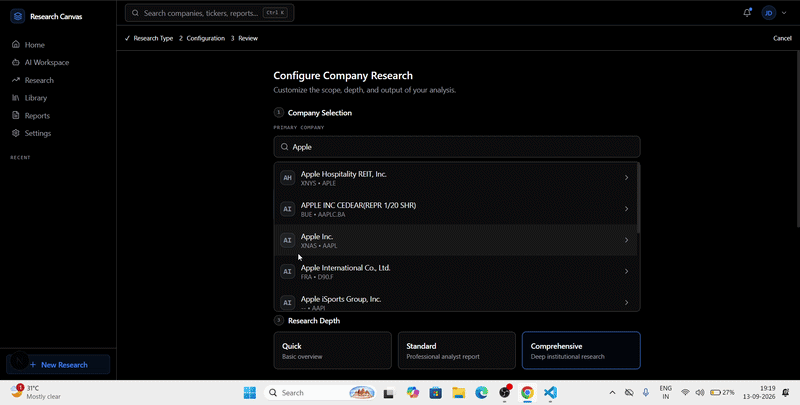
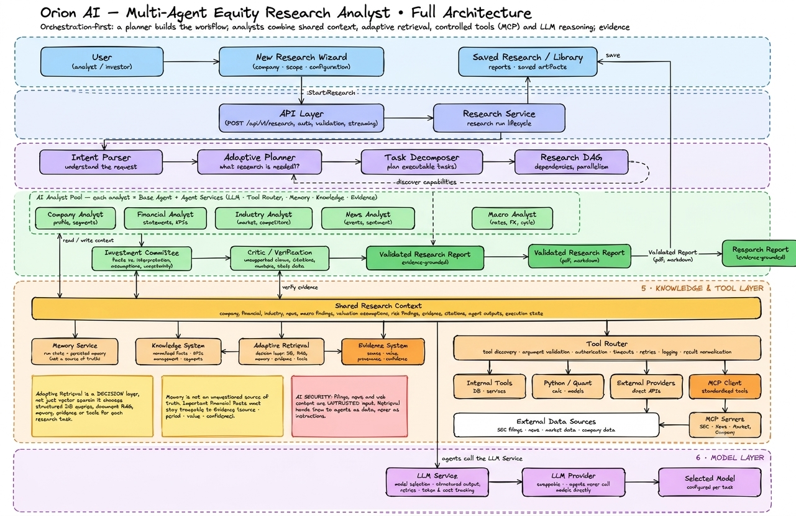
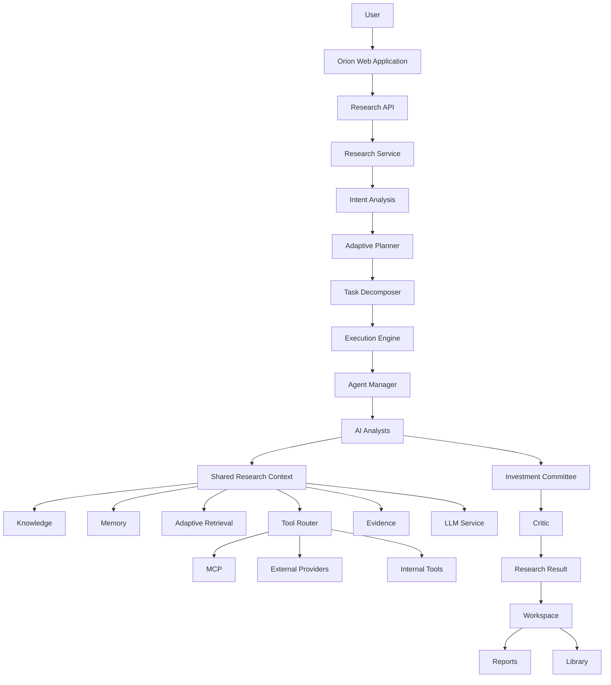
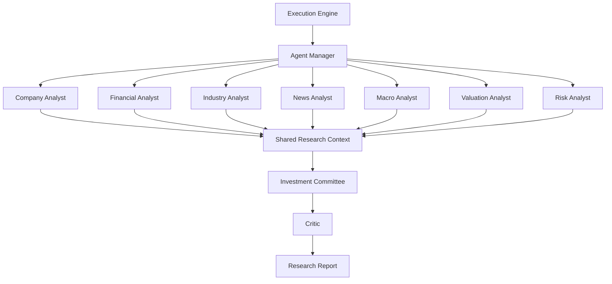

# Orion AI — Multi-Agent Equity Research Analyst

<p align="center">
  
</p>

<p align="center">
  <strong>Turning complex equity research into a structured, evidence-grounded multi-agent workflow.</strong>
</p>

<p align="center">

**Multi-Agent Systems** • **LLM Engineering** • **RAG** • **Retrieval** • **Financial Data** • **Tool Orchestration** • **Evidence & Provenance** • **AI Evaluation**

</p>

---

## 🎥 Full Demo

<p align="center">
  <a href="https://youtu.be/b-b2Kd7DPwA">
    ▶️ <strong>Watch the Full Orion AI Demo on YouTube</strong>
  </a>
</p>


## 🌐 Live Demo

**[Open Orion AI →](https://orion-ai-henna.vercel.app/login)**

Experience the live multi-agent equity research workflow.

The demo walks through the research workflow from the initial research request through planning, multi-agent execution, evidence collection, synthesis, validation, and the final research workspace.

```text
Research Request
       ↓
Research Configuration
       ↓
Intent Analysis
       ↓
Adaptive Planning
       ↓
Task Decomposition
       ↓
Execution DAG
       ↓
Specialized AI Analysts
       ↓
Knowledge + Retrieval + Tools
       ↓
Evidence Collection
       ↓
Investment Committee
       ↓
Critic / Validation
       ↓
Research Result
       ↓
Research Workspace
       ↓
Report / Library
```

> Replace `YOUR_YOUTUBE_VIDEO_URL` with the actual YouTube demo URL.

---

# 🚀 Overview

**Orion AI** is a multi-agent equity research system designed to transform a research question into a structured, evidence-grounded research workflow.

Instead of relying on a single LLM to perform the entire analysis, Orion coordinates a team of specialized **AI analysts** through a planning and execution architecture.

A typical research run can involve:

```text
Research Request
       ↓
Intent Analysis
       ↓
Adaptive Planning
       ↓
Task Decomposition
       ↓
Execution DAG
       ↓
Specialized AI Analysts
       ↓
Knowledge + Retrieval + Tools
       ↓
Evidence Collection
       ↓
Investment Committee
       ↓
Critic / Validation
       ↓
Research Report
```

The system is designed around a core principle:

> **LLMs provide reasoning and synthesis, while deterministic services, controlled tools, structured data, retrieval, and evidence systems provide the research foundation.**

---

# 🎯 What Orion AI Does

Orion AI is designed to support research across multiple dimensions of an equity.

## Company Analysis

The Company AI Analyst can investigate:

* company profile
* business model
* products and services
* business segments
* management
* competitive positioning
* corporate developments

## Financial Analysis

The Financial AI Analyst works with:

* revenue
* earnings
* margins
* cash flow
* balance sheet information
* financial ratios
* historical financial trends

## Industry Analysis

The Industry AI Analyst examines:

* industry structure
* market trends
* competitors
* industry dynamics
* growth drivers
* competitive factors

## News Analysis

The News AI Analyst can analyze:

* company developments
* earnings events
* corporate announcements
* market events
* regulatory developments
* relevant recent news

## Macro Analysis

The Macro AI Analyst considers:

* interest rates
* inflation
* economic indicators
* monetary policy
* broader market conditions

## Valuation Analysis

The Valuation AI Analyst combines financial and market information for analytical workflows involving:

* valuation multiples
* comparable-company analysis
* cash-flow-based valuation
* growth assumptions
* profitability assumptions
* scenario analysis
* valuation drivers

## Risk Analysis

The Risk AI Analyst evaluates research-relevant risks such as:

* business risk
* financial risk
* competitive risk
* industry risk
* macroeconomic risk
* regulatory risk
* event risk
* valuation risk

## Investment Committee

The Investment Committee synthesizes outputs from the specialized AI analysts into a coherent research view.

## Critic

The Critic provides a quality-control stage that checks for issues such as:

* unsupported claims
* missing evidence
* citation gaps
* numerical inconsistencies
* contradictory findings
* incomplete analysis
* unsupported assumptions

---

# 🧠 Architecture

Orion AI separates research planning, task execution, AI analyst reasoning, data access, evidence management, and quality control.

## Full System Architecture

<p align="center">
  
</p>

The full architecture illustrates the major components involved in turning a research request into an evidence-grounded research result.

### High-Level Architecture



---

# 🔬 End-to-End Research Workflow

A research run follows a structured execution pipeline.

```text
New Research
     ↓
Company Selection
     ↓
Research Configuration
     ↓
Research Run
     ↓
Intent Analysis
     ↓
Adaptive Planning
     ↓
Task Decomposition
     ↓
Execution DAG
     ↓
AI Analysts
     ↓
Knowledge + Retrieval + Tools
     ↓
Evidence
     ↓
Investment Committee
     ↓
Critic
     ↓
Research Result
     ↓
Research Workspace
     ↓
Report / Library
```

The important design decision is that the research workflow is **planned before execution**.

The planner determines the capabilities and analyst tasks required for the research question.

The Execution Engine then schedules and executes those tasks according to their dependencies.

---

# 🤖 AI Analyst Team

Orion AI uses specialized AI analysts rather than forcing one model to perform every research function.

<p align="center">
  
</p>

### Analyst Architecture



Each analyst focuses on a specific research domain while sharing common infrastructure.

## Specialized Analysts

| Analyst                  | Primary Responsibilities                                                |
| ------------------------ | ----------------------------------------------------------------------- |
| **Company Analyst**      | Business model, products, segments, management, competitive positioning |
| **Financial Analyst**    | Revenue, earnings, margins, cash flow, balance sheet, financial trends  |
| **Industry Analyst**     | Industry structure, market trends, competitors, growth drivers          |
| **News Analyst**         | Recent company events, earnings, announcements, regulatory developments |
| **Macro Analyst**        | Interest rates, inflation, monetary policy, economic conditions         |
| **Valuation Analyst**    | Multiples, comparable companies, DCF, scenarios, valuation drivers      |
| **Risk Analyst**         | Business, financial, competitive, regulatory, macro and valuation risks |
| **Investment Committee** | Cross-domain synthesis of analyst outputs                               |
| **Critic**               | Evidence, citation, consistency and research-quality validation         |

## Shared Analyst Services

AI analysts can be provided with shared services for:

* LLM access
* memory
* knowledge retrieval
* evidence management
* tool execution
* research context
* observability
* configuration

This keeps domain-specific analyst logic separate from infrastructure concerns.

---

# 🗺️ Adaptive Planning

Orion does not need to execute every analyst for every research question.

The planner can determine which capabilities are required.

For example:

```text
Question:

"Analyze the financial performance and valuation of a company."

Required capabilities:

Financial Analysis
       +
Market Data
       +
Valuation
       +
Risk
```

A broader research question may require:

```text
Company
Financial
Industry
News
Macro
Valuation
Risk
Committee
Critic
```

This capability-driven architecture allows the research workflow to adapt to the request.

---

# ⚙️ Execution Engine

After planning, the Execution Engine converts the plan into executable tasks.

```text
Research Plan
     ↓
Execution DAG
     ↓
Task Scheduling
     ↓
Workers
     ↓
AI Analysts
     ↓
Shared Context
     ↓
Results
```

Independent tasks can execute concurrently when their dependencies allow it.

For example:

```text
Company ───────┐
Financial ─────┤
Industry ──────┤
News ──────────┼──→ Shared Research Context
Macro ─────────┘
                         ↓
                    Valuation
                         ↓
                       Risk
                         ↓
                Investment Committee
                         ↓
                       Critic
```

This provides a dependency-aware execution model instead of a fixed linear pipeline.

---

# 📚 Knowledge & Adaptive Retrieval

Orion AI separates knowledge storage from retrieval strategy.

The retrieval layer can combine different information sources depending on the research task.

```text
Research Question
       ↓
Adaptive Retrieval
       |
       +── Vector Retrieval
       +── Keyword Retrieval
       +── Structured Data
       +── Company Data
       +── Financial Data
       +── Research Memory
       +── Evidence
       ↓
Relevant Research Context
```

The knowledge layer can contain information from:

* annual reports
* SEC filings
* earnings transcripts
* investor presentations
* research documents
* company information
* financial data
* industry information

---

# 🔗 Evidence & Provenance

Evidence is treated as a first-class research object.

The system separates:

```text
Source
   ↓
Retrieved Information
   ↓
Evidence
   ↓
Claim
   ↓
Analyst Finding
   ↓
Committee Synthesis
   ↓
Critic
   ↓
Report
```

An evidence record can retain metadata such as:

```text
research_id
task_id
agent_id
claim_id
source
source_type
document
document_version
section
page
passage
extracted_value
period
publication_date
retrieval_timestamp
confidence
provenance
```

This enables the system to answer:

> **What source supports this claim?**

and:

> **How did this information contribute to the final research result?**

---

# 🛠️ Tool Router

AI analysts do not need to directly control external APIs.

Instead, Orion uses a controlled Tool Router.

```text
AI Analyst
    ↓
Tool Router
    ↓
Tool Registry
    ↓
Validation + Authorization
    ↓
Tool
    ├── Internal Services
    ├── MCP
    └── External Providers
    ↓
Normalized Result
    ↓
Evidence + Research Context
```

This creates a clean boundary between:

```text
AI Reasoning
```

and:

```text
External Data Access
```

The Tool Router can provide capabilities for:

* SEC data
* financial data
* market data
* company data
* news
* macroeconomic data
* knowledge retrieval
* quantitative calculations

---

# 🔌 MCP Integration

Orion includes an MCP layer for structured tool access.

Conceptually:

```text
Tool Router
     ↓
MCP Client
     ↓
MCP Server
     ├── SEC
     ├── Financial
     ├── News
     ├── Market
     └── Company
```

The MCP layer remains behind the Tool Router so that tool discovery, authorization, validation, execution, observability, and error handling can remain centrally controlled.

---

# 🧮 Deterministic Financial Computation

LLMs are useful for reasoning and interpretation, but financial calculations should use deterministic computation where appropriate.

Examples include:

* growth rates
* margins
* financial ratios
* valuation calculations
* DCF calculations
* comparable-company calculations
* scenario analysis
* return calculations

Conceptually:

```text
Source Financial Data
       ↓
Deterministic Calculation
       ↓
Derived Value
       ↓
Provenance
       ↓
Analyst Interpretation
```

This separates **source facts** from **derived calculations** and **LLM-generated interpretation**.

---

# 🏛️ Investment Committee

After specialized analysts complete their work, the Investment Committee synthesizes the research.

```text
Company Analyst
Financial Analyst
Industry Analyst
News Analyst
Macro Analyst
Valuation Analyst
Risk Analyst
       ↓
Investment Committee
       ↓
Unified Research Synthesis
```

The committee can consolidate:

* business understanding
* financial performance
* industry conditions
* macro environment
* valuation
* risk factors
* supporting evidence

---

# 🔍 Critic & Quality Control

The Critic is a separate quality-control stage.

```text
Analyst Outputs
      ↓
Investment Committee
      ↓
Critic
      ↓
Validation
      ↓
Research Result
```

The Critic can inspect:

* evidence coverage
* citation support
* numerical consistency
* contradictory findings
* unsupported claims
* missing analysis
* unsupported assumptions
* evidence quality

This creates a research workflow in which generation and review are separate stages.

---

# 📊 Observability

Orion's architecture is designed to make research execution observable across multiple layers.

```text
Research
   ↓
Task
   ↓
AI Analyst
   ↓
Tool Call
   ↓
Provider
   ↓
Retrieval
   ↓
LLM Call
   ↓
Evidence
   ↓
Report
```

## Research Metrics

* research duration
* task completion
* task failures
* research status

## AI Analyst Metrics

* execution latency
* success/failure
* token usage
* model latency

## Retrieval Metrics

* retrieval latency
* retrieved documents
* evidence coverage
* retrieval quality

## Tool Metrics

* tool latency
* provider failures
* retries
* timeouts
* tool usage

## Cost Metrics

* LLM usage
* provider usage
* estimated research cost

---

# 🧪 Evaluation

Orion AI separates system evaluation from normal execution.

Evaluation can cover:

```text
Factual Accuracy
Numerical Correctness
Evidence Grounding
Citation Quality
Completeness
Consistency
Hallucination Rate
Latency
Tool Reliability
```

The evaluation architecture is intended to answer both:

> **Did the system produce a useful research result?**

and:

> **Did the system produce that result using reliable evidence and controlled execution?**

---

# 🔐 Security & Governance

Security is implemented as a set of boundaries rather than as a single feature.

Key areas include:

```text
Authentication
Authorization
Permissions
Secret Management
Audit Logging
Input Validation
Tool Access Control
Data Isolation
Prompt Injection Resistance
Evidence Provenance
```

External documents and web content are treated as **untrusted data**, not system instructions.

The Tool Router provides an important security boundary by preventing AI analysts from directly accessing arbitrary external services or credentials.

---

# 🧱 Technology Stack

## Backend

```text
Python
FastAPI
PostgreSQL
Redis
SQLAlchemy
Alembic
Pydantic
```

## AI / Research

```text
LLM Service
Multi-Agent Architecture
RAG
Adaptive Retrieval
Embeddings
Vector Search
Evidence / Provenance
Quantitative Analysis
```

## Tooling

```text
MCP
SEC Connectors
Financial Data Providers
Market Data Providers
News Providers
Company Data Providers
```

## Frontend

```text
Next.js
React
TypeScript
Tailwind CSS
```

## Infrastructure

```text
Docker
Docker Compose
Neon PostgreSQL
GCP / Cloud Deployment
```

---

# 📁 Project Structure

```text
Orion_AI_System/
│
├── backend/
│   ├── app/
│   │   ├── agents/
│   │   │   ├── base/
│   │   │   ├── company/
│   │   │   ├── financial/
│   │   │   ├── industry/
│   │   │   ├── news/
│   │   │   ├── macro/
│   │   │   ├── valuation/
│   │   │   ├── risk/
│   │   │   ├── investment_committee/
│   │   │   └── critic/
│   │   │
│   │   ├── planning/
│   │   ├── execution/
│   │   ├── knowledge/
│   │   ├── evidence/
│   │   ├── tools/
│   │   ├── mcp/
│   │   ├── observability/
│   │   ├── evaluation/
│   │   ├── security/
│   │   ├── feedback/
│   │   └── api/
│   │
│   ├── alembic/
│   ├── scripts/
│   ├── tests/
│   ├── Dockerfile
│   └── requirements.txt
│
├── orion-ui/
│   ├── app/
│   ├── components/
│   ├── context/
│   ├── lib/
│   ├── types/
│   ├── public/
│   ├── Dockerfile
│   └── next.config.ts
│
├── docs/
│   ├── architecture.md
│   ├── new-research.md
│   ├── planning.md
│   ├── agents.md
│   ├── execution.md
│   ├── knowledge.md
│   ├── evidence.md
│   ├── tools.md
│   ├── observability.md
│   ├── evaluation.md
│   ├── security.md
│   │
│   └── img/
│       ├── adaptive_retrieval.png
│       ├── agents.png
│       ├── agents_mermaid.png
│       ├── agent_1.png
│       ├── evidence.png
│       ├── execution.png
│       ├── full_arch_orion.png
│       ├── knowledge.png
│       ├── new_research.png
│       ├── new_research_2.png
│       ├── new_research (2).png
│       ├── orion_full_arch2.png
│       ├── orion_ful_arch.png
│       ├── orion_vid.gif
│       ├── planning.png
│       └── planning (2).png
│
└── README.md
```

---

# 🖥️ Frontend

The Orion web application provides the research workspace for interacting with completed and running research.

The frontend architecture is based on:

```text
Next.js
    ↓
Research UI
    ↓
Backend API
    ↓
Research Service
```

The workspace is designed around research artifacts such as:

```text
Analysis
Documents
Evidence
Reports
Library
```

This separates the research execution system from the presentation layer.

---

# 🐳 Deployment

Orion is containerized for deployment.

## Backend

```text
Python 3.12
        ↓
FastAPI
        ↓
Docker
        ↓
Cloud Runtime
```

## Frontend

```text
Node.js
   ↓
Next.js Standalone Build
   ↓
Docker
   ↓
Cloud Runtime
```

## Database

The production architecture uses PostgreSQL, with **Neon** as the managed PostgreSQL deployment target.

```text
Orion Backend
      ↓
PostgreSQL
      ↓
Neon
```

Redis is used where required for application/runtime infrastructure.

---

# 📖 Documentation

Detailed architecture documentation is available under [`docs/`](docs/).

| Document                                    | Description                          |
| ------------------------------------------- | ------------------------------------ |
| [`architecture.md`](docs/architecture.md)   | Complete system architecture         |
| [`new-research.md`](docs/new-research.md)   | End-to-end research workflow         |
| [`planning.md`](docs/planning.md)           | Planning and task decomposition      |
| [`agents.md`](docs/agents.md)               | AI analyst architecture              |
| [`execution.md`](docs/execution.md)         | Execution Engine and task runtime    |
| [`knowledge.md`](docs/knowledge.md)         | Knowledge and retrieval architecture |
| [`evidence.md`](docs/evidence.md)           | Evidence and provenance              |
| [`tools.md`](docs/tools.md)                 | Tool Router, MCP, and integrations   |
| [`observability.md`](docs/observability.md) | Tracing, metrics, logging, and cost  |
| [`evaluation.md`](docs/evaluation.md)       | AI and research evaluation           |
| [`security.md`](docs/security.md)           | Security and governance              |

---

# 🖼️ Architecture Visuals

The repository contains additional architecture diagrams covering the major Orion subsystems.

| Visual                                                      | Description                          |
| ----------------------------------------------------------- | ------------------------------------ |
| [`full_arch_orion.png`](docs/img/full_arch_orion.png)       | Full Orion AI system architecture    |
| [`agents.png`](docs/img/agents.png)                         | Multi-agent analyst architecture     |
| [`adaptive_retrieval.png`](docs/img/adaptive_retrieval.png) | Adaptive retrieval architecture      |
| [`planning.png`](docs/img/planning.png)                     | Research planning architecture       |
| [`execution.png`](docs/img/execution.png)                   | Execution Engine architecture        |
| [`knowledge.png`](docs/img/knowledge.png)                   | Knowledge architecture               |
| [`evidence.png`](docs/img/evidence.png)                     | Evidence and provenance architecture |
| [`new_research.png`](docs/img/new_research.png)             | New research workflow                |
| [`orion_vid.gif`](docs/img/orion_vid.gif)                   | Orion AI product demonstration       |

---

# 🎥 Demo

The demo illustrates the Orion research workflow from the user-facing research experience through the resulting research workspace.

```text
User
 ↓
New Research
 ↓
Research Configuration
 ↓
Adaptive Planning
 ↓
Execution
 ↓
AI Analyst Team
 ↓
Knowledge / Retrieval / Tools
 ↓
Evidence
 ↓
Investment Committee
 ↓
Critic
 ↓
Research Workspace
 ↓
Reports / Library
```

For the complete interactive walkthrough:

**[▶️ Watch the Full Orion AI Demo](YOUR_YOUTUBE_VIDEO_URL)**

---

# 🔭 Architecture Philosophy

Orion AI is designed around several principles.

## Specialized Reasoning

Different research domains are handled by specialized AI analysts.

## Controlled Tool Access

AI analysts use a Tool Router rather than directly controlling external integrations.

## Evidence-First Research

Research findings should retain relationships to their supporting evidence.

## Adaptive Execution

The planner determines which capabilities are required instead of forcing every research run through the same pipeline.

## Deterministic Computation

Financial calculations should use deterministic tools where appropriate.

## Separation of Concerns

Planning, execution, reasoning, retrieval, tool access, evidence, evaluation, and presentation are separate architectural concerns.

## Review Before Reporting

The Investment Committee synthesizes research and the Critic provides a separate validation stage.

## Observable Execution

Research runs should be traceable from the research request through individual tasks, AI analysts, tools, providers, evidence, and final outputs.

---

# 🛣️ Roadmap

Potential future development areas include:

* richer research planning strategies
* additional financial data providers
* broader MCP tool coverage
* improved retrieval evaluation
* stronger evidence verification
* expanded quantitative analysis
* more research templates
* richer analyst collaboration
* human approval workflows
* deeper observability
* automated evaluation benchmarks
* additional portfolio-level research capabilities

---

# 📌 Project Status

Orion AI is being developed as a production-oriented AI engineering project focused on:

```text
Multi-Agent Systems
        +
LLM Engineering
        +
RAG / Retrieval
        +
Financial Data
        +
Tool Orchestration
        +
Evidence / Provenance
        +
AI Evaluation
        +
Security / Governance
        +
Observability
```

The goal is not simply to build a chatbot that answers financial questions.

The goal is to build a **structured AI research system** in which planning, execution, specialized analysis, data access, evidence, synthesis, validation, and reporting operate as distinct but connected components.

---

# 🏗️ Core Architecture

```text
                         ORION AI
                            |
                     Research Request
                            |
                            v
                     Intent Analysis
                            |
                            v
                     Adaptive Planner
                            |
                            v
                    Task Decomposition
                            |
                            v
                    Execution Engine
                            |
                            v
                     AI Analyst Team
                            |
          +-----------------+------------------+
          |                 |                  |
          v                 v                  v
      Knowledge         Tool Router         Memory
          |                 |                  |
          v                 v                  v
      Retrieval            MCP             Context
          |                 |
          +--------+--------+
                   |
                   v
                Evidence
                   |
                   v
          Investment Committee
                   |
                   v
                 Critic
                   |
                   v
             Research Report
                   |
                   v
        Workspace / Reports / Library
```

---

# ⭐ Key Idea

> **Orion AI — turning complex equity research into a structured, evidence-grounded multi-agent workflow.**

The system brings together:

```text
Research Planning
       +
Multi-Agent Reasoning
       +
Adaptive Retrieval
       +
Knowledge Systems
       +
Controlled Tool Access
       +
MCP
       +
Deterministic Computation
       +
Evidence / Provenance
       +
Evaluation
       +
Observability
       +
Security
```

The result is a research architecture designed around **traceable reasoning, controlled execution, and evidence-grounded synthesis** rather than a single monolithic LLM workflow.

---

# 👩‍💻 Author

**Garima Kumari**

AI / ML Engineering • Multi-Agent Systems • Retrieval • AI Research

---

<p align="center">

**Orion AI**

*Structured research. Specialized reasoning. Evidence-grounded analysis.*

</p>
