# Orion AI — AI Analyst Architecture


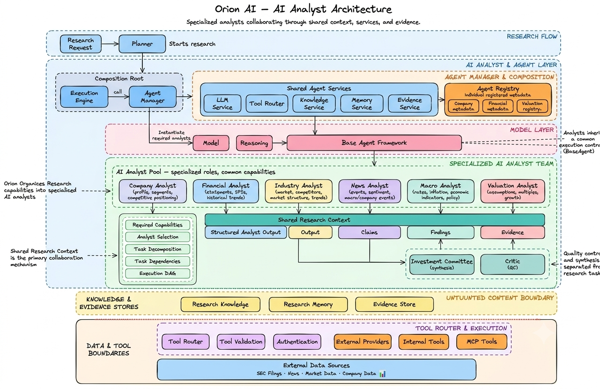


> **Orion's AI analysts are specialized research agents that collaborate through shared services, research context, evidence, tools, and structured outputs.**

The agent layer is the core intelligence layer of Orion AI.

Instead of using one general-purpose AI agent for every research question, Orion organizes research capabilities into specialized **AI analysts**.

Each analyst focuses on a specific research domain while sharing the same underlying infrastructure.

```text id="8ozr6f"
                    Orion AI
                       │
                       ▼
                AI Analyst Team
                       │
        ┌──────────────┼──────────────┐
        ▼              ▼              ▼
     Company       Financial       Industry
     Analyst        Analyst         Analyst
        │              │              │
        ├──────────────┼──────────────┤
        │              │              │
        ▼              ▼              ▼
      News           Macro         Valuation
     Analyst         Analyst         Analyst
                       │
                       ▼
                   Risk Analyst
                       │
                       ▼
             Investment Committee
                       │
                       ▼
                     Critic
```

---

# 1. Purpose of the Agent Layer

The agent layer provides specialized AI research capabilities.

An analyst is responsible for:

* understanding its assigned research task
* retrieving relevant information
* using approved tools
* reasoning over research data
* producing structured findings
* recording supporting evidence
* contributing results to the shared research context

An analyst is **not** responsible for:

* controlling the complete research workflow
* directly managing other analysts
* managing worker processes
* owning application authentication
* directly managing database connections
* bypassing the Tool Router
* independently managing execution retries

Those responsibilities belong to the surrounding platform.

---

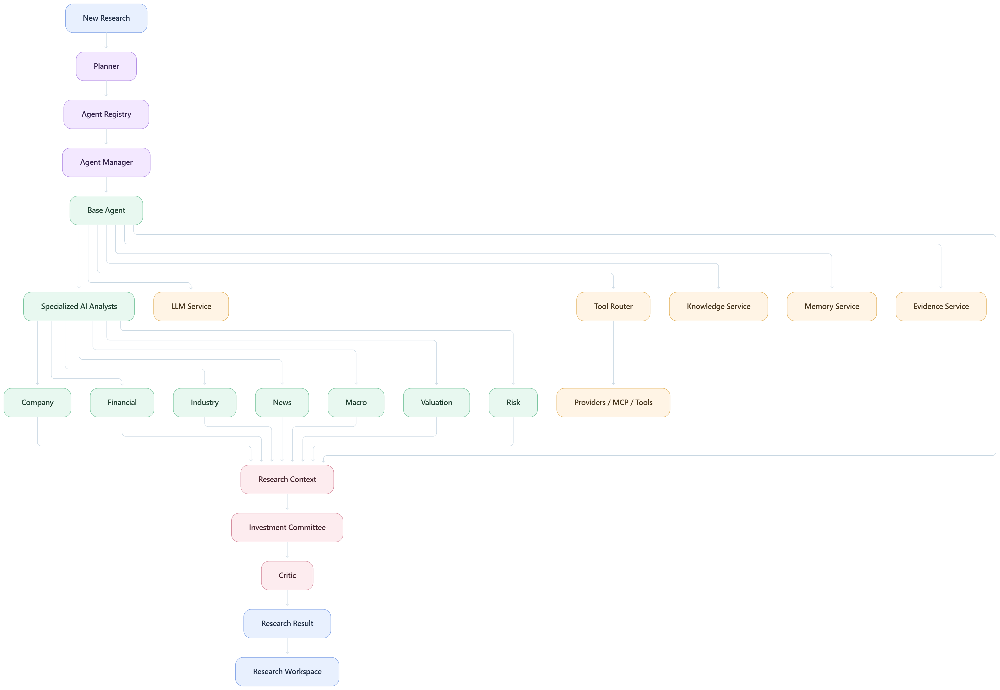

# 2. Agent Architecture

The high-level agent architecture is:

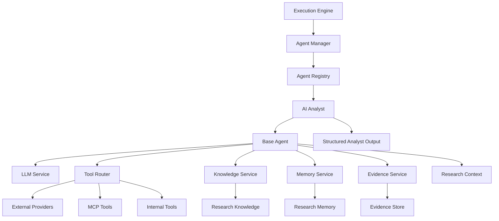

The Base Agent provides common capabilities.

Specialized analysts provide domain-specific research behavior.

---

# 3. Agent Hierarchy

Orion can be viewed as a layered agent architecture.

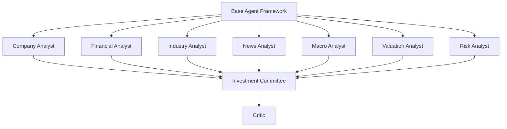

The hierarchy separates **specialized research** from **cross-domain synthesis**.

---

# 4. Base Agent

The Base Agent defines the common execution contract for Orion's AI analysts.

Conceptually:

```text id="y2u9xk"
BaseAgent
│
├── configuration
├── shared services
├── research context
├── task execution
├── structured output
└── error handling
```

A specialized analyst extends this common framework.

Conceptually:

```python
class CompanyResearchAgent(BaseAgent):
    ...
```

The important architectural idea is that analysts inherit a common runtime environment instead of independently implementing infrastructure.

---

# 5. Shared Agent Services

All major analysts should have access to the same platform services.

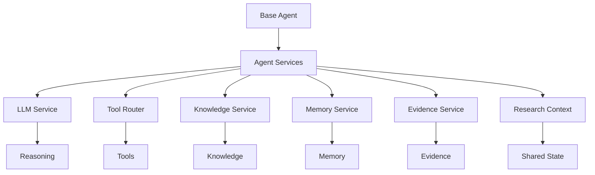

This provides a consistent execution environment across the analyst team.

---

# 6. Agent Services Container

The shared services can conceptually be grouped into an agent service container.

```text id="uwq0te"
AgentServices
│
├── llm
├── tools
├── knowledge
├── memory
├── evidence
└── research_context
```

The Agent Manager can construct these services and inject them into the analysts.

This avoids creating separate infrastructure instances inside every agent.

---

# 7. Agent Manager

The Agent Manager acts as the composition root for the agent system.

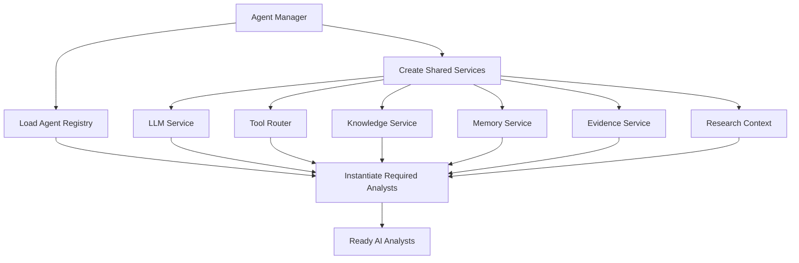

The Agent Manager is therefore responsible for composition rather than research planning.

The Planner decides **which analysts are required**.

The Agent Manager creates the runtime objects needed to execute them.

---

# 8. Agent Registry

The Agent Registry describes the available analyst types.

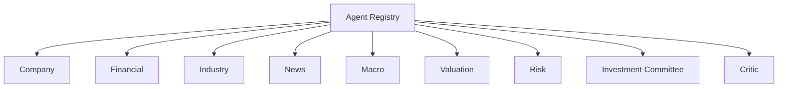

Each registration can expose metadata such as:

```text id="2n5pkk"
Agent Metadata
│
├── name
├── group
├── capabilities
├── dependencies
├── input schema
├── output schema
└── supported tools
```

This metadata is consumed by the planning layer.

---

# 9. Registry → Planner Relationship

The Agent Registry and Planner have different responsibilities.

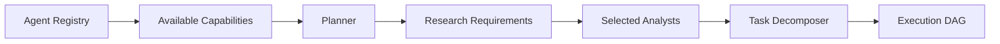

The Registry answers:

> **What can the analyst system do?**

The Planner answers:

> **What capabilities are required for this research request?**

---

# 10. Company Analyst

The Company Analyst focuses on company-level research.

Potential responsibilities include:

* company profile
* business model
* products and services
* business segments
* management information
* competitive positioning
* company-specific developments
* corporate information

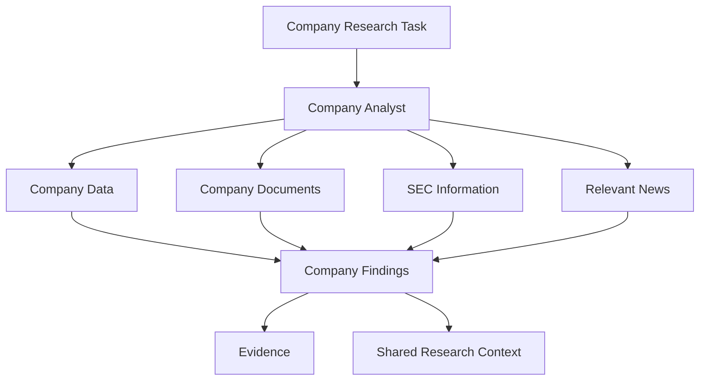

The Company Analyst provides foundational context that other analysts can use.

---

# 11. Financial Analyst

The Financial Analyst focuses on financial performance and financial data.

Typical analysis areas include:

* revenue
* earnings
* margins
* cash flow
* balance sheet
* financial ratios
* historical trends
* financial performance

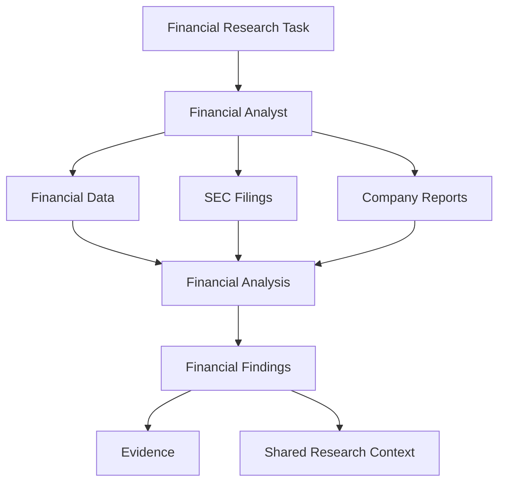

Financial outputs can become inputs to valuation and risk analysis.

---

# 12. Industry Analyst

The Industry Analyst focuses on the broader industry environment.

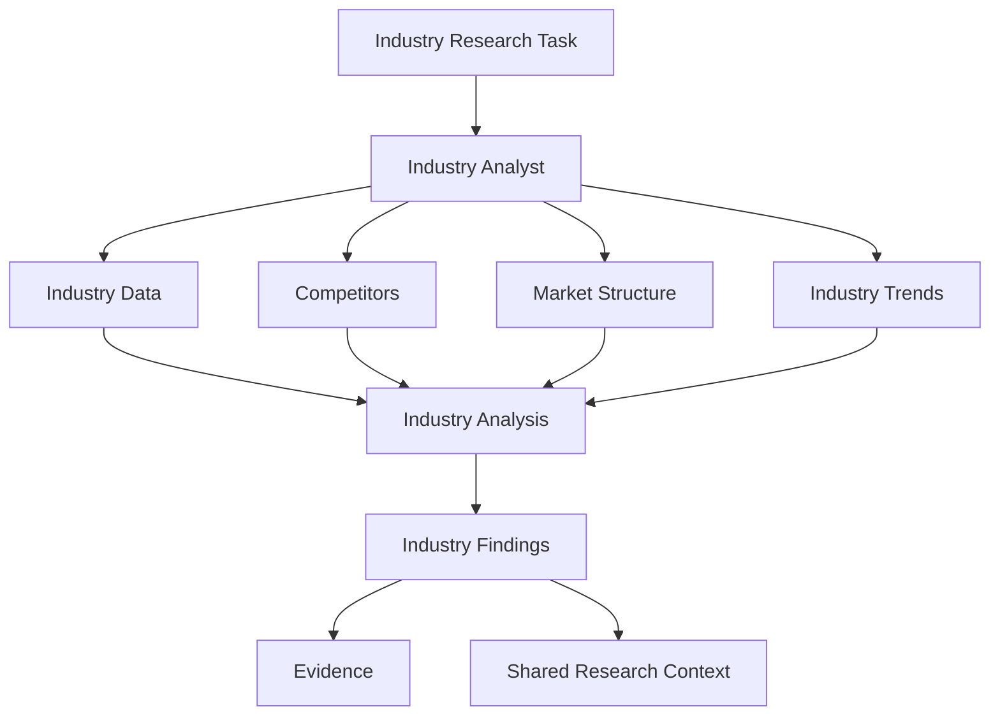

Industry analysis provides context for company performance and risk.

---

# 13. News Analyst

The News Analyst focuses on recent events and developments.

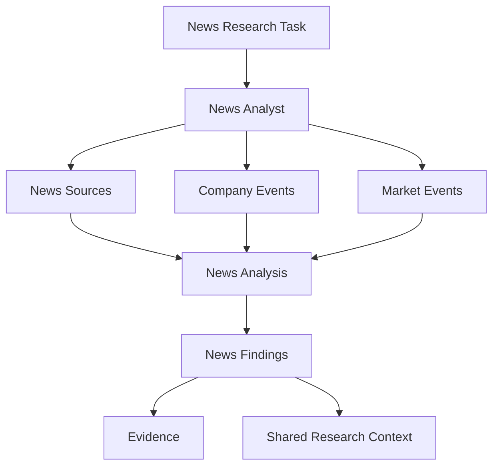

News information is particularly time-sensitive and should carry appropriate source and timestamp information.

---

# 14. Macro Analyst

The Macro Analyst examines economic and market-level conditions.

Potential inputs include:

* interest rates
* inflation
* economic indicators
* monetary policy
* macroeconomic trends
* market conditions

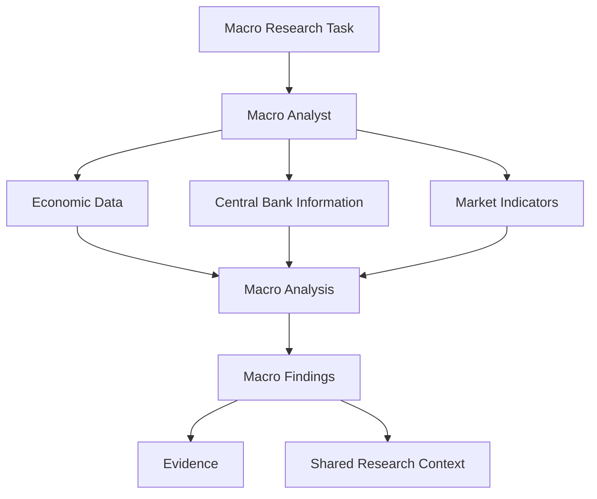

Macro analysis can contribute to valuation and risk assessment.

---

# 15. Valuation Analyst

The Valuation Analyst focuses on estimating and interpreting company valuation.

Potential inputs include:

* financial performance
* growth assumptions
* profitability
* market data
* comparable companies
* valuation multiples
* cash-flow assumptions

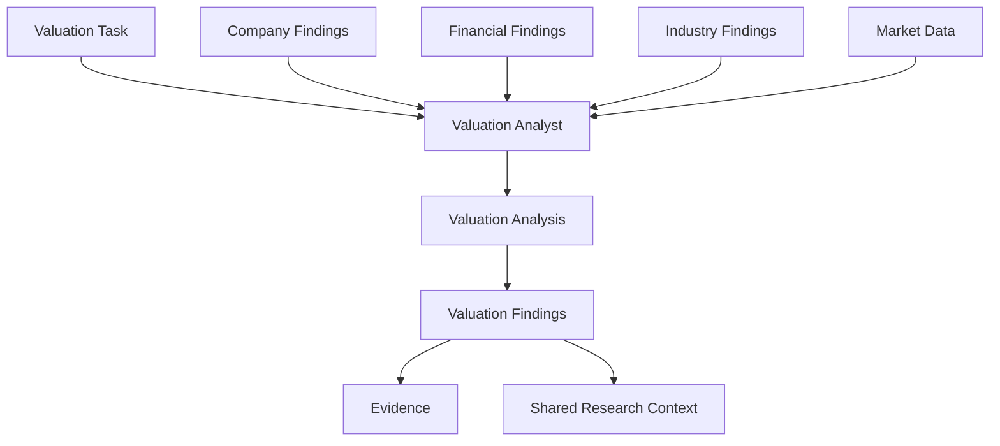

The Valuation Analyst should consume structured financial information rather than independently reconstructing the entire research context.

---

# 16. Risk Analyst

The Risk Analyst focuses on identifying and analyzing investment risks.

Potential areas include:

* business risk
* financial risk
* industry risk
* macroeconomic risk
* regulatory risk
* competitive risk
* valuation risk
* event risk

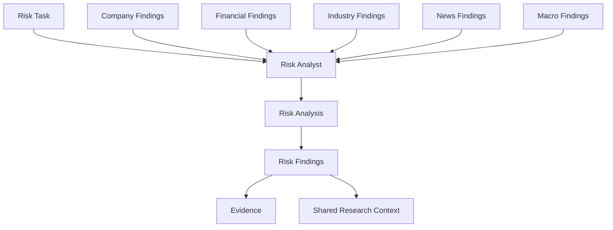

Risk analysis can therefore consume information produced by multiple specialist analysts.

---

# 17. Investment Committee

The Investment Committee is a synthesis agent.

It consumes the relevant specialist outputs.

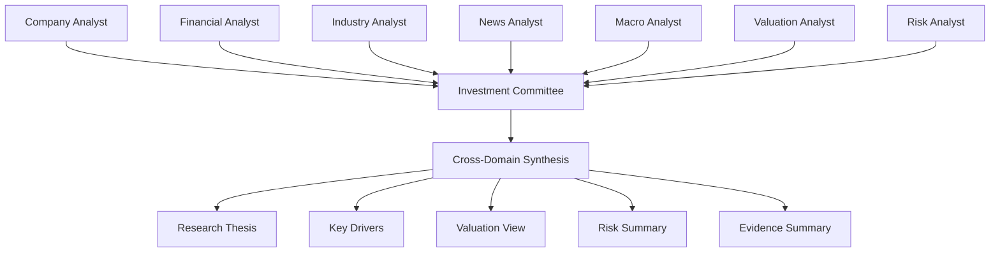

The committee should synthesize available research rather than independently duplicating every specialist task.

---

# 18. Critic Agent

The Critic is the quality-control agent.

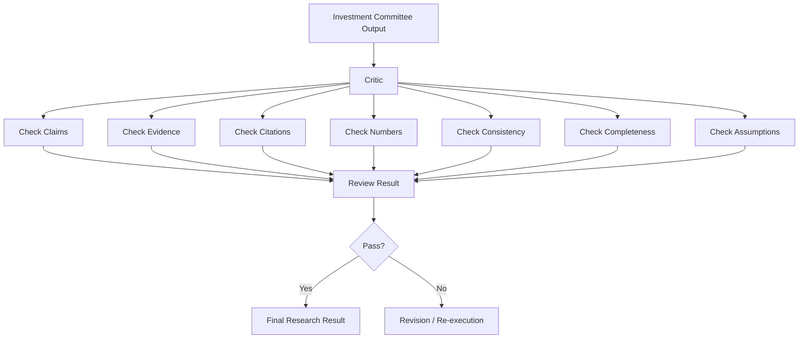

The Critic provides an independent review stage before the research result is finalized.

---

# 19. Complete Analyst Team

The complete conceptual analyst topology is:

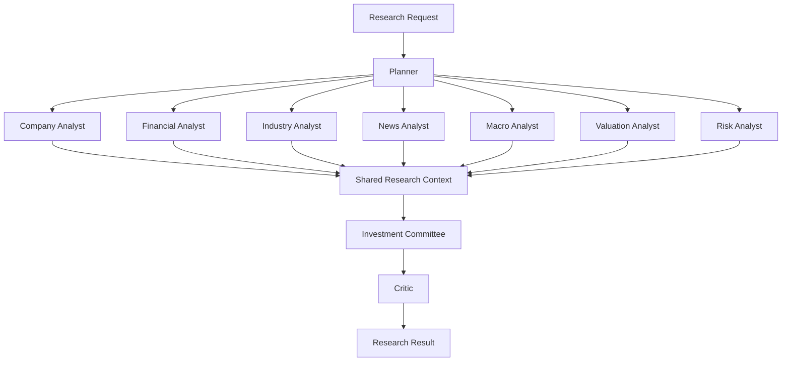

The Planner determines which subset of this team is required for each research request.

---

# 20. Agent Execution Lifecycle

Each analyst follows a common execution lifecycle.

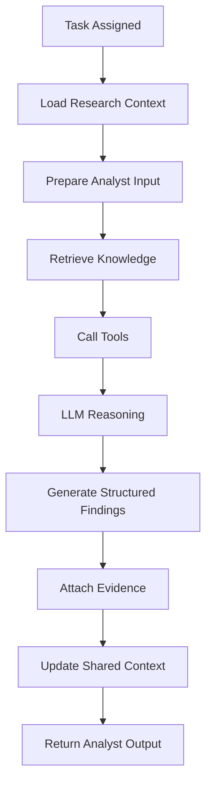

The exact sequence may vary depending on the analyst and task.

---

# 21. Agent Input

An analyst should receive enough context to perform its assigned task without requiring access to the entire application state.

Conceptually:

```text id="j8s7lq"
AgentInput
│
├── research_id
├── task_id
├── company
├── research_objective
├── task_objective
├── dependencies
├── relevant context
└── constraints
```

The execution layer prepares the task context before invoking the analyst.

---

# 22. Agent Output

Analyst outputs should be structured rather than returning an unbounded text response.

Conceptually:

```text id="4j1wq9"
AgentOutput
│
├── analyst
├── task_id
├── summary
├── findings
├── metrics
├── assumptions
├── evidence
├── citations
└── metadata
```

This makes outputs easier to:

* store
* validate
* compare
* pass to downstream analysts
* display in the workspace
* evaluate

---

# 23. Agent Output Flow

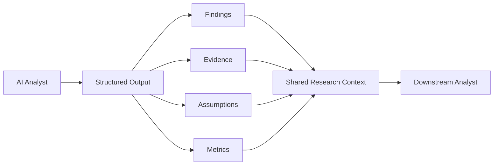

This creates a machine-readable research pipeline rather than a chain of free-form prompts.

---

# 24. Shared Research Context

The Shared Research Context is the main collaboration mechanism.

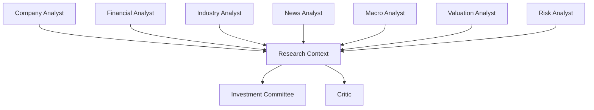

This allows analysts to collaborate without creating direct dependencies such as:

```text
CompanyAgent → FinancialAgent → ValuationAgent
```

Instead, they communicate through shared research state.

---

# 25. Why Shared Context Matters

Without shared context, every analyst would need to know how to communicate with every other analyst.

That creates a tightly coupled architecture.

```text id="c6v0b9"
Without Shared Context

Company ──→ Financial
   │           │
   ├────────→ Risk
   │           │
   ├────────→ Valuation
   │           │
   └────────→ Committee
```

With shared context:

```text id="b0a6wq"
Company ──────┐
Financial ────┤
Industry ─────┤
News ─────────┤
Macro ────────┤
Valuation ────┤
Risk ─────────┘
       │
       ▼
Shared Research Context
       │
       ▼
Investment Committee
```

This reduces coupling and makes the analyst system easier to extend.

---

# 26. Agent Collaboration Through Dependencies

Shared context does not remove task dependencies.

The Planner still defines which outputs are required before another task can run.

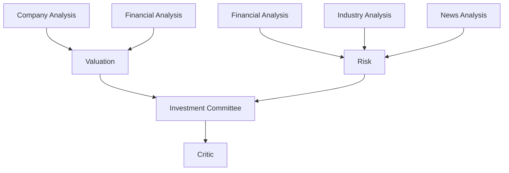

The difference is that the actual information exchange happens through the shared research state.

---

# 27. Agent and LLM Relationship

The analyst is not the same thing as the LLM.

The relationship is:

```mermaid id="s7s0d2"
flowchart LR

    A["AI Analyst"] --> B["LLM Service"]

    B --> C["Model"]

    A --> D["Research Context"]
    A --> E["Knowledge"]
    A --> F["Tools"]
    A --> G["Evidence"]

    C --> H["Reasoning / Generation"]

    H --> A
```

The analyst provides the **research role and workflow**.

The LLM provides the **reasoning and generation capability**.

This distinction allows Orion to change models without redesigning the analyst architecture.

---

# 28. Agent and Tool Router

Analysts should access external information through the Tool Router.

```mermaid id="c5m6xx"
flowchart TD

    A["AI Analyst"] --> B["Tool Router"]

    B --> C["Tool Validation"]
    B --> D["Authentication"]
    B --> E["Execution"]
    B --> F["Normalization"]
    B --> G["Logging"]

    E --> H["SEC"]
    E --> I["Market Data"]
    E --> J["News"]
    E --> K["Company Data"]
    E --> L["MCP"]
    E --> M["Python / Quant Tools"]

    H --> N["Tool Result"]
    I --> N
    J --> N
    K --> N
    L --> N
    M --> N

    N --> A
```

This keeps provider-specific integration outside individual analysts.

---

# 29. Agent and Knowledge System

The Knowledge Service provides analysts with research information.

```mermaid id="6x8vkp"
flowchart TD

    A["AI Analyst"] --> B["Knowledge Service"]

    B --> C["Structured Company Data"]
    B --> D["Financial Data"]
    B --> E["SEC Filings"]
    B --> F["News"]
    B --> G["Research Documents"]
    B --> H["Vector Retrieval"]
    B --> I["Historical Research"]

    C --> J["Relevant Knowledge"]
    D --> J
    E --> J
    F --> J
    G --> J
    H --> J
    I --> J

    J --> A
```

The analyst can then reason over retrieved information using the LLM Service.

---

# 30. Agent and Evidence

Evidence is generated as part of analyst execution.

```mermaid id="v2j7j4"
flowchart TD

    A["Source"] --> B["Retrieval / Tool"]
    B --> C["AI Analyst"]

    C --> D["Claim"]

    D --> E["Evidence Service"]

    E --> F["Evidence Record"]

    F --> G["Research Context"]

    G --> H["Investment Committee"]
    G --> I["Critic"]
```

This allows the final research result to preserve provenance from source to claim.

---

# 31. Agent Dependencies

Analyst dependencies are represented at the planning layer.

For example:

```text id="f0qfcy"
Valuation Analyst
    requires:
        Company Analysis
        Financial Analysis
```

and:

```text id="m7s4rd"
Risk Analyst
    may require:
        Financial Analysis
        Industry Analysis
        News Analysis
        Macro Analysis
```

The Execution Engine uses these dependencies to determine when each analyst is ready to execute.

---

# 32. Agent Registry and Dynamic Expansion

A registry-based architecture makes it possible to add analysts without redesigning the entire platform.

```mermaid id="x0f9v2"
flowchart LR

    A["Agent Registry"] --> B["Existing Analysts"]

    A --> C["New Specialist Analyst"]

    C --> D["Capabilities"]

    D --> E["Planner"]

    E --> F["Research Plan"]

    F --> G["Execution Engine"]
```

For example, future specialist analysts could include:

* ESG Analyst
* Supply Chain Analyst
* Geopolitical Analyst
* Credit Analyst
* Quantitative Analyst
* Alternative Data Analyst

These are examples of extensibility, not requirements for every research run.

---

# 33. Agent Manager and Registry

The relationship between the Agent Manager and Registry is:

```mermaid id="x6l0xk"
flowchart TD

    A["Agent Manager"] --> B["Agent Registry"]

    B --> C["Agent Metadata"]

    C --> A

    A --> D["Shared Agent Services"]

    D --> E["LLM"]
    D --> F["Tools"]
    D --> G["Knowledge"]
    D --> H["Memory"]
    D --> I["Evidence"]
    D --> J["Research Context"]

    A --> K["Instantiate Selected Analysts"]

    E --> K
    F --> K
    G --> K
    H --> K
    I --> K
    J --> K
```

The registry describes what exists.

The manager constructs what is needed for the current execution.

---

# 34. Agent Execution Architecture

The runtime architecture can be summarized as:

```mermaid id="z8n4w4"
flowchart TD

    A["Execution Engine"] --> B["Agent Manager"]

    B --> C["Selected AI Analyst"]

    C --> D["Base Agent"]

    D --> E["Agent Services"]

    E --> F["LLM"]
    E --> G["Knowledge"]
    E --> H["Tools"]
    E --> I["Memory"]
    E --> J["Evidence"]
    E --> K["Research Context"]

    F --> L["Reasoning"]
    G --> L
    H --> L
    I --> L
    J --> L
    K --> L

    L --> M["Structured Analyst Output"]

    M --> N["Execution State"]
    M --> O["Shared Context"]
```

---

# 35. Agent Lifecycle

An analyst's lifecycle can be represented as:

```mermaid id="l6t2k8"
stateDiagram-v2

    [*] --> Registered

    Registered --> Available

    Available --> Selected

    Selected --> Initialized

    Initialized --> Executing

    Executing --> Completed

    Executing --> Failed

    Failed --> Executing: Retry

    Completed --> [*]
```

The Agent Registry controls availability metadata.

The Planner controls selection.

The Execution Engine controls runtime execution.

---

# 36. Agent Failure Handling

Analyst failures should be handled by the execution infrastructure rather than hidden inside individual agents.

```mermaid id="8x4f4h"
flowchart TD

    A["AI Analyst"] --> B["Execute Task"]

    B --> C{"Success?"}

    C -->|Yes| D["Store Output"]

    C -->|No| E["Record Error"]

    E --> F{"Retryable?"}

    F -->|Yes| G["Execution Engine Retry"]
    G --> B

    F -->|No| H["Task Failed"]

    H --> I["Update Research State"]
```

This keeps failure handling consistent across all analysts.

---

# 37. Agent Observability

Each analyst execution should be observable.

Important telemetry can include:

* analyst name
* task ID
* research ID
* execution duration
* LLM latency
* tool calls
* retrieval operations
* token usage
* failures
* retries
* evidence count
* output size

```mermaid id="p2z9c4"
flowchart LR

    A["AI Analyst"] --> B["Execution"]

    B --> C["LLM Calls"]
    B --> D["Tool Calls"]
    B --> E["Retrieval"]
    B --> F["Evidence"]

    C --> G["Observability"]
    D --> G
    E --> G
    F --> G

    G --> H["Logs"]
    G --> I["Metrics"]
    G --> J["Traces"]
```

This makes it possible to understand not only the final answer but also how it was produced.

---

# 38. Agent Evaluation

Individual analysts can be evaluated independently.

Possible evaluation dimensions include:

| Dimension                  | Example                                    |
| -------------------------- | ------------------------------------------ |
| Factual Accuracy           | Are extracted facts correct?               |
| Numerical Accuracy         | Are financial values correct?              |
| Evidence Grounding         | Are claims supported?                      |
| Citation Quality           | Are sources appropriate?                   |
| Completeness               | Were required findings produced?           |
| Consistency                | Are outputs internally consistent?         |
| Tool Correctness           | Were appropriate tools used?               |
| Latency                    | How long did execution take?               |
| Structured Output Validity | Does the result match the expected schema? |

Agent evaluation should be separated from evaluation of the final research report.

---

# 39. Agent Security

AI analysts operate within controlled platform boundaries.

```mermaid id="r4l3yw"
flowchart TD

    A["User Request"] --> B["Planner"]

    B --> C["Selected Analyst"]

    C --> D["Authorized Services"]

    D --> E["Tool Router"]

    E --> F["Authorization"]

    F --> G["External Tool"]

    C --> H["Knowledge Service"]

    C --> I["Evidence Service"]
```

Analysts should not be given unrestricted access to:

* arbitrary credentials
* arbitrary network destinations
* unrelated user data
* unrestricted database operations
* privileged system operations

External content should also be treated as **untrusted input**.

---

# 40. Prompt Injection Boundary

External documents, filings, websites, and other retrieved content may contain instructions that are unrelated to the research task.

The architecture should distinguish:

```text id="h0q8o4"
Research Instructions
        │
        ▼
AI Analyst
        ▲
        │
Untrusted External Content
```

External content is evidence/data, not automatically an instruction to the analyst.

The Tool Router, retrieval layer, validation logic, and agent prompts should maintain this separation.

---

# 41. Agent-to-Agent Communication

Orion should prefer structured shared state over unrestricted direct agent-to-agent messaging.

Preferred architecture:

```mermaid id="p4m7p7"
flowchart TD

    A["Company Analyst"] --> H["Shared Research Context"]
    B["Financial Analyst"] --> H
    C["Industry Analyst"] --> H
    D["News Analyst"] --> H
    E["Macro Analyst"] --> H
    F["Valuation Analyst"] --> H
    G["Risk Analyst"] --> H

    H --> I["Investment Committee"]
    H --> J["Critic"]
```

This gives the platform a centralized place to:

* validate outputs
* persist research state
* track provenance
* inspect intermediate results
* enforce access boundaries
* observe agent interactions

---

# 42. Complete Agent Architecture

```mermaid id="n3j7k9"
flowchart TD

    A["Research Planner"] --> B["Agent Registry"]

    B --> C["Agent Manager"]

    C --> D["Base Agent Framework"]

    D --> E["Company Analyst"]
    D --> F["Financial Analyst"]
    D --> G["Industry Analyst"]
    D --> H["News Analyst"]
    D --> I["Macro Analyst"]
    D --> J["Valuation Analyst"]
    D --> K["Risk Analyst"]

    E --> L["Shared Research Context"]
    F --> L
    G --> L
    H --> L
    I --> L
    J --> L
    K --> L

    D --> M["LLM Service"]
    D --> N["Knowledge Service"]
    D --> O["Tool Router"]
    D --> P["Memory Service"]
    D --> Q["Evidence Service"]

    O --> R["External Providers"]
    O --> S["MCP"]
    O --> T["Internal Tools"]

    L --> U["Investment Committee"]

    U --> V["Critic"]

    V --> W["Final Research Result"]
```

---

# 43. Agent Architecture Mental Model

The easiest way to understand Orion's AI analyst architecture is:

```text id="9y5k1x"
                    Base Agent
                        │
              ┌─────────┴─────────┐
              │                   │
        Shared Services      Research Context
              │                   │
     ┌────────┼────────┐          │
     │        │        │          │
    LLM     Tools   Knowledge     │
     │        │        │          │
     └────────┼────────┘          │
              │                   │
              └─────────┬─────────┘
                        │
                 Specialized Analyst
                        │
                        ▼
                Structured Findings
                        │
                        ▼
                Shared Research Context
                        │
                        ▼
             Investment Committee
                        │
                        ▼
                     Critic
```

---

# 44. Relationship to Planning

The Agent Architecture and Planning Architecture form two separate layers.

```mermaid id="1n4p5q"
flowchart LR

    A["Research Intent"] --> B["Planner"]

    B --> C["Agent Registry"]

    C --> D["Selected Analysts"]

    D --> E["Task Decomposer"]

    E --> F["Execution DAG"]

    F --> G["Execution Engine"]

    G --> H["Agent Manager"]

    H --> I["AI Analysts"]

    I --> J["Research Outputs"]
```

The Planner chooses the work.

The Agent Framework provides the workers capable of performing that work.

---

# 45. Relationship to the Execution Engine

The Execution Engine owns runtime coordination.

```mermaid id="c8v2h5"
flowchart TD

    A["Execution DAG"] --> B["Execution Engine"]

    B --> C["Ready Task"]

    C --> D["Agent Manager"]

    D --> E["AI Analyst"]

    E --> F["Execute"]

    F --> G["Structured Output"]

    G --> H["Execution State"]

    H --> I["Next Ready Task"]

    I --> B
```

The analyst should therefore remain focused on the task itself.

---

# 46. Relationship to the Research Workspace

The analyst outputs eventually become user-visible research.

```mermaid id="0x1z4a"
flowchart LR

    A["AI Analysts"] --> B["Research Context"]

    B --> C["Investment Committee"]

    C --> D["Critic"]

    D --> E["Research Result"]

    E --> F["Research Workspace"]

    F --> G["Analysis"]
    F --> H["Evidence"]
    F --> I["Documents"]
    F --> J["Report"]
```

The frontend should present the research result rather than exposing internal agent implementation details.

---

# 47. Recommended Agent Package Structure

Conceptually, the agent layer can be organized as:

```text id="h6y2w8"
backend/
└── app/
    └── agents/
        ├── base/
        │   ├── base_agent.py
        │   ├── agent_manager.py
        │   ├── agent_services.py
        │   └── registry.py
        │
        ├── company/
        ├── financial/
        ├── industry/
        ├── news/
        ├── macro/
        ├── valuation/
        ├── risk/
        ├── investment_committee/
        └── critic/
```

The exact package layout may evolve with implementation, but the architectural separation should remain clear.

---

# 48. Design Principles

## 48.1 Specialization

Each analyst should have a clearly defined research responsibility.

## 48.2 Shared infrastructure

Analysts should reuse common platform services.

## 48.3 Structured outputs

Analysts should produce machine-readable results.

## 48.4 Evidence grounding

Claims should be connected to supporting evidence.

## 48.5 Dependency-aware execution

Analysts should run according to the research DAG.

## 48.6 Controlled tool access

External systems should be accessed through approved tool infrastructure.

## 48.7 Observable execution

Analyst activity should produce logs, metrics, and traces.

## 48.8 Independent quality control

The Critic should provide a separate review stage.

## 48.9 Extensibility

New analyst capabilities should be registerable without redesigning the complete platform.

---

# 49. Final Architecture

The complete AI analyst architecture can be summarized as:

```mermaid id="m9k3s1"
flowchart TD

    A["New Research"] --> B["Planner"]

    B --> C["Agent Registry"]

    C --> D["Agent Manager"]

    D --> E["Base Agent"]

    E --> F["Specialized AI Analysts"]

    F --> F1["Company"]
    F --> F2["Financial"]
    F --> F3["Industry"]
    F --> F4["News"]
    F --> F5["Macro"]
    F --> F6["Valuation"]
    F --> F7["Risk"]

    E --> G["LLM Service"]
    E --> H["Tool Router"]
    E --> I["Knowledge Service"]
    E --> J["Memory Service"]
    E --> K["Evidence Service"]
    E --> L["Research Context"]

    H --> M["Providers / MCP / Tools"]

    F1 --> L
    F2 --> L
    F3 --> L
    F4 --> L
    F5 --> L
    F6 --> L
    F7 --> L

    L --> N["Investment Committee"]

    N --> O["Critic"]

    O --> P["Research Result"]

    P --> Q["Research Workspace"]
```

---

# 50. Summary

Orion's AI analyst layer is built around a simple principle:

> **Specialized analysts perform specialized research, while shared platform services provide the infrastructure required to perform that research safely and consistently.**

The architecture is:

```text id="0l7q6x"
Planner
   ↓
Agent Registry
   ↓
Agent Manager
   ↓
Base Agent
   ↓
Specialized AI Analysts
   ↓
Shared Services
   ├── LLM
   ├── Knowledge
   ├── Retrieval
   ├── Tools
   ├── Memory
   ├── Evidence
   └── Research Context
   ↓
Structured Analyst Outputs
   ↓
Investment Committee
   ↓
Critic
   ↓
Research Result
```

This architecture allows Orion AI to scale from a small set of equity research analysts into a larger **multi-agent AI research platform**, while keeping planning, execution, reasoning, data access, evidence, and quality control as separate architectural concerns.
