# Orion AI — Execution Engine

> **Production-oriented execution architecture for coordinating AI analysts, dependencies, shared research context, tools, evidence, retries, and research state.**

The **Execution Engine** is the runtime orchestration layer of Orion AI.

The Planning layer determines **what research tasks need to be performed**. The Execution Engine determines **when and how those tasks are executed**.
 
 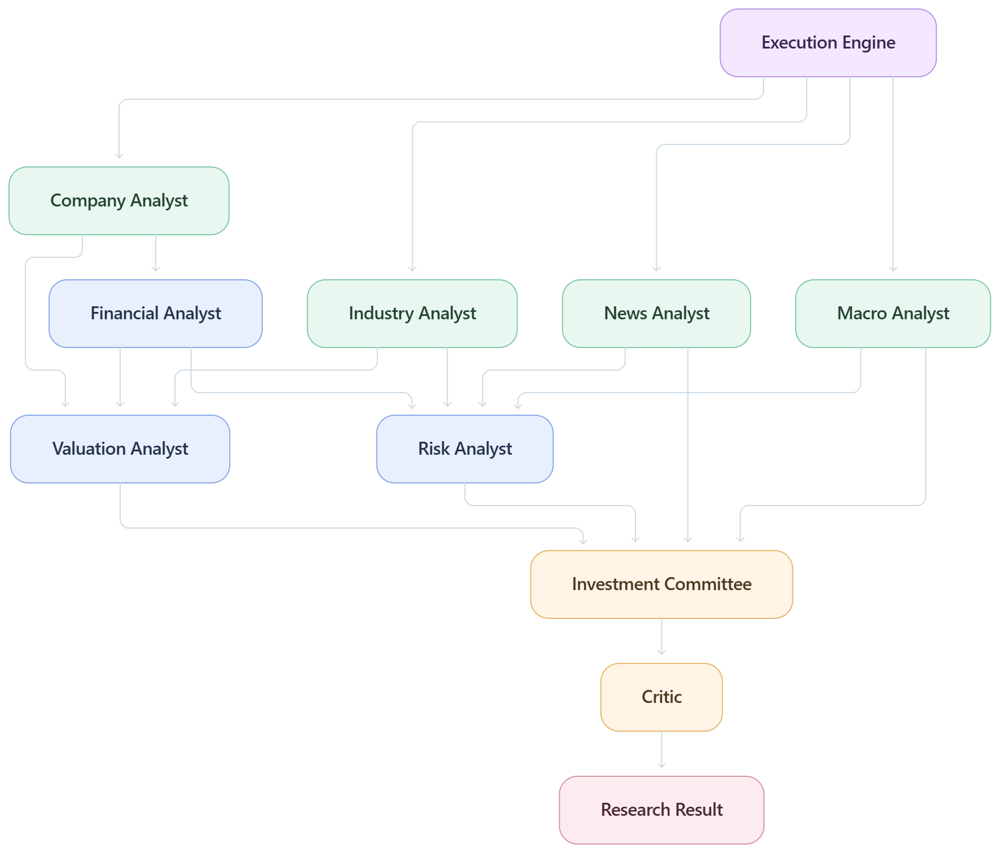
It receives the validated execution plan produced by the Planner and Task Decomposer, resolves task dependencies, dispatches work to the appropriate AI analysts, manages shared state, handles failures and retries, and collects structured outputs for downstream synthesis.

---

## 1. Execution Layer Overview

The execution layer sits between planning and the AI analyst runtime.

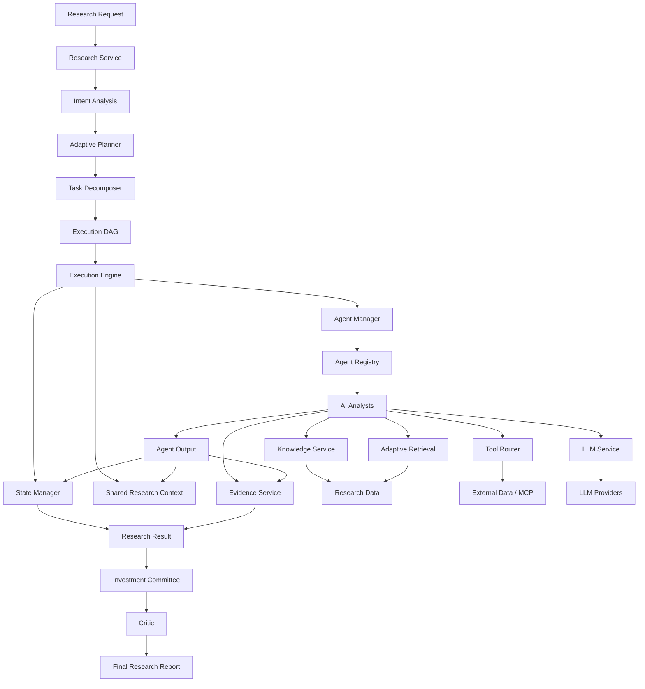
```mermaid
flowchart TD

    A[Research Request] --> B[Research Service]
    B --> C[Intent Analysis]
    C --> D[Adaptive Planner]
    D --> E[Task Decomposer]

    E --> F[Execution DAG]
    F --> G[Execution Engine]

    G --> H[State Manager]
    G --> I[Agent Manager]
    G --> J[Shared Research Context]

    I --> K[Agent Registry]
    K --> L[AI Analysts]

    L --> M[Knowledge Service]
    L --> N[Adaptive Retrieval]
    L --> O[Tool Router]
    L --> P[LLM Service]
    L --> Q[Evidence Service]

    M --> R[Research Data]
    N --> R
    O --> S[External Data / MCP]
    P --> T[LLM Providers]

    L --> U[Agent Output]
    U --> J
    U --> Q
    U --> H

    H --> V[Research Result]
    Q --> V

    V --> W[Investment Committee]
    W --> X[Critic]
    X --> Y[Final Research Report]
```

The Execution Engine therefore coordinates:

* execution plans
* task dependencies
* AI analyst dispatch
* parallel execution
* sequential execution
* shared research context
* execution state
* retries
* failures
* timeouts
* cancellation
* evidence collection
* structured outputs
* observability
* final result assembly

---

# 2. Planning vs Execution

Planning and execution are separate responsibilities.

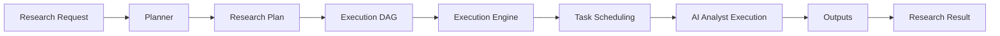
```mermaid
flowchart LR

    A[Research Request] --> B[Planner]

    B --> C[Research Plan]
    C --> D[Execution DAG]

    D --> E[Execution Engine]

    E --> F[Task Scheduling]
    F --> G[AI Analyst Execution]

    G --> H[Outputs]
    H --> I[Research Result]
```

### Planning answers

> **What should Orion do?**

### Execution answers

> **How should Orion execute the plan?**

For example:

```text
Research Request
      |
      v
Planner
      |
      v
Required Analysts
      |
      v
Task DAG
      |
      v
Execution Engine
      |
      +---- Company Analyst
      +---- Financial Analyst
      +---- Industry Analyst
      +---- News Analyst
      +---- Macro Analyst
      +---- Valuation Analyst
      +---- Risk Analyst
      |
      v
Investment Committee
      |
      v
Critic
```

---

# 3. Execution Responsibilities

The Execution Engine is responsible for runtime orchestration.

| Responsibility        | Description                           |
| --------------------- | ------------------------------------- |
| Plan execution        | Execute the DAG produced by planning  |
| Dependency resolution | Ensure prerequisites complete first   |
| Scheduling            | Determine which tasks can run         |
| Dispatch              | Send tasks to appropriate AI analysts |
| Parallelism           | Run independent tasks concurrently    |
| State management      | Track task and research state         |
| Retry handling        | Retry recoverable failures            |
| Timeout handling      | Stop tasks exceeding limits           |
| Cancellation          | Stop active execution when requested  |
| Context propagation   | Provide shared research context       |
| Output collection     | Collect structured analyst results    |
| Evidence propagation  | Preserve evidence and provenance      |
| Observability         | Record traces, metrics and logs       |
| Finalization          | Assemble completed research results   |

---

# 4. Execution Architecture

The runtime can be viewed as several cooperating components.

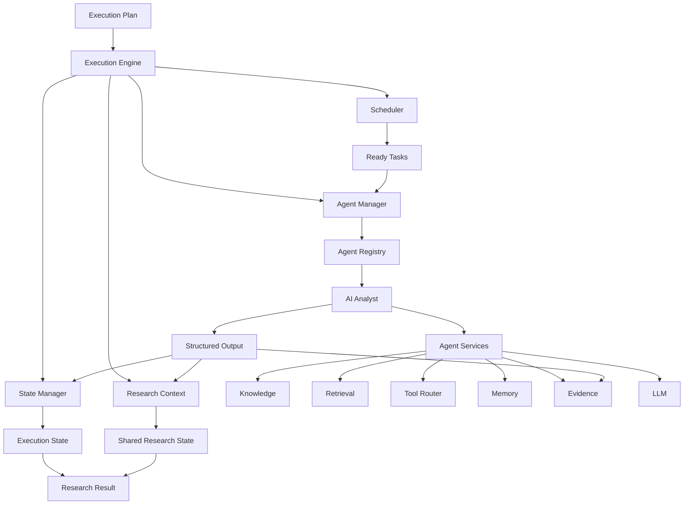
```mermaid
flowchart TD

    A[Execution Plan] --> B[Execution Engine]

    B --> C[Scheduler]
    B --> D[State Manager]
    B --> E[Agent Manager]
    B --> F[Research Context]

    C --> G[Ready Tasks]

    G --> E
    E --> H[Agent Registry]
    H --> I[AI Analyst]

    I --> J[Agent Services]

    J --> K[Knowledge]
    J --> L[Retrieval]
    J --> M[Tool Router]
    J --> N[Memory]
    J --> O[Evidence]
    J --> P[LLM]

    I --> Q[Structured Output]

    Q --> F
    Q --> D
    Q --> O

    D --> R[Execution State]
    F --> S[Shared Research State]

    R --> T[Research Result]
    S --> T
```

---

# 5. Execution DAG

The Execution Engine operates on a **Directed Acyclic Graph (DAG)**.

Each node represents a research task.

Each edge represents a dependency.

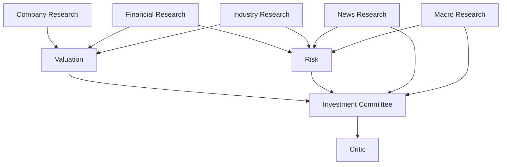
```mermaid
flowchart TD

    A[Company Research]
    B[Financial Research]
    C[Industry Research]
    D[News Research]
    E[Macro Research]

    A --> F[Valuation]
    B --> F
    C --> F

    B --> G[Risk]
    C --> G
    D --> G
    E --> G

    F --> H[Investment Committee]
    G --> H
    D --> H
    E --> H

    H --> I[Critic]
```

The DAG allows Orion to determine:

```text
Which tasks can start immediately?
Which tasks must wait?
Which tasks can execute in parallel?
Which tasks depend on failed tasks?
Which tasks are complete?
Which tasks remain pending?
```

---

# 6. Execution Task

A task represents one executable research unit.

Conceptually:

```text
ExecutionTask
│
├── task_id
├── research_id
├── agent
├── capability
├── input
├── dependencies
├── status
├── priority
├── retry_count
├── timeout
├── started_at
├── completed_at
├── output
└── error
```

A task should have a clear execution boundary.

For example:

```text
Task:
    financial_analysis

Agent:
    Financial Analyst

Input:
    Company = Apple

Dependencies:
    Company Analyst

Output:
    FinancialAnalysisResult

Evidence:
    SEC filings
    financial data
    market data
```

---

# 7. Execution State

The Execution Engine must maintain explicit state.

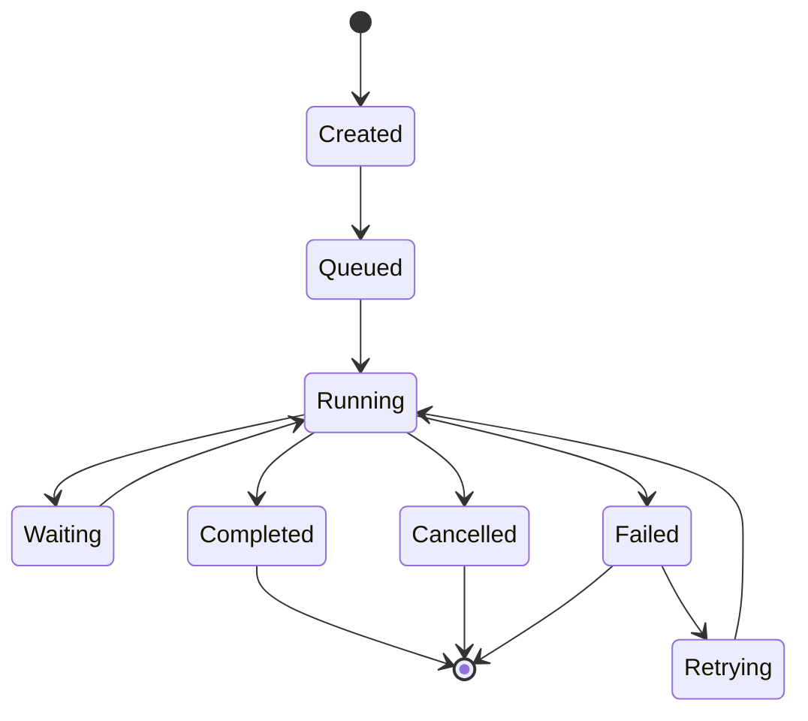
```mermaid
stateDiagram-v2

    [*] --> Created

    Created --> Queued
    Queued --> Running

    Running --> Waiting
    Waiting --> Running

    Running --> Completed
    Running --> Failed
    Running --> Cancelled

    Failed --> Retrying
    Retrying --> Running

    Completed --> [*]
    Cancelled --> [*]
    Failed --> [*]
```

At the research level, Orion can maintain states such as:

```text
CREATED
PLANNING
QUEUED
EXECUTING
WAITING
REVIEWING
COMPLETED
FAILED
CANCELLED
```

---

# 8. Task State Machine

Individual tasks require more granular state.

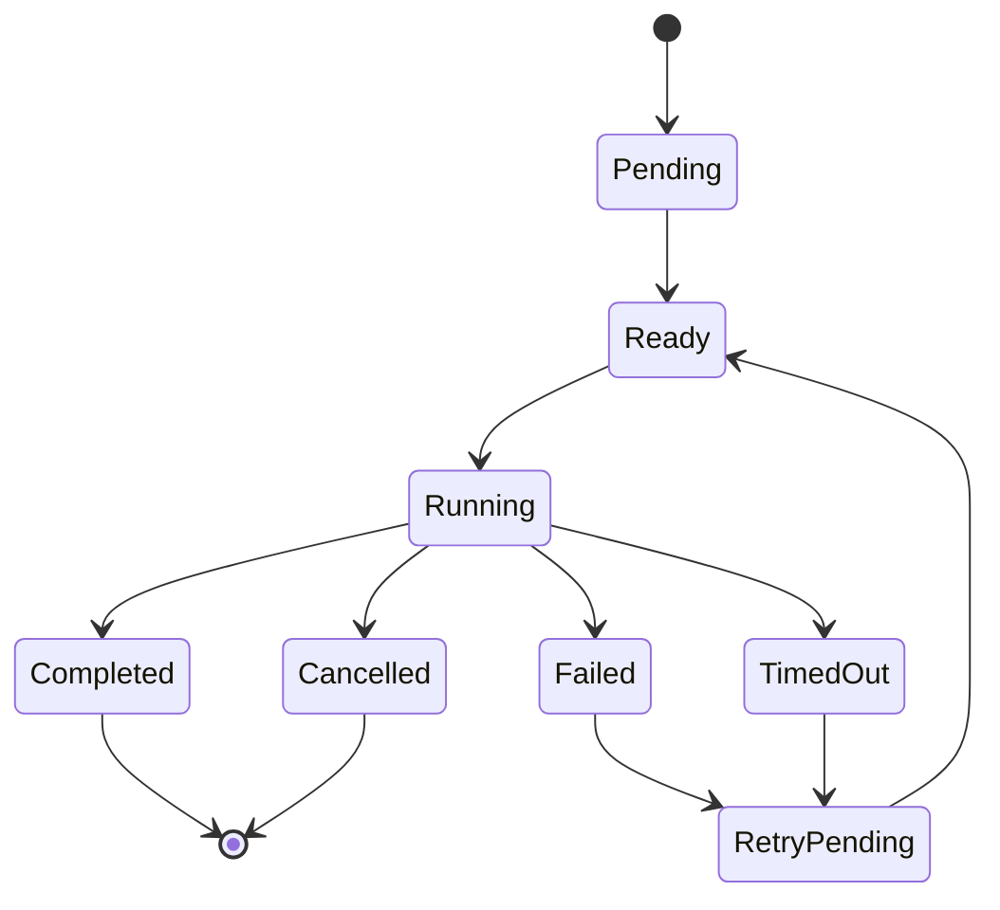
```mermaid
stateDiagram-v2

    [*] --> Pending

    Pending --> Ready
    Ready --> Running

    Running --> Completed
    Running --> Failed
    Running --> TimedOut
    Running --> Cancelled

    Failed --> RetryPending
    TimedOut --> RetryPending

    RetryPending --> Ready

    Completed --> [*]
    Cancelled --> [*]
```

This prevents the system from treating the entire research run as a single opaque operation.

---

# 9. Ready Task Detection

The scheduler identifies tasks whose dependencies have been satisfied.

Example:

```text
Company Analyst
      |
      v
Financial Analyst
      |
      +----> Valuation Analyst
      |
      +----> Risk Analyst
```

Initially:

```text
Company Analyst = READY
Financial Analyst = BLOCKED
Valuation Analyst = BLOCKED
Risk Analyst = BLOCKED
```

After Company Analyst completes:

```text
Company Analyst = COMPLETED
Financial Analyst = READY
```

After Financial Analyst completes:

```text
Financial Analyst = COMPLETED

Valuation Analyst = READY
Risk Analyst = READY
```

Valuation and Risk can then execute concurrently if resources permit.

---

# 10. Dependency Resolution

Dependency resolution is one of the central responsibilities of the Execution Engine.

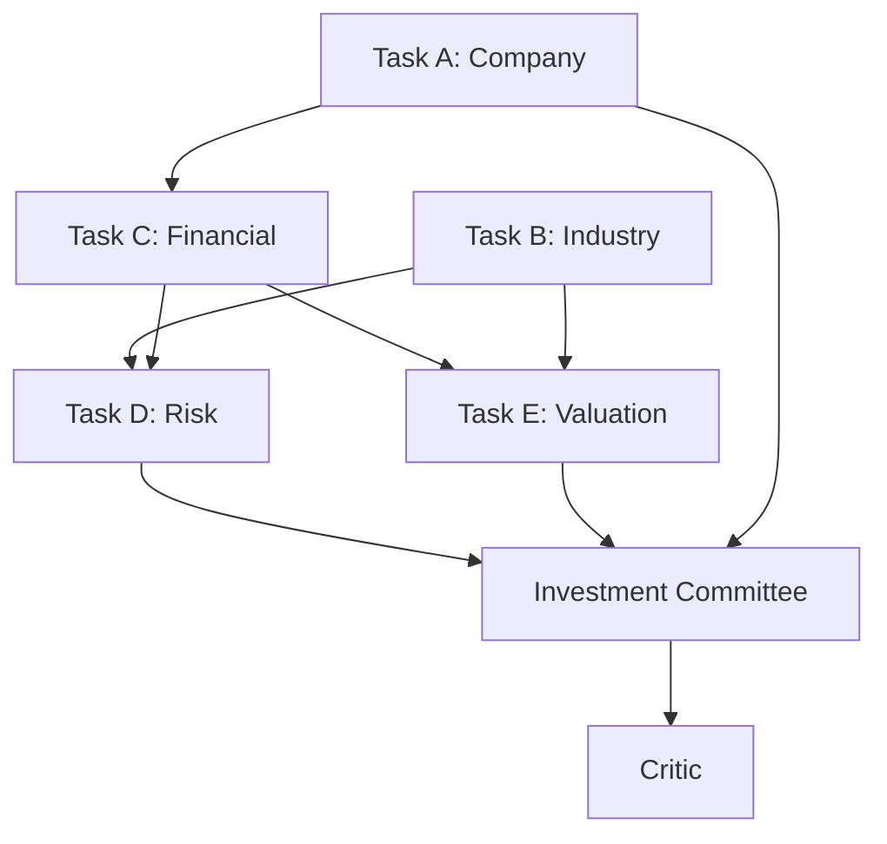
```mermaid
flowchart TD

    A[Task A: Company] --> C[Task C: Financial]
    B[Task B: Industry] --> D[Task D: Risk]

    C --> E[Task E: Valuation]
    B --> E

    C --> D

    D --> F[Investment Committee]
    E --> F
    A --> F

    F --> G[Critic]
```

The engine must never execute a task before its required dependencies are satisfied.

For example:

```text
Valuation Analyst
        |
        +-- requires Financial Analyst
        +-- requires Company Analyst
        +-- may require Industry Analyst
```

Therefore:

```text
Company ──┐
          ├──> Valuation
Financial ┘
```

---

# 11. Parallel Execution

Independent tasks should be executed concurrently when possible.

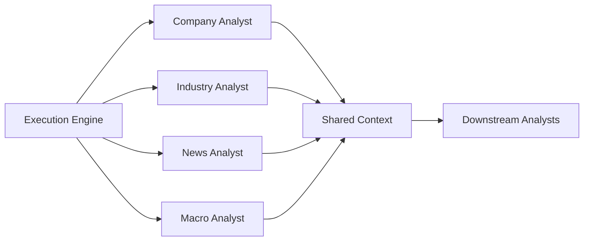
```mermaid
flowchart LR

    A[Execution Engine]

    A --> B[Company Analyst]
    A --> C[Industry Analyst]
    A --> D[News Analyst]
    A --> E[Macro Analyst]

    B --> F[Shared Context]
    C --> F
    D --> F
    E --> F

    F --> G[Downstream Analysts]
```

For example:

```text
Company Analyst   ─┐
Industry Analyst  ─┤
News Analyst      ─┼──> Shared Context
Macro Analyst     ─┘
```

There is no reason for these tasks to execute sequentially if they do not depend on one another.

Parallel execution can reduce total research latency.

---

# 12. Sequential Execution

Some tasks require previous results.

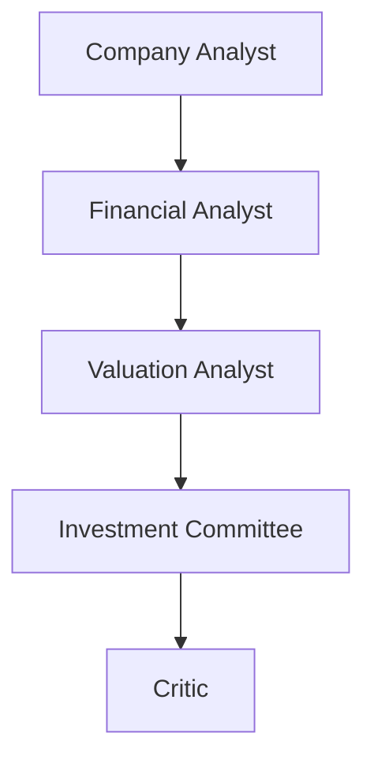
```mermaid
flowchart TD

    A[Company Analyst]
    B[Financial Analyst]
    C[Valuation Analyst]
    D[Investment Committee]
    E[Critic]

    A --> B
    B --> C
    C --> D
    D --> E
```

This creates a dependency chain:

```text
Company
   |
Financial
   |
Valuation
   |
Committee
   |
Critic
```

The Execution Engine waits for each prerequisite before dispatching the next task.

---

# 13. Mixed Parallel and Sequential Execution

Most real research workflows contain both.

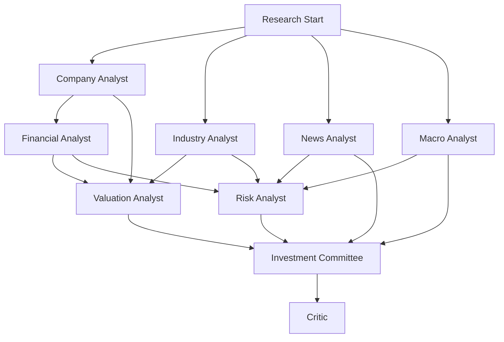
```mermaid
flowchart TD

    A[Research Start]

    A --> B[Company Analyst]
    A --> C[Industry Analyst]
    A --> D[News Analyst]
    A --> E[Macro Analyst]

    B --> F[Financial Analyst]

    B --> G[Valuation Analyst]
    F --> G
    C --> G

    C --> H[Risk Analyst]
    D --> H
    E --> H
    F --> H

    G --> I[Investment Committee]
    H --> I
    D --> I
    E --> I

    I --> J[Critic]
```

This pattern allows Orion to maximize useful parallelism while preserving correctness.

---

# 14. Agent Dispatch

The Execution Engine does not need to hard-code every analyst.

Instead, it can use the Agent Manager and Agent Registry.

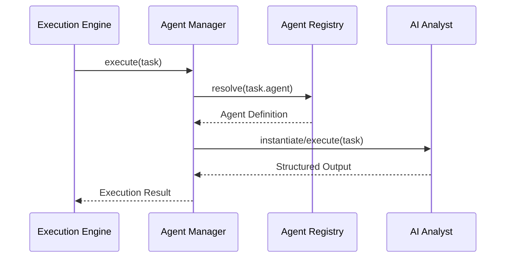
```mermaid
sequenceDiagram

    participant EE as Execution Engine
    participant AM as Agent Manager
    participant AR as Agent Registry
    participant AG as AI Analyst

    EE->>AM: execute(task)
    AM->>AR: resolve(task.agent)
    AR-->>AM: Agent Definition
    AM->>AG: instantiate/execute(task)
    AG-->>AM: Structured Output
    AM-->>EE: Execution Result
```

The flow is:

```text
Execution Task
      |
      v
Execution Engine
      |
      v
Agent Manager
      |
      v
Agent Registry
      |
      v
AI Analyst
```

---

# 15. Agent Manager Integration

The Agent Manager acts as the runtime composition layer.

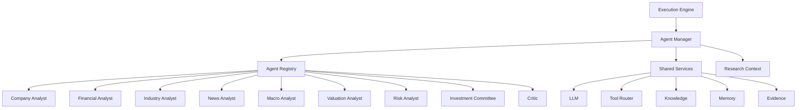
```mermaid
flowchart TD

    A[Execution Engine] --> B[Agent Manager]

    B --> C[Agent Registry]
    B --> D[Shared Services]
    B --> E[Research Context]

    C --> F[Company Analyst]
    C --> G[Financial Analyst]
    C --> H[Industry Analyst]
    C --> I[News Analyst]
    C --> J[Macro Analyst]
    C --> K[Valuation Analyst]
    C --> L[Risk Analyst]
    C --> M[Investment Committee]
    C --> N[Critic]

    D --> O[LLM]
    D --> P[Tool Router]
    D --> Q[Knowledge]
    D --> R[Memory]
    D --> S[Evidence]
```

This keeps runtime construction centralized.

---

# 16. Shared Research Context

Agents should not communicate through direct object references.

Instead, the Execution Engine provides a shared research context.

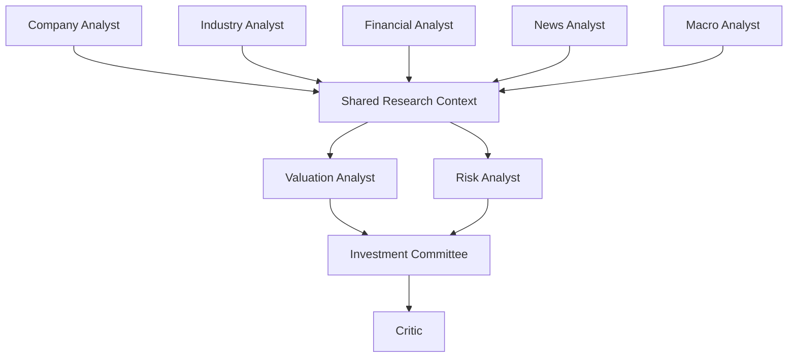
```mermaid
flowchart TD

    A[Company Analyst] --> C[Shared Research Context]
    B[Industry Analyst] --> C
    D[Financial Analyst] --> C
    E[News Analyst] --> C
    F[Macro Analyst] --> C

    C --> G[Valuation Analyst]
    C --> H[Risk Analyst]

    G --> I[Investment Committee]
    H --> I

    I --> J[Critic]
```

The context can contain:

```text
research metadata
company information
financial findings
industry findings
news findings
macro findings
valuation assumptions
risk findings
evidence references
agent outputs
execution state
```

---

# 17. Context Propagation

When one analyst completes a task, its output can become available to downstream tasks.

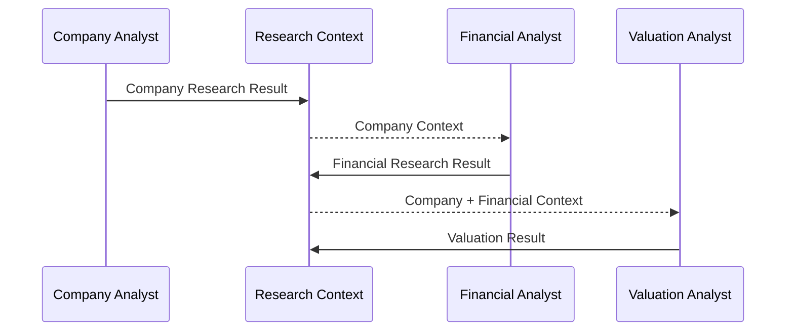
```mermaid
sequenceDiagram

    participant A as Company Analyst
    participant C as Research Context
    participant F as Financial Analyst
    participant V as Valuation Analyst

    A->>C: Company Research Result
    C-->>F: Company Context
    F->>C: Financial Research Result
    C-->>V: Company + Financial Context
    V->>C: Valuation Result
```

This creates controlled information sharing without requiring direct agent-to-agent calls.

---

# 18. Execution Result

Each task should produce a structured result.

Conceptually:

```text
ExecutionResult
│
├── task_id
├── agent
├── status
├── output
├── evidence
├── metrics
├── warnings
├── errors
├── started_at
└── completed_at
```

Example:

```text
Agent:
Financial Analyst

Status:
COMPLETED

Output:
Revenue growth
Margin trends
Cash-flow analysis
Balance-sheet observations

Evidence:
SEC filings
Financial statements
Market data

Metrics:
Execution latency
Token usage
Tool calls
Retrieval calls
```

---

# 19. Evidence During Execution

Evidence should be collected during execution rather than reconstructed afterward.

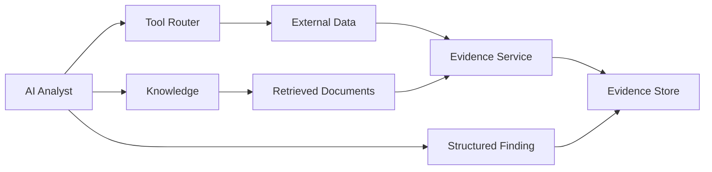
```mermaid
flowchart LR

    A[AI Analyst] --> B[Tool Router]
    B --> C[External Data]

    A --> D[Knowledge]
    D --> E[Retrieved Documents]

    C --> F[Evidence Service]
    E --> F

    F --> G[Evidence Store]

    A --> H[Structured Finding]
    H --> G
```

A research finding should be associated with its supporting evidence whenever possible.

---

# 20. Tool Execution

AI analysts access external information through the Tool Router.

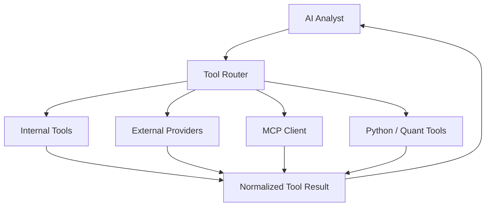
```mermaid
flowchart TD

    A[AI Analyst] --> B[Tool Router]

    B --> C[Internal Tools]
    B --> D[External Providers]
    B --> E[MCP Client]
    B --> F[Python / Quant Tools]

    C --> G[Normalized Tool Result]
    D --> G
    E --> G
    F --> G

    G --> A
```

The Execution Engine itself should not become a data-access layer.

Its responsibility is orchestration.

The Tool Router is responsible for tool execution.

---

# 21. MCP Integration

MCP sits behind the Tool Router.

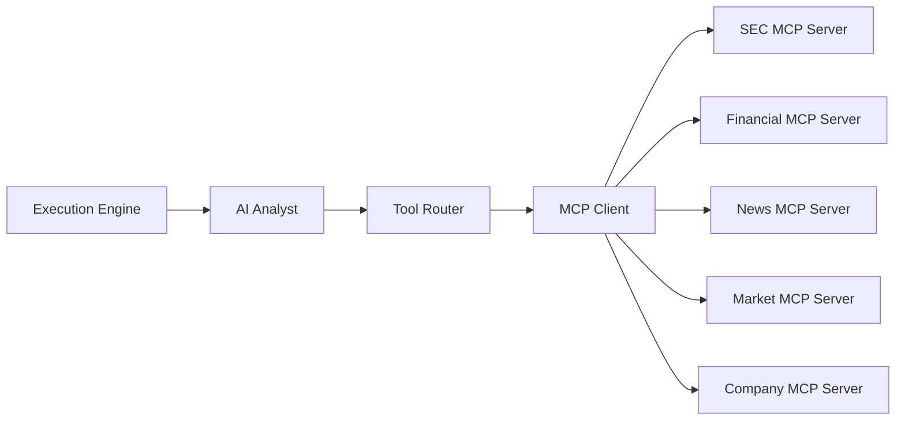
```mermaid
flowchart LR

    A[Execution Engine]
    B[AI Analyst]
    C[Tool Router]
    D[MCP Client]

    A --> B
    B --> C
    C --> D

    D --> E[SEC MCP Server]
    D --> F[Financial MCP Server]
    D --> G[News MCP Server]
    D --> H[Market MCP Server]
    D --> I[Company MCP Server]
```

This keeps the execution layer independent from specific external integrations.

---

# 22. Knowledge and Retrieval During Execution

Analysts may need different sources of information.

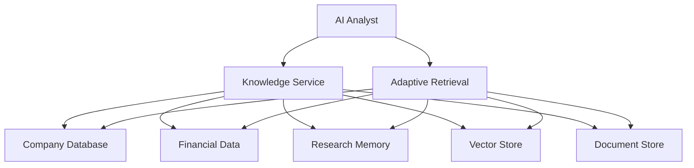
```mermaid
flowchart TD

    A[AI Analyst] --> B[Knowledge Service]

    B --> C[Company Database]
    B --> D[Financial Data]
    B --> E[Research Memory]
    B --> F[Vector Store]
    B --> G[Document Store]

    A --> H[Adaptive Retrieval]

    H --> C
    H --> D
    H --> E
    H --> F
    H --> G
```

The Execution Engine coordinates the analyst but does not determine every retrieval operation.

---

# 23. LLM Execution

The LLM Service provides reasoning and structured generation.

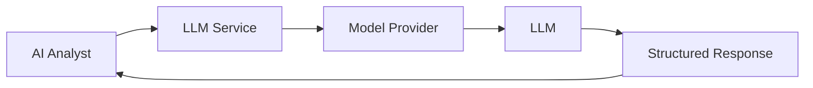
```mermaid
flowchart LR

    A[AI Analyst] --> B[LLM Service]

    B --> C[Model Provider]
    C --> D[LLM]

    D --> E[Structured Response]

    E --> A
```

The LLM should not become the execution controller.

The Execution Engine remains responsible for workflow state and task orchestration.

---

# 24. Execution and LLM Separation

The architectural separation is:

```text
Execution Engine
    |
    | controls
    v
Research Workflow

AI Analyst
    |
    | uses
    v
LLM Service

LLM
    |
    | reasons over
    v
Research Context + Evidence + Tool Results
```

This prevents the system from relying on an unconstrained LLM to control the entire application.

---

# 25. Retry Handling

Not every failure requires the entire research run to fail.

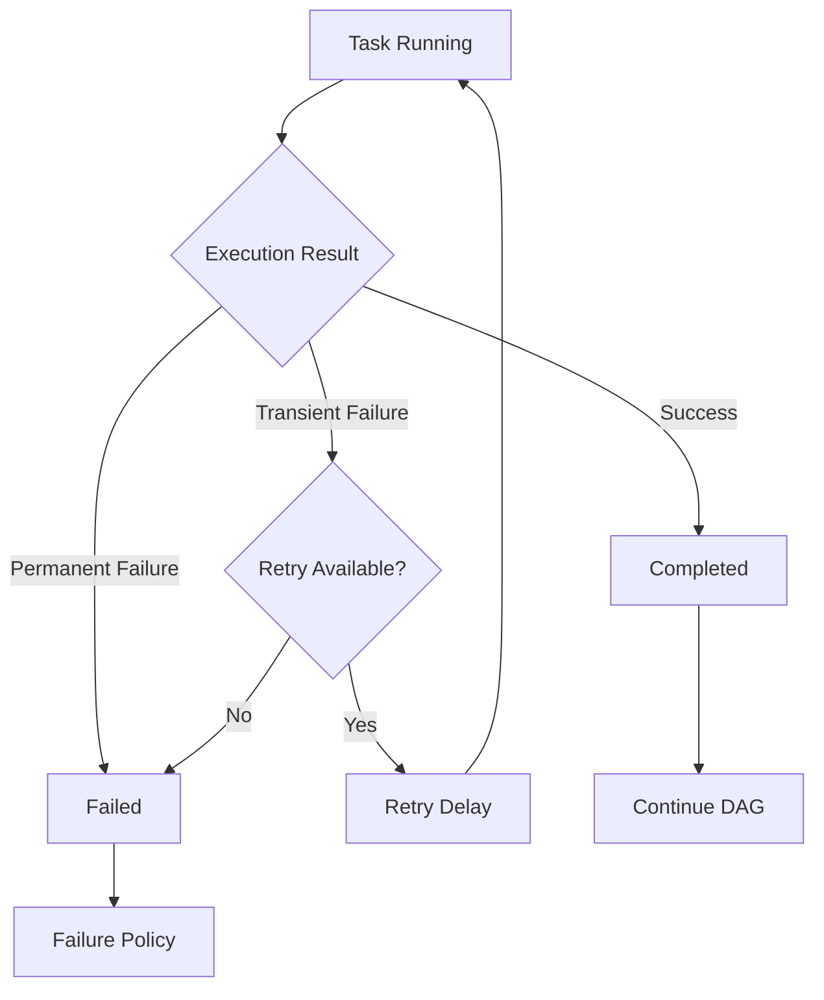
```mermaid
flowchart TD

    A[Task Running] --> B{Execution Result}

    B -->|Success| C[Completed]
    B -->|Transient Failure| D{Retry Available?}
    B -->|Permanent Failure| E[Failed]

    D -->|Yes| F[Retry Delay]
    F --> A

    D -->|No| E

    C --> G[Continue DAG]
    E --> H[Failure Policy]
```

Typical retryable failures may include:

* temporary provider errors
* network timeouts
* rate limits
* temporary service unavailability
* transient database failures

Permanent failures may include:

* invalid task configuration
* unsupported capability
* invalid input
* unavailable required data
* schema validation failure

---

# 26. Retry Policy

A task can maintain:

```text
retry_count
max_retries
retry_delay
backoff_strategy
last_error
```

Conceptually:

```text
Attempt 1
   |
failure
   |
backoff
   |
Attempt 2
   |
failure
   |
backoff
   |
Attempt 3
   |
failure
   |
Task Failed
```

The retry policy should be bounded.

Unbounded retries can create:

* resource exhaustion
* excessive latency
* excessive API costs
* duplicate external requests

---

# 27. Timeout Handling

Every execution task should have an execution boundary.

```mermaid
flowchart TD

    A[Task Start] --> B[Start Timer]
    B --> C[Execute Analyst]

    C --> D{Completed Before Timeout?}

    D -->|Yes| E[Completed]
    D -->|No| F[Timed Out]

    F --> G[Retry Policy]
    F --> H[Record Timeout]

    G --> I[Retry or Fail]
```

Timeouts should be recorded as part of execution telemetry.

---

# 28. Failure Isolation

A failure in one task does not necessarily mean the entire research run must fail.

```mermaid
flowchart TD

    A[Research Execution]

    A --> B[Company]
    A --> C[Financial]
    A --> D[Industry]
    A --> E[News]

    B --> F[Valuation]
    C --> F
    D --> F

    D --> G[Risk]
    E --> G

    C --> H[Financially Dependent Task]

    I[News Failure] --> J[Failure Policy]

    J --> K[Skip]
    J --> L[Retry]
    J --> M[Degrade]
```

The appropriate behavior depends on task criticality.

For example:

```text
Required task failure
        |
        v
Research may be blocked

Optional task failure
        |
        v
Research may continue
```

---

# 29. Critical vs Optional Tasks

Tasks can be classified conceptually as:

```text
CRITICAL
OPTIONAL
BEST_EFFORT
```

Example:

```text
Financial Analysis
    -> CRITICAL

Company Analysis
    -> CRITICAL

News Analysis
    -> BEST_EFFORT

Macro Analysis
    -> OPTIONAL / configuration-dependent
```

The final policy should be determined by the research plan.

---

# 30. Cancellation

Users may cancel an active research run.

```mermaid
sequenceDiagram

    participant U as User
    participant API as API
    participant EE as Execution Engine
    participant W as Active Workers
    participant S as State Manager

    U->>API: Cancel Research
    API->>EE: cancel(research_id)
    EE->>W: Cancel active tasks
    EE->>S: Mark execution cancelled
    S-->>EE: State updated
    EE-->>API: Cancellation acknowledged
    API-->>U: Research Cancelled
```

Cancellation should propagate to active work where supported.

---

# 31. Execution Concurrency

Parallel execution should be controlled.

```text
Execution Engine
      |
      v
Concurrency Controller
      |
      +---- Worker 1
      +---- Worker 2
      +---- Worker 3
      +---- Worker 4
```

The system should consider:

* CPU capacity
* memory
* provider rate limits
* LLM concurrency
* database connections
* external API quotas
* task priority

Uncontrolled parallelism can increase system instability.

---

# 32. Worker Model

Workers execute individual tasks.

```mermaid
flowchart TD

    A[Execution Engine] --> B[Task Queue]

    B --> C[Worker 1]
    B --> D[Worker 2]
    B --> E[Worker 3]
    B --> F[Worker N]

    C --> G[AI Analyst]
    D --> H[AI Analyst]
    E --> I[AI Analyst]
    F --> J[AI Analyst]

    G --> K[Result]
    H --> K
    I --> K
    J --> K

    K --> L[Execution Engine]
```

The Worker should focus on execution.

The Execution Engine should remain responsible for orchestration.

---

# 33. Worker Lifecycle

A worker can conceptually follow:

```text
Receive Task
     |
     v
Validate Task
     |
     v
Load Context
     |
     v
Resolve Agent
     |
     v
Execute Agent
     |
     v
Collect Evidence
     |
     v
Persist Result
     |
     v
Update State
     |
     v
Return Result
```

---

# 34. State Manager

The State Manager maintains execution state independently from agent logic.

```mermaid
flowchart TD

    A[Execution Engine] --> B[State Manager]

    B --> C[Research State]
    B --> D[Task State]
    B --> E[Agent State]
    B --> F[Retry State]
    B --> G[Timing Metadata]

    C --> H[(PostgreSQL)]
    D --> H
    E --> H
```

This provides durable execution tracking.

---

# 35. State Persistence

Research execution should not depend entirely on process memory.

Conceptually:

```text
Runtime
   |
   +-- In-memory execution state
   |
   +-- Shared research context
   |
   +-- Persistent database state
```

Persistent state enables:

* research history
* workspace recovery
* progress tracking
* debugging
* auditability
* retry after service restart
* reporting

---

# 36. Execution Recovery

If a worker or service crashes:

```mermaid
flowchart TD

    A[Execution Started] --> B[Task State Persisted]
    B --> C[Worker Executes]

    C --> D{Process Failure}

    D --> E[Task Remains Recoverable]

    E --> F[Recovery Worker]
    F --> G[Load Persisted State]
    G --> H[Resume / Retry]

    H --> I[Continue Research]
```

Persistent state allows Orion to distinguish:

```text
completed
running
stalled
failed
cancelled
```

rather than losing the entire execution history.

---

# 37. Idempotency

Execution should avoid accidental duplicate work.

For example:

```text
research_id
+
task_id
+
execution_attempt
```

can identify a specific execution attempt.

The system should consider idempotency when:

* retrying external API calls
* saving results
* writing evidence
* updating research state
* publishing events

---

# 38. Execution Events

The execution layer can emit internal events.

```mermaid
flowchart LR

    A[Execution Engine] --> B[Event Bus]

    B --> C[Task Started]
    B --> D[Task Completed]
    B --> E[Task Failed]
    B --> F[Task Retried]
    B --> G[Research Completed]

    B --> H[Observability]
    B --> I[Notifications]
    B --> J[Workspace Updates]
```

Potential events include:

```text
research.created
research.started
task.queued
task.started
task.completed
task.failed
task.retrying
task.cancelled
research.reviewing
research.completed
research.failed
```

---

# 39. Live Progress

Execution state can drive frontend progress.

```mermaid
flowchart TD

    A[Execution Engine] --> B[Execution Events]
    B --> C[API / Streaming Layer]
    C --> D[Research Workspace]

    D --> E[Company Analyst ✓]
    D --> F[Financial Analyst ✓]
    D --> G[Industry Analyst ✓]
    D --> H[Valuation Analyst ...]
    D --> I[Risk Analyst ...]
    D --> J[Critic Pending]
```

This allows users to see the research process instead of waiting for a single opaque response.

---

# 40. Execution Observability

Every execution should be observable.

```mermaid
flowchart TD

    A[Execution Engine]

    A --> B[Research Trace]
    A --> C[Task Metrics]
    A --> D[Execution Logs]
    A --> E[Cost Tracking]

    B --> F[Observability Platform]
    C --> F
    D --> F
    E --> F
```

Important execution metrics include:

```text
research duration
task duration
queue latency
agent execution latency
tool latency
retrieval latency
LLM latency
retry count
failure count
token usage
estimated cost
tasks completed
tasks skipped
```

---

# 41. Trace Hierarchy

Execution tracing can follow the research hierarchy.

```text
Research Trace
│
├── Planning Span
│
├── Execution Span
│   │
│   ├── Company Agent
│   │   ├── Retrieval
│   │   ├── Tool Call
│   │   └── LLM Call
│   │
│   ├── Financial Agent
│   │   ├── Retrieval
│   │   ├── Tool Call
│   │   └── LLM Call
│   │
│   └── Valuation Agent
│       ├── Retrieval
│       ├── Tool Call
│       └── LLM Call
│
├── Committee Span
│
└── Critic Span
```

This makes performance bottlenecks easier to locate.

---

# 42. Execution Logging

Logs should contain structured execution information.

Conceptually:

```text
timestamp
research_id
task_id
agent
status
attempt
duration
tool
provider
error
```

Sensitive information such as:

```text
API keys
tokens
credentials
private secrets
```

must not be written into logs.

---

# 43. Execution Security

The Execution Engine is a security boundary.

It should validate:

```text
research ownership
authorization
task configuration
agent capability
tool permissions
input schemas
output schemas
external content
resource limits
```

External data should be treated as untrusted.

```mermaid
flowchart TD

    A[External Content] --> B[Tool / Retrieval Layer]
    B --> C[Validation]
    C --> D[Evidence]
    D --> E[AI Analyst]

    E --> F[Structured Output]
    F --> G[Execution Engine]
```

The system should not allow retrieved documents or external content to redefine execution policies.

---

# 44. Prompt Injection Boundary

Research documents and web content may contain malicious instructions.

The architecture therefore separates:

```text
External Content
       |
       v
Retrieved Evidence
       |
       v
AI Analyst Context
       |
       v
Structured Output
       |
       v
Execution Engine
```

External content should be treated as **data**, not as trusted system instructions.

The Execution Engine retains control over:

* task sequencing
* tool access
* permissions
* retries
* state transitions
* workflow completion

---

# 45. Output Validation

Agent outputs should be validated before being accepted.

```mermaid
flowchart TD

    A[AI Analyst] --> B[Raw Output]
    B --> C[Schema Validation]

    C -->|Valid| D[Evidence Validation]
    C -->|Invalid| E[Reject / Retry]

    D -->|Valid| F[Persist Result]
    D -->|Invalid| G[Flag for Review]

    F --> H[Shared Research Context]
```

This protects downstream analysts from malformed results.

---

# 46. Research Completion

The research run should not be marked complete simply because all workers stopped.

A completion pipeline can be:

```mermaid
flowchart TD

    A[All Required Tasks Complete]
    A --> B[Collect Results]
    B --> C[Validate Outputs]
    C --> D[Validate Evidence]
    D --> E[Investment Committee]
    E --> F[Critic]
    F --> G{Review Passed?}

    G -->|Yes| H[Research Completed]
    G -->|No| I[Revision / Re-execution]

    I --> E
```

This creates a distinction between:

```text
execution completion
```

and

```text
research completion
```

---

# 47. Investment Committee Execution

The Investment Committee should execute after the required analyst outputs are available.

```mermaid
flowchart TD

    A[Company Analysis] --> G[Investment Committee]
    B[Financial Analysis] --> G
    C[Industry Analysis] --> G
    D[News Analysis] --> G
    E[Macro Analysis] --> G
    F[Valuation Analysis] --> G
    H[Risk Analysis] --> G

    G --> I[Integrated Research Thesis]
```

The committee synthesizes rather than independently replacing every specialist analysis.

---

# 48. Critic Execution

The Critic executes after synthesis.

```mermaid
flowchart LR

    A[Analyst Outputs] --> B[Investment Committee]
    B --> C[Draft Research Result]
    C --> D[Critic]

    D --> E[Evidence Check]
    D --> F[Numerical Check]
    D --> G[Consistency Check]
    D --> H[Completeness Check]

    E --> I[Review Result]
    F --> I
    G --> I
    H --> I
```

The Critic can identify:

* unsupported claims
* missing evidence
* inconsistent numbers
* contradictory analyst outputs
* missing sections
* unsupported assumptions
* citation problems

---

# 49. Re-execution

A failed review does not necessarily require restarting the entire research run.

```mermaid
flowchart TD

    A[Critic] --> B{Issue Detected?}

    B -->|No| C[Complete]
    B -->|Yes| D[Identify Affected Task]

    D --> E[Re-execute Required Analyst]
    E --> F[Update Shared Context]
    F --> G[Investment Committee]
    G --> H[Critic]

    H --> B
```

This supports targeted correction.

---

# 50. Execution Result Assembly

The final result combines:

```text
Research Metadata
+
Analyst Outputs
+
Evidence
+
Valuation
+
Risk
+
Committee Synthesis
+
Critic Review
+
Execution Metadata
```

Conceptually:

```mermaid
flowchart TD

    A[Research Metadata]
    B[Agent Outputs]
    C[Evidence]
    D[Valuation]
    E[Risk]
    F[Committee]
    G[Critic]
    H[Execution Metadata]

    A --> I[Research Result]
    B --> I
    C --> I
    D --> I
    E --> I
    F --> I
    G --> I
    H --> I

    I --> J[Research Workspace]
    J --> K[Report]
    K --> L[Library]
```

---

# 51. Execution to Workspace

Execution results become available to the Research Workspace.

```mermaid
flowchart LR

    A[Execution Engine] --> B[Research Result]

    B --> C[Research Workspace]

    C --> D[Analysis]
    C --> E[Documents]
    C --> F[Evidence]
    C --> G[Reports]

    G --> H[Library]
```

This separates runtime execution from the user-facing research experience.

---

# 52. Execution API Boundary

Conceptually, the API layer communicates with the execution system through the Research Service.

```mermaid
sequenceDiagram

    participant UI as Orion UI
    participant API as API Layer
    participant RS as Research Service
    participant EE as Execution Engine
    participant DB as PostgreSQL

    UI->>API: Start Research
    API->>RS: Create Research Run
    RS->>DB: Persist Research
    RS->>EE: Execute Plan
    EE->>DB: Update State
    EE-->>RS: Execution Started
    RS-->>API: Research ID
    API-->>UI: Research Created
```

The frontend does not directly control individual AI analysts.

---

# 53. Complete Runtime Flow

The complete execution path is:

```mermaid
flowchart TD

    A[User] --> B[Orion Web Application]
    B --> C[Research API]
    C --> D[Research Service]

    D --> E[Planner]
    E --> F[Task Decomposer]
    F --> G[Execution DAG]

    G --> H[Execution Engine]

    H --> I[Scheduler]
    H --> J[State Manager]
    H --> K[Agent Manager]
    H --> L[Shared Research Context]

    K --> M[Agent Registry]

    M --> N[Company Analyst]
    M --> O[Financial Analyst]
    M --> P[Industry Analyst]
    M --> Q[News Analyst]
    M --> R[Macro Analyst]
    M --> S[Valuation Analyst]
    M --> T[Risk Analyst]

    N --> L
    O --> L
    P --> L
    Q --> L
    R --> L

    N --> U[Knowledge / Retrieval / Tools / LLM]
    O --> U
    P --> U
    Q --> U
    R --> U
    S --> U
    T --> U

    S --> L
    T --> L

    L --> V[Investment Committee]
    V --> W[Critic]

    W --> X[Research Result]
    X --> Y[Research Workspace]
    Y --> Z[Report / Library]
```

---

# 54. Conceptual Module Structure

The execution layer fits into the broader backend architecture as follows:

```text
backend/
└── app/
    ├── planning/
    │   ├── planner.py
    │   ├── task_decomposer.py
    │   └── templates/
    │
    ├── execution/
    │   ├── execution_engine.py
    │   ├── worker.py
    │   └── state_manager.py
    │
    ├── agents/
    │   └── base/
    │       ├── base_agent.py
    │       ├── agent_manager.py
    │       ├── agent_services.py
    │       └── registry.py
    │
    ├── memory/
    │
    ├── knowledge/
    │
    ├── evidence/
    │
    ├── tools/
    │
    ├── mcp/
    │
    ├── observability/
    │
    └── evaluation/
```

---

# 55. Execution Engine Responsibilities by Component

| Component             | Responsibility                           |
| --------------------- | ---------------------------------------- |
| `execution_engine.py` | Main runtime orchestration               |
| `worker.py`           | Execute individual tasks                 |
| `state_manager.py`    | Track research/task execution state      |
| Agent Manager         | Construct and provide analysts           |
| Agent Registry        | Resolve agent metadata and capabilities  |
| Shared Context        | Exchange research state between tasks    |
| Evidence Service      | Store provenance and supporting evidence |
| Tool Router           | Execute tools and external integrations  |
| Knowledge Service     | Provide normalized research information  |
| LLM Service           | Provide model inference                  |
| Event Bus             | Publish execution lifecycle events       |
| Observability         | Record execution telemetry               |

---

# 56. Execution Engine vs Worker

The distinction is important.

```text
Execution Engine
        |
        | decides
        v
WHAT runs
WHEN it runs
WHAT depends on what
WHAT happens after failure
WHEN research is complete

Worker
        |
        | performs
        v
Execute ONE task
```

This prevents worker processes from becoming hidden workflow controllers.

---

# 57. Execution Engine vs Agent Manager

Similarly:

```text
Execution Engine
    |
    | orchestration
    v
"Run Financial Analysis"

Agent Manager
    |
    | composition
    v
"Provide Financial Analyst"

Financial Analyst
    |
    | reasoning
    v
"Perform Financial Analysis"
```

Each layer has a distinct responsibility.

---

# 58. Execution Engine Design Principles

### 58.1 Dependency aware

Tasks execute according to explicit dependencies.

### 58.2 Observable

Every important state transition should be measurable.

### 58.3 Recoverable

Failures should not automatically destroy the entire research run.

### 58.4 Idempotent

Retries should minimize duplicate side effects.

### 58.5 Structured

Tasks and outputs should use explicit schemas.

### 58.6 Modular

The engine should not contain business logic belonging to individual analysts.

### 58.7 Extensible

New analysts should be registerable without rewriting the scheduler.

### 58.8 Secure

Execution policies must remain controlled by trusted application code.

---

# 59. Execution Lifecycle

The overall runtime lifecycle can be summarized as:

```text
Research Created
       |
       v
Plan Loaded
       |
       v
DAG Validated
       |
       v
Tasks Queued
       |
       v
Ready Tasks Dispatched
       |
       v
AI Analysts Execute
       |
       v
Results + Evidence Stored
       |
       v
Dependencies Resolved
       |
       v
Next Tasks Execute
       |
       v
Investment Committee
       |
       v
Critic
       |
       v
Research Result
       |
       v
Workspace
       |
       v
Report / Library
```

---

# 60. Execution Mental Model

A useful mental model for Orion is:

```text
Planner
  ↓
creates the plan

Task Decomposer
  ↓
creates the dependency graph

Execution Engine
  ↓
runs the graph

Worker
  ↓
executes individual tasks

Agent Manager
  ↓
provides the AI analyst

AI Analyst
  ↓
performs specialized reasoning

Shared Services
  ↓
provide memory, knowledge, evidence, tools and LLM access

State Manager
  ↓
tracks execution

Investment Committee
  ↓
synthesizes findings

Critic
  ↓
reviews the result

Research Result
  ↓
feeds the workspace and reports
```

---

# 61. Final Execution Architecture

```mermaid
flowchart TB

    subgraph Planning
        A[Research Request]
        B[Planner]
        C[Task Decomposer]
        D[Execution DAG]
    end

    subgraph Runtime["Execution Runtime"]
        E[Execution Engine]
        F[Scheduler]
        G[State Manager]
        H[Worker Pool]
    end

    subgraph Agents["AI Analyst Layer"]
        I[Agent Manager]
        J[Agent Registry]
        K[Specialized AI Analysts]
        L[Investment Committee]
        M[Critic]
    end

    subgraph Shared["Shared Research Services"]
        N[Research Context]
        O[Memory]
        P[Knowledge]
        Q[Adaptive Retrieval]
        R[Evidence]
        S[Tool Router]
        T[LLM Service]
    end

    subgraph External["External Systems"]
        U[MCP Servers]
        V[External Providers]
        W[Documents / Vector Store]
        X[PostgreSQL]
    end

    A --> B
    B --> C
    C --> D

    D --> E
    E --> F
    E --> G
    E --> H

    H --> I
    I --> J
    J --> K

    K --> N
    K --> O
    K --> P
    K --> Q
    K --> R
    K --> S
    K --> T

    S --> U
    S --> V
    P --> W
    G --> X
    R --> X
    N --> X

    K --> L
    L --> M

    M --> Y[Research Result]
```

---

# 62. Relationship With the Rest of Orion

The Execution Engine connects the major architectural layers:

```text
                  ORION AI

                     │
                     ▼
              Research Service
                     │
                     ▼
                  Planning
                     │
                     ▼
              Execution Engine
                     │
          ┌──────────┼──────────┐
          ▼          ▼          ▼
       Agents     Context     State
          │          │          │
          └──────┬───┘          │
                 ▼              │
        Shared Research         │
            Services            │
                 │              │
      ┌──────────┼──────────┐   │
      ▼          ▼          ▼   │
  Knowledge    Tools       LLM  │
      │          │          │   │
      └──────────┼──────────┘   │
                 ▼              │
              Evidence          │
                 │              │
                 ▼              │
        Investment Committee    │
                 │              │
                 ▼              │
               Critic           │
                 │              │
                 └──────┬───────┘
                        ▼
                 Research Result
                        │
                        ▼
                Research Workspace
                        │
                        ▼
                   Reports / Library
```

The key architectural principle is:

> **The Execution Engine orchestrates work; AI analysts perform research; shared services provide capabilities; persistent state records what happened.**

---

# 63. Summary

The Orion AI Execution Engine transforms a research plan into a controlled, observable runtime workflow.

Its primary responsibilities are:

1. Load the validated execution DAG.
2. Resolve task dependencies.
3. Identify ready tasks.
4. Dispatch tasks to AI analysts.
5. Execute independent tasks concurrently.
6. Maintain shared research context.
7. Track execution state.
8. Handle retries and timeouts.
9. Isolate recoverable failures.
10. Collect structured outputs.
11. Preserve evidence and provenance.
12. Publish execution events.
13. Provide observability.
14. Execute synthesis and criticism stages.
15. Assemble the final research result.
16. Persist the result for the Research Workspace, Reports, and Library.

The resulting architecture separates **planning, orchestration, reasoning, data access, state management, evidence, and presentation**.

That separation allows Orion to evolve from a collection of AI agents into a structured **multi-agent research execution platform**.
