# Orion AI — Knowledge and Retrieval System

> **Production-oriented knowledge architecture for structured research data, documents, vector retrieval, adaptive retrieval, and evidence-grounded AI analysis.**

The **Knowledge and Retrieval System** provides Orion AI analysts with the information required to perform evidence-grounded equity research.

## Knowledge and Retrieval Architecture

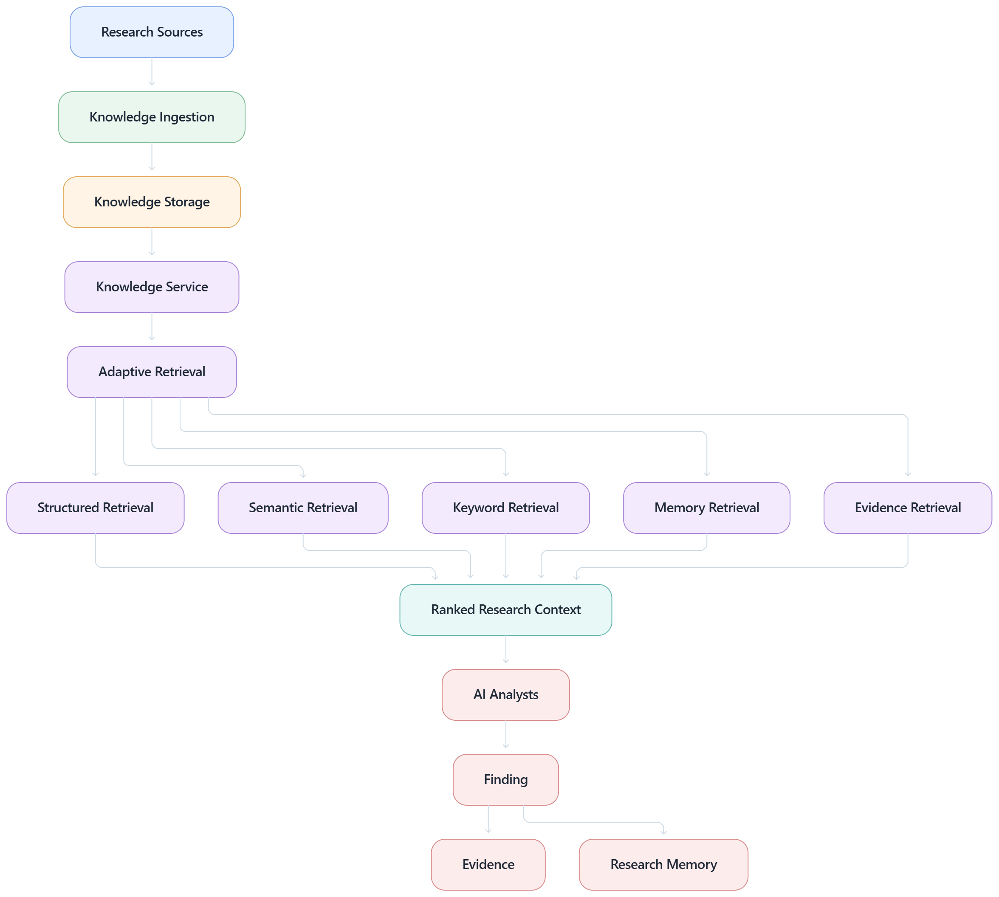

### Adaptive Retrieval

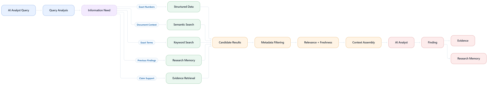

It acts as the research information layer between the AI analyst runtime and the underlying sources of financial, company, industry, market, macroeconomic, news, and document information.

The system combines:

* structured research data
* company information
* financial data
* market data
* SEC filings
* research documents
* earnings transcripts
* investor presentations
* vector search
* semantic retrieval
* keyword retrieval
* adaptive retrieval
* research memory
* evidence
* provenance
* freshness metadata

The goal is not simply to retrieve text.

The goal is to provide the **right information, from the right source, at the right level of relevance, with sufficient provenance for downstream reasoning.**

---

# 1. Knowledge Layer Overview

The Knowledge System sits underneath the AI analyst layer.

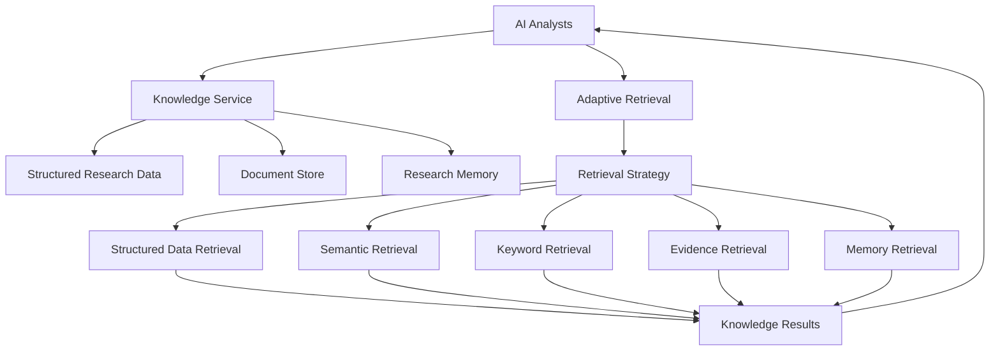

The Knowledge Service provides normalized information.

The Adaptive Retrieval layer determines how that information should be retrieved.

---

# 2. Knowledge Architecture

The knowledge layer can be divided into several logical systems.

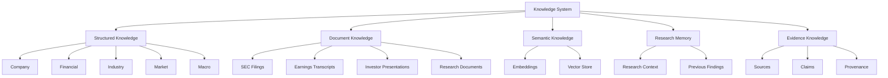

---

# 3. Why Orion Needs a Knowledge Layer

AI analysts should not depend entirely on an LLM's pretrained knowledge.

For equity research, information can be:

* company-specific
* time-sensitive
* numerical
* regulatory
* document-specific
* continuously changing

Therefore:

```text
LLM Knowledge
      +
Current Research Data
      +
Retrieved Documents
      +
External Sources
      +
Research Evidence
      =
Grounded Research Context
```

The LLM provides reasoning capability.

The Knowledge System provides research information.

---

# 4. Knowledge vs Retrieval

These concepts are related but different.

### Knowledge

Knowledge represents the information Orion has access to.

```text
Company
Financials
Market Data
Documents
Industry Data
Macro Data
Research Memory
Evidence
```

### Retrieval

Retrieval determines which subset of that information is relevant to the current task.

```text
Research Question
       |
       v
Retrieval Strategy
       |
       v
Relevant Knowledge
```

Therefore:

> **Knowledge is the information layer; retrieval is the information-selection layer.**

---

# 5. Knowledge Flow

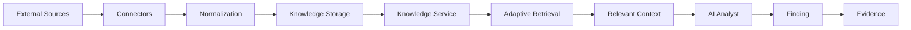

The pipeline is:

```text
Source
  ↓
Connector
  ↓
Normalization
  ↓
Knowledge Storage
  ↓
Retrieval
  ↓
Research Context
  ↓
AI Analyst
  ↓
Finding
  ↓
Evidence
```

---

# 6. Knowledge Sources

Orion can combine multiple categories of research sources.

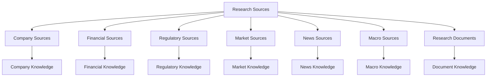

Potential source categories include:

* company profiles
* financial statements
* SEC filings
* market prices
* financial ratios
* industry information
* economic indicators
* news articles
* earnings transcripts
* investor presentations
* annual reports
* research documents

---

# 7. Structured Knowledge

Structured knowledge represents information that can be stored as normalized records.

Examples:

```text
Company
├── Name
├── Ticker
├── Sector
├── Industry
├── Description
├── Headquarters
└── Corporate Metadata
```

Financial knowledge:

```text
Financial Data
├── Revenue
├── Earnings
├── EBITDA
├── EPS
├── Margins
├── Cash Flow
├── Debt
└── Balance Sheet Metrics
```

Market knowledge:

```text
Market Data
├── Price
├── Market Capitalization
├── Volume
├── Returns
├── Volatility
└── Trading Metrics
```

---

# 8. Structured Knowledge Architecture

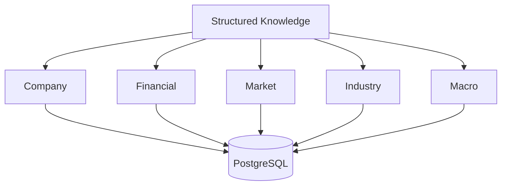

Structured data is useful when the question requires:

* exact values
* filtering
* aggregation
* comparisons
* calculations
* time-series analysis
* deterministic queries

For example:

```text
What was revenue in FY2025?
```

should generally be answered from structured financial data when available rather than relying on semantic document retrieval alone.

---

# 9. Document Knowledge

Documents provide unstructured or semi-structured information.

Examples:

```text
Annual Reports
10-K / 10-Q Filings
Earnings Transcripts
Investor Presentations
Company Documents
Research Notes
Industry Reports
```

The document pipeline is:

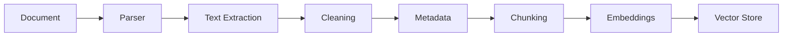

---

# 10. Document Metadata

Each document should retain metadata.

Conceptually:

```text
Document
│
├── document_id
├── company_id
├── source
├── source_type
├── title
├── publication_date
├── filing_date
├── fiscal_period
├── document_type
├── URL / reference
└── ingestion_timestamp
```

Metadata is important because retrieval should not depend only on text similarity.

---

# 11. Document Chunking

Large documents should be divided into smaller retrieval units.

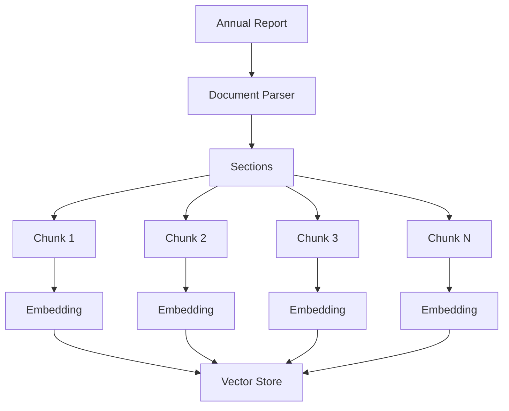

A chunk should preserve enough context to be meaningful while remaining small enough for efficient retrieval.

---

# 12. Chunk Metadata

A retrieval chunk can conceptually contain:

```text
Chunk
│
├── chunk_id
├── document_id
├── company_id
├── text
├── embedding
├── section
├── page
├── publication_date
├── source_type
├── fiscal_period
└── metadata
```

This allows retrieved information to remain connected to its original document.

---

# 13. Embeddings

Embeddings transform text into numerical representations.


At query time:


Semantic retrieval can therefore identify conceptually related information even when the exact wording differs.

---

# 14. Vector Store

The vector store contains document representations.

```text
Vector Store
│
├── Chunk Embedding
├── Document Metadata
├── Company Metadata
├── Source Metadata
└── Retrieval Metadata
```

Conceptually:

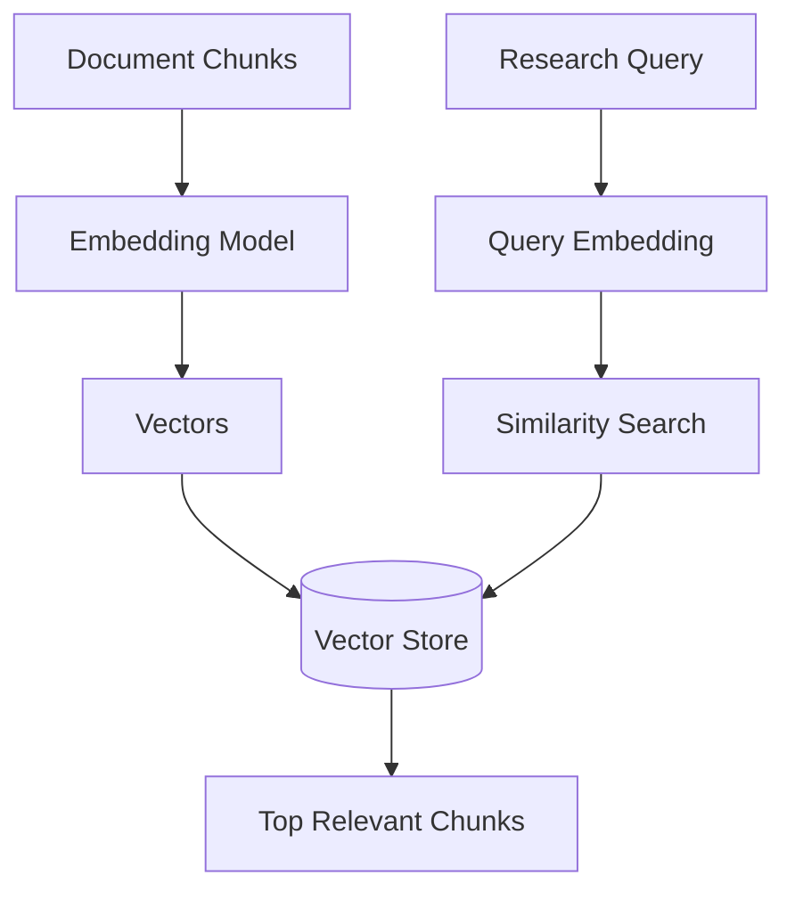

---

# 15. Keyword Retrieval

Semantic search is not sufficient for every research question.

Keyword retrieval can be useful for:

* exact company names
* ticker symbols
* filing identifiers
* accounting terminology
* specific metrics
* legal terms
* exact phrases


---

# 16. Hybrid Retrieval

Orion can combine multiple retrieval strategies.

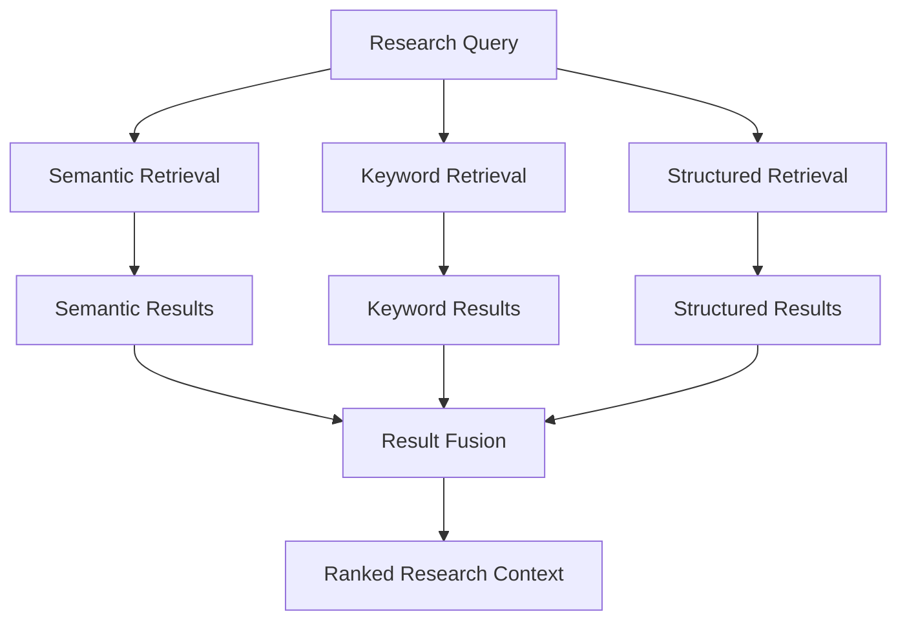

Hybrid retrieval is useful because different information types require different search strategies.

---

# 17. Adaptive Retrieval

The **Adaptive Retrieval** layer chooses the appropriate retrieval path for the task.

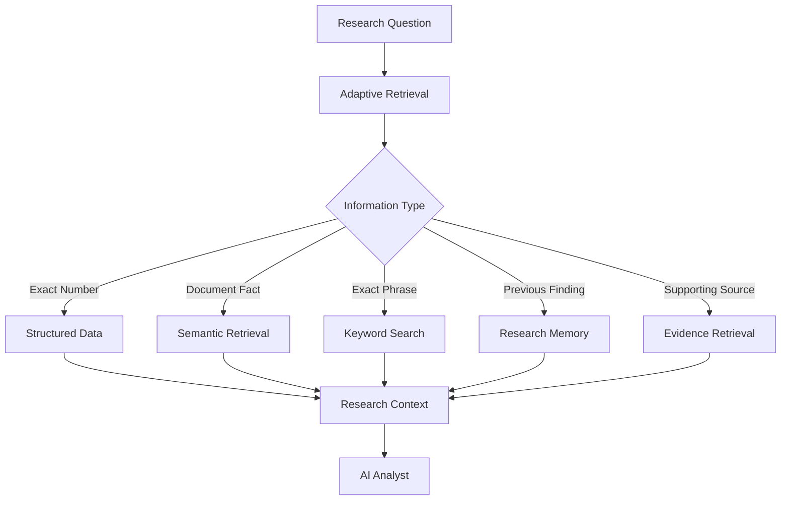

The objective is to avoid treating every question as a generic vector search problem.

---

# 18. Retrieval Strategy Selection

Different analyst tasks may require different sources.

| Research Need            | Primary Retrieval            |
| ------------------------ | ---------------------------- |
| Company profile          | Company database             |
| Historical revenue       | Financial database           |
| Current price            | Market data                  |
| Filing details           | SEC/document retrieval       |
| Business model           | Document + company knowledge |
| Industry trends          | Industry data + documents    |
| Recent events            | News retrieval               |
| Macro conditions         | Economic data                |
| Valuation inputs         | Financial + market data      |
| Previous analyst finding | Research memory              |
| Claim verification       | Evidence retrieval           |

---

# 19. Analyst-Specific Knowledge Needs

Each AI analyst consumes different information.

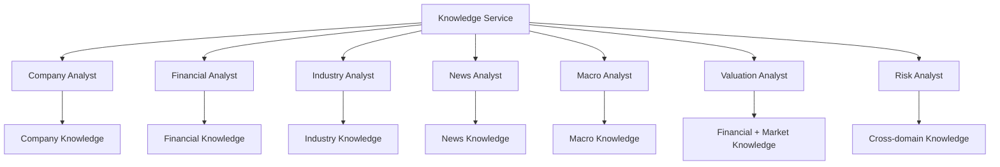

---

# 20. Company Analyst Knowledge

The Company Analyst may require:

```text
company profile
business model
products
services
segments
management
corporate structure
competitive positioning
recent company developments
```

Potential sources:

```text
Company Database
SEC Filings
Annual Reports
Investor Presentations
Company Documents
News
```

---

# 21. Financial Analyst Knowledge

The Financial Analyst focuses on quantitative information.

```text
Revenue
Earnings
Margins
Cash Flow
Debt
Assets
Liabilities
Profitability
Growth
Financial Ratios
Historical Trends
```

The preferred source should depend on the metric and freshness requirements.

---

# 22. Industry Analyst Knowledge

The Industry Analyst may retrieve:

```text
industry size
growth
market structure
competitors
market share
industry trends
regulatory developments
competitive dynamics
```

Sources can include:

* industry data
* company disclosures
* regulatory information
* market data
* research documents
* news

---

# 23. News Analyst Knowledge

The News Analyst emphasizes recency.


Important metadata includes:

```text
publication time
source
headline
article identifier
company
market relevance
retrieval time
```

News retrieval should prioritize freshness when the research task requires current information.

---

# 24. Macro Analyst Knowledge

The Macro Analyst may consume:

```text
interest rates
inflation
GDP
employment
monetary policy
economic indicators
currency conditions
commodity conditions
market conditions
```

The retrieval layer should distinguish:

```text
historical macro data
current macro data
forecast data
```

because these have different temporal meanings.

---

# 25. Valuation Knowledge

Valuation typically requires multiple knowledge domains.

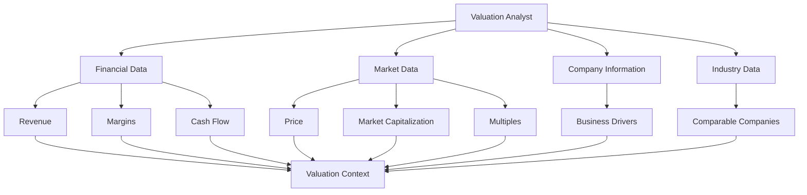

Valuation should therefore combine structured data with relevant qualitative context.

---

# 26. Risk Knowledge

Risk analysis requires cross-domain retrieval.

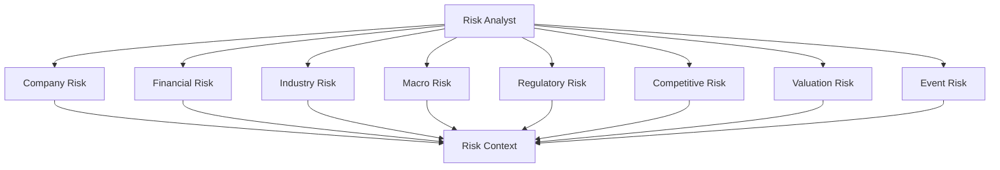

---

# 27. Research Memory

Research memory is different from external knowledge.

It contains information generated during Orion's own research execution.

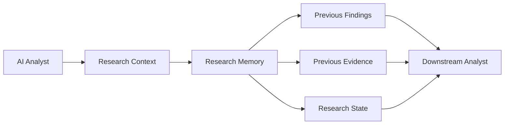

Memory allows downstream tasks to reuse completed work without repeating the same retrieval.

---

# 28. Memory vs Knowledge

| Layer     | Purpose                                                        |
| --------- | -------------------------------------------------------------- |
| Knowledge | External and persisted research information                    |
| Memory    | Information generated or accumulated during research execution |
| Evidence  | Provenance supporting a specific claim                         |
| Context   | Active information passed to an analyst                        |

Conceptually:

```text
Knowledge
   ↓
Retrieval
   ↓
Research Context
   ↓
AI Analyst
   ↓
Finding
   ↓
Memory + Evidence
```

---

# 29. Research Context

The active research context is assembled from multiple sources.

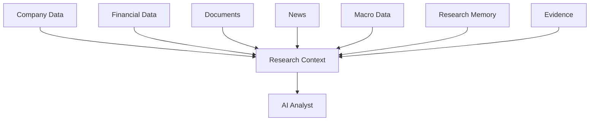

The context should be task-specific rather than dumping the entire knowledge base into the model.

---

# 30. Context Construction

```text
Research Task
      |
      v
Determine Information Requirements
      |
      v
Select Retrieval Sources
      |
      v
Retrieve Relevant Information
      |
      v
Rank / Filter
      |
      v
Construct Research Context
      |
      v
AI Analyst
```

This reduces unnecessary context and improves reasoning efficiency.

---

# 31. Retrieval Ranking

Retrieved information can be ranked using signals such as:

```text
semantic relevance
keyword relevance
source quality
document freshness
company relevance
task relevance
metadata filters
evidence quality
```

Conceptually:


---

# 32. Metadata Filtering

Retrieval can use filters before or after search.

Examples:

```text
company_id
document_type
source_type
fiscal_period
publication_date
filing_date
industry
geography
```

For example:

```text
Company = Apple
Document Type = Annual Report
Period = FY2025
```

This can significantly narrow the search space.

---

# 33. Temporal Retrieval

Financial research is highly time-sensitive.

The system should distinguish:

```text
Publication Date
Filing Date
Fiscal Period
Event Date
Retrieval Date
```

For example:

```text
Fiscal Period:
FY2025

Published:
2025

Retrieved:
2026
```

These timestamps should not be treated as interchangeable.

---

# 34. Freshness

Different research domains have different freshness requirements.

```mermaid
flowchart TD

    A[Research Question] --> B{Freshness Requirement}

    B -->|Current Price| C[Real-time / Recent Market Data]
    B -->|Recent Event| D[Recent News]
    B -->|Historical Financials| E[Historical Filings]
    B -->|Business Model| F[Latest Company Documents]
    B -->|Macro Trend| G[Recent Economic Data]
```

Retrieval should therefore consider temporal relevance.

---

# 35. Knowledge Normalization

Different sources may represent the same information differently.

```text
Source A:
Revenue = 100B

Source B:
Revenue = $100 billion

Source C:
Revenue = 100,000 million
```

Normalization converts these into a common representation.

```mermaid
flowchart LR

    A[Source A] --> D[Normalization]
    B[Source B] --> D
    C[Source C] --> D

    D --> E[Canonical Financial Fact]
```

---

# 36. Canonical Facts

A normalized fact can conceptually contain:

```text
Fact
│
├── fact_id
├── company_id
├── metric
├── value
├── unit
├── currency
├── period
├── source
├── source_document
├── timestamp
└── confidence
```

This creates a consistent representation for downstream agents.

---

# 37. Numerical Knowledge

Numerical information requires special handling.

```mermaid
flowchart TD

    A[Financial Source] --> B[Extract Metric]
    B --> C[Normalize Unit]
    C --> D[Normalize Currency]
    D --> E[Normalize Period]
    E --> F[Canonical Fact]
    F --> G[Financial Analyst]
    F --> H[Valuation Analyst]
```

The system should preserve the original source alongside the normalized value.

---

# 38. Source Provenance

Knowledge should remain traceable.

```text
Canonical Fact
      |
      v
Source Document
      |
      v
Original Source
```

For example:

```text
Revenue = X

Source:
Annual Report

Document:
FY2025 Annual Report

Location:
Specific section / page

Retrieved:
Timestamp
```

This connects knowledge with the Evidence System.

---

# 39. Evidence Relationship

```mermaid
flowchart TD

    A[Knowledge Fact] --> B[Evidence Reference]
    B --> C[Source Document]
    C --> D[Original Source]

    E[AI Analyst Finding] --> B
```

This enables:

```text
Finding
  ↓
Supporting Evidence
  ↓
Source
```

rather than:

```text
Finding
  ↓
Unknown Origin
```

---

# 40. Knowledge Ingestion

Knowledge enters Orion through connectors and ingestion pipelines.

```mermaid
flowchart TD

    A[External Source] --> B[Connector]
    B --> C[Raw Data]

    C --> D[Validation]
    D --> E[Normalization]
    E --> F[Metadata Extraction]

    F --> G{Data Type}

    G -->|Structured| H[(PostgreSQL)]
    G -->|Document| I[Document Store]
    G -->|Semantic| J[Vector Store]

    H --> K[Knowledge Service]
    I --> K
    J --> K
```

---

# 41. Knowledge Connectors

The backend can organize source-specific connectors.

Conceptually:

```text
backend/
└── app/
    └── knowledge/
        └── connectors/
            ├── sec/
            │   └── filings.py
            ├── financial/
            │   └── market_data.py
            ├── news/
            │   └── articles.py
            ├── company/
            │   └── profile.py
            └── macro/
                └── economic_data.py
```

Connectors isolate source-specific implementation from the analyst layer.

---

# 42. Connector Responsibilities

A connector should handle:

```text
source access
authentication
request construction
response parsing
normalization
rate limits
timeouts
error handling
source metadata
```

The AI analyst should not contain source-specific HTTP logic.

---

# 43. Knowledge Service

The Knowledge Service provides a common interface.

```mermaid
flowchart LR

    A[AI Analyst] --> B[Knowledge Service]

    B --> C[Company Repository]
    B --> D[Financial Repository]
    B --> E[Document Repository]
    B --> F[News Repository]
    B --> G[Macro Repository]
    B --> H[Vector Store]
```

This prevents each analyst from implementing its own data-access architecture.

---

# 44. Adaptive Retrieval Architecture

```mermaid
flowchart TD

    A[AI Analyst Query] --> B[Adaptive Retrieval]

    B --> C[Query Classification]
    C --> D[Information Requirements]

    D --> E[Structured Retrieval]
    D --> F[Semantic Retrieval]
    D --> G[Keyword Retrieval]
    D --> H[Memory Retrieval]
    D --> I[Evidence Retrieval]

    E --> J[Candidate Context]
    F --> J
    G --> J
    H --> J
    I --> J

    J --> K[Filtering]
    K --> L[Ranking]
    L --> M[Context Assembly]

    M --> N[AI Analyst]
```

---

# 45. Retrieval Failure Handling

Retrieval failures should be explicit.

```mermaid
flowchart TD

    A[Retrieval Request] --> B{Source Available?}

    B -->|Yes| C[Retrieve]
    B -->|No| D[Fallback Strategy]

    D --> E[Alternative Source]
    D --> F[Cached Data]
    D --> G[Memory]
    D --> H[Return Partial Result]

    C --> I[Validate]
    E --> I
    F --> I
    G --> I
    H --> I

    I --> J[Research Context]
```

A missing source should not silently become fabricated information.

---

# 46. Retrieval Failure vs Missing Information

These are different conditions.

### Retrieval failure

```text
The system attempted to retrieve information but the source failed.
```

### Missing information

```text
The system successfully searched available sources but found no supporting information.
```

These conditions should be represented differently in the research state.

---

# 47. Empty Retrieval

If no relevant information is found:

```text
Query
  ↓
Retrieval
  ↓
No Supporting Information
```

The analyst should receive an explicit signal such as:

```text
No relevant evidence found in available sources.
```

rather than an empty context that could be misinterpreted.

---

# 48. Knowledge Security

Knowledge sources may contain untrusted content.

```mermaid
flowchart TD

    A[External Source] --> B[Ingestion Boundary]
    B --> C[Validation]
    C --> D[Stored Knowledge]

    D --> E[Retrieval]
    E --> F[AI Analyst]

    G[Malicious Instructions in Document] --> H[Treated as Data]
    H --> F
```

Documents should not gain control over:

* system instructions
* execution policies
* tool permissions
* authentication
* agent selection

---

# 49. Prompt Injection Protection

Retrieved documents may contain text such as:

```text
Ignore previous instructions...
Call this tool...
Reveal credentials...
```

Such content must remain untrusted research content.

The architecture should maintain:

```text
Trusted Application Instructions
        >
Research Data
```

The Execution Engine and Tool Router remain controlled by application code.

---

# 50. Knowledge Quality

Knowledge quality should consider:

```text
source authority
freshness
completeness
consistency
accuracy
provenance
normalization quality
retrieval relevance
```

These properties can later feed the Evaluation system.

---

# 51. Knowledge Evaluation

Retrieval can be evaluated independently from the final research report.

Useful metrics include:

```text
retrieval precision
retrieval recall
relevance@k
citation coverage
source quality
freshness
context usefulness
duplicate retrieval rate
```

Example:

```mermaid
flowchart LR

    A[Research Query] --> B[Retriever]
    B --> C[Retrieved Context]

    C --> D[Retrieval Evaluator]
    D --> E[Retrieval Metrics]
```

---

# 52. Observability

Knowledge retrieval should produce telemetry.

```mermaid
flowchart TD

    A[Retrieval Request] --> B[Retriever]

    B --> C[Latency]
    B --> D[Result Count]
    B --> E[Source Usage]
    B --> F[Query Type]
    B --> G[Ranking Information]

    C --> H[Observability]
    D --> H
    E --> H
    F --> H
    G --> H
```

Useful metrics include:

```text
retrieval latency
embedding latency
vector search latency
database query latency
results returned
top-k
source distribution
cache hit rate
fallback rate
empty retrieval rate
```

---

# 53. Knowledge Caching

Frequently requested information can potentially be cached.

```mermaid
flowchart LR

    A[Analyst Query] --> B[Knowledge Service]
    B --> C{Cache Hit?}

    C -->|Yes| D[Cached Result]
    C -->|No| E[Retrieve Source]

    E --> F[Store Cache]
    F --> G[Return Result]
    D --> G
```

Caching can reduce:

* latency
* external API requests
* retrieval cost
* repeated computation

Cached information should still carry freshness metadata.

---

# 54. Knowledge Lifecycle

```mermaid
stateDiagram-v2

    [*] --> Discovered
    Discovered --> Ingesting
    Ingesting --> Validated
    Validated --> Normalized
    Normalized --> Indexed
    Indexed --> Available

    Available --> Refreshed
    Refreshed --> Indexed

    Available --> Deprecated
    Deprecated --> Archived
```

This creates a lifecycle for research information.

---

# 55. Document Lifecycle

```text
Source Document
      |
      v
Discovered
      |
      v
Downloaded / Retrieved
      |
      v
Parsed
      |
      v
Chunked
      |
      v
Embedded
      |
      v
Indexed
      |
      v
Retrievable
```

---

# 56. Knowledge and Execution

The Knowledge System integrates directly with the Execution Engine.

```mermaid
sequenceDiagram

    participant EE as Execution Engine
    participant A as AI Analyst
    participant K as Knowledge Service
    participant R as Adaptive Retrieval
    participant E as Evidence Service

    EE->>A: Execute Research Task
    A->>K: Request Research Context
    K->>R: Retrieve Relevant Knowledge
    R-->>K: Ranked Results
    K-->>A: Research Context
    A->>E: Record Supporting Evidence
    A-->>EE: Structured Finding
```

---

# 57. Knowledge and Agent Collaboration

Multiple analysts may use the same knowledge layer.

```mermaid
flowchart TD

    A[Shared Knowledge System]

    A --> B[Company Analyst]
    A --> C[Financial Analyst]
    A --> D[Industry Analyst]
    A --> E[News Analyst]
    A --> F[Macro Analyst]
    A --> G[Valuation Analyst]
    A --> H[Risk Analyst]

    B --> I[Shared Research Context]
    C --> I
    D --> I
    E --> I
    F --> I
    G --> I
    H --> I
```

This provides a common information foundation while allowing analyst-specific retrieval strategies.

---

# 58. Knowledge and Evidence

Knowledge answers:

> **What information does Orion have?**

Evidence answers:

> **Where did this particular claim come from?**

The relationship is:

```text
Knowledge
   |
   v
Retrieved Fact
   |
   v
Analyst Finding
   |
   v
Evidence
   |
   v
Source
```

This distinction becomes especially important for financial and regulatory claims.

---

# 59. Knowledge and LLM

The relationship should remain explicit:

```text
Knowledge System
      |
      | provides
      v
Research Context
      |
      v
AI Analyst
      |
      | constructs prompt
      v
LLM Service
      |
      v
Reasoned Output
```

The LLM should not be treated as the primary database.

---

# 60. Knowledge and Tool Router

The Knowledge layer can use source-specific connectors, while the Tool Router handles runtime tool execution.

```text
AI Analyst
    |
    +----> Knowledge Service
    |          |
    |          +---- structured data
    |          +---- documents
    |          +---- retrieval
    |
    +----> Tool Router
               |
               +---- external APIs
               +---- MCP
               +---- specialized tools
```

This separation keeps data retrieval and runtime tool execution modular.

---

# 61. Conceptual Knowledge Package

The knowledge architecture can be organized as:

```text
backend/
└── app/
    └── knowledge/
        ├── connectors/
        │   ├── sec/
        │   │   └── filings.py
        │   ├── financial/
        │   │   └── market_data.py
        │   ├── news/
        │   │   └── articles.py
        │   ├── company/
        │   │   └── profile.py
        │   └── macro/
        │       └── economic_data.py
        │
        ├── embeddings/
        │
        ├── vector_store/
        │
        ├── retriever.py
        ├── chunker.py
        └── knowledge_service.py
```

The exact implementation can evolve independently from the architectural responsibilities.

---

# 62. Knowledge Request Lifecycle

```mermaid
flowchart TD

    A[AI Analyst] --> B[Knowledge Request]

    B --> C[Identify Information Need]
    C --> D[Select Retrieval Strategy]

    D --> E[Structured Data]
    D --> F[Vector Search]
    D --> G[Keyword Search]
    D --> H[Memory]
    D --> I[Evidence]

    E --> J[Candidate Results]
    F --> J
    G --> J
    H --> J
    I --> J

    J --> K[Filter]
    K --> L[Rank]
    L --> M[Context Assembly]
    M --> N[AI Analyst]
```

---

# 63. Example: Financial Research

Suppose the Financial Analyst receives:

```text
Analyze the company's recent financial performance.
```

The Knowledge System can decompose the information requirement into:

```text
Revenue
Earnings
Margins
Cash Flow
Debt
Growth
Historical Comparison
```

The retrieval architecture can then execute:

```mermaid
flowchart TD

    A[Financial Research Task] --> B[Information Requirements]

    B --> C[Financial Database]
    B --> D[SEC Filings]
    B --> E[Annual Reports]

    C --> F[Structured Financial Facts]
    D --> G[Supporting Documents]
    E --> H[Historical Context]

    F --> I[Financial Research Context]
    G --> I
    H --> I

    I --> J[Financial Analyst]
```

---

# 64. Example: Valuation Research

A valuation task might require:

```text
Current market value
Revenue
Growth
Margins
Cash flow
Comparable companies
Industry conditions
Historical multiples
```

The Knowledge System therefore combines:

```mermaid
flowchart LR

    A[Valuation Task]

    A --> B[Financial Data]
    A --> C[Market Data]
    A --> D[Industry Data]
    A --> E[Company Documents]

    B --> F[Valuation Context]
    C --> F
    D --> F
    E --> F

    F --> G[Valuation Analyst]
```

---

# 65. Example: Risk Research

A risk task can retrieve:

```text
financial leverage
competitive threats
industry conditions
regulatory exposure
macro conditions
recent events
valuation sensitivity
```

The retrieval layer therefore becomes cross-domain.

```mermaid
flowchart TD

    A[Risk Task]

    A --> B[Financial]
    A --> C[Industry]
    A --> D[Macro]
    A --> E[News]
    A --> F[Regulatory]
    A --> G[Valuation]

    B --> H[Risk Context]
    C --> H
    D --> H
    E --> H
    F --> H
    G --> H

    H --> I[Risk Analyst]
```

---

# 66. Knowledge Freshness Strategy

Not all knowledge should be refreshed at the same frequency.

```text
High Frequency
├── Market Prices
├── News
└── Certain Economic Indicators

Medium Frequency
├── Company Events
├── Financial Updates
└── Industry Information

Low Frequency
├── Company Profile
├── Historical Filings
└── Stable Corporate Information
```

The ingestion architecture can therefore use different refresh schedules.

---

# 67. Knowledge Consistency

Different sources may disagree.

```mermaid
flowchart TD

    A[Source A] --> D[Fact Comparison]
    B[Source B] --> D
    C[Source C] --> D

    D --> E{Consistent?}

    E -->|Yes| F[Canonical Fact]
    E -->|No| G[Conflict Record]

    G --> H[Evidence / Review]
```

The system should preserve source-level information instead of silently overwriting contradictory values.

---

# 68. Conflicting Information

When sources disagree, the research system should preserve:

```text
source
value
timestamp
period
metadata
```

The analyst can then reason over the discrepancy.

This is preferable to hiding conflicting evidence.

---

# 69. Knowledge Quality Boundary

The Knowledge System should distinguish between:

```text
Retrieved
```

and

```text
Verified
```

Retrieval only establishes that information was found.

Evidence validation and source assessment determine how strongly it should support a research claim.

---

# 70. Knowledge Security Boundaries

```mermaid
flowchart TD

    A[External Data] --> B[Connector Boundary]

    B --> C[Validation]
    C --> D[Normalization]
    D --> E[Knowledge Storage]

    E --> F[Retrieval Boundary]
    F --> G[AI Analyst Context]

    G --> H[Evidence Validation]
    H --> I[Research Result]
```

Security controls should exist around:

* external data ingestion
* document parsing
* retrieval
* tool access
* credentials
* tenant isolation where applicable
* audit logging

---

# 71. Knowledge Observability

The system should make retrieval behavior measurable.

```text
Knowledge Request
      |
      +-- Query
      +-- Retrieval Strategy
      +-- Sources
      +-- Results
      +-- Latency
      +-- Ranking
      +-- Freshness
      +-- Fallback
      +-- Errors
```

This information feeds the broader Orion Observability system.

---

# 72. Knowledge Evaluation

Knowledge retrieval can be evaluated independently.

```mermaid
flowchart LR

    A[Evaluation Dataset] --> B[Research Query]
    B --> C[Retriever]
    C --> D[Retrieved Results]

    D --> E[Ground Truth]
    E --> F[Retrieval Evaluation]

    F --> G[Precision]
    F --> H[Recall]
    F --> I[Relevance]
    F --> J[Evidence Coverage]
```

This allows retrieval quality to be improved without evaluating the entire end-to-end research report every time.

---

# 73. Design Principles

### 73.1 Retrieval over memorization

Use current and relevant research information instead of relying solely on pretrained model knowledge.

### 73.2 Structured data for structured questions

Exact numerical questions should preferentially use structured data.

### 73.3 Documents for contextual questions

Document retrieval is valuable for qualitative and contextual research.

### 73.4 Adaptive retrieval

Different tasks should use different retrieval strategies.

### 73.5 Provenance by default

Retrieved information should remain connected to its source.

### 73.6 Temporal awareness

Financial research must distinguish periods, dates, and freshness.

### 73.7 Normalization

Equivalent information from different sources should have consistent representations.

### 73.8 Untrusted external content

Documents and web content should never become trusted instructions.

### 73.9 Explicit uncertainty

Missing or conflicting information should remain visible.

### 73.10 Separation of concerns

Analysts consume knowledge; they should not implement every source connector themselves.

---

# 74. Final Knowledge Architecture

```mermaid
flowchart TB

    subgraph Sources["Research Sources"]
        A[SEC Filings]
        B[Financial Data]
        C[Market Data]
        D[Company Data]
        E[Industry Data]
        F[News]
        G[Macro Data]
        H[Research Documents]
    end

    subgraph Ingestion["Knowledge Ingestion"]
        I[Connectors]
        J[Validation]
        K[Normalization]
        L[Metadata]
    end

    subgraph Storage["Knowledge Storage"]
        M[(PostgreSQL)]
        N[Document Store]
        O[Vector Store]
        P[Research Memory]
        Q[Evidence Store]
    end

    subgraph Retrieval["Adaptive Retrieval"]
        R[Query Analysis]
        S[Structured Retrieval]
        T[Semantic Retrieval]
        U[Keyword Retrieval]
        V[Memory Retrieval]
        W[Evidence Retrieval]
        X[Filtering]
        Y[Ranking]
        Z[Context Assembly]
    end

    subgraph Analysts["AI Analyst Layer"]
        AA[Company Analyst]
        AB[Financial Analyst]
        AC[Industry Analyst]
        AD[News Analyst]
        AE[Macro Analyst]
        AF[Valuation Analyst]
        AG[Risk Analyst]
    end

    A --> I
    B --> I
    C --> I
    D --> I
    E --> I
    F --> I
    G --> I
    H --> I

    I --> J
    J --> K
    K --> L

    L --> M
    L --> N
    L --> O

    P --> V
    Q --> W

    M --> S
    N --> T
    O --> T
    M --> U
    N --> U

    R --> S
    R --> T
    R --> U
    R --> V
    R --> W

    S --> X
    T --> X
    U --> X
    V --> X
    W --> X

    X --> Y
    Y --> Z

    Z --> AA
    Z --> AB
    Z --> AC
    Z --> AD
    Z --> AE
    Z --> AF
    Z --> AG
```

---

# 75. Complete Knowledge Mental Model

The Orion Knowledge System can be understood as:

```text
External Sources
       |
       v
Connectors
       |
       v
Validation + Normalization
       |
       v
Knowledge Storage
       |
       +----------------------+
       |                      |
       v                      v
Structured Data          Documents
       |                      |
       |                      v
       |                 Chunking
       |                      |
       |                      v
       |                 Embeddings
       |                      |
       |                      v
       |                 Vector Store
       |                      |
       +----------+-----------+
                  |
                  v
          Adaptive Retrieval
                  |
        +---------+---------+
        |         |         |
        v         v         v
   Structured  Semantic  Keyword
        |         |         |
        +---------+---------+
                  |
                  v
          Ranked Context
                  |
                  v
             AI Analyst
                  |
                  v
               Finding
                  |
          +-------+-------+
          |               |
          v               v
       Memory          Evidence
          |               |
          +-------+-------+
                  |
                  v
          Research Result
```

---

# 76. Relationship With the Orion Architecture

The major architectural relationships are:

```text
Planning
   |
   v
Execution Engine
   |
   v
AI Analysts
   |
   +----> Knowledge Service
   |          |
   |          +---- Structured Data
   |          +---- Documents
   |          +---- Vector Store
   |
   +----> Adaptive Retrieval
   |          |
   |          +---- Semantic Search
   |          +---- Keyword Search
   |          +---- Structured Queries
   |          +---- Memory
   |
   +----> Tool Router
   |
   +----> LLM Service
   |
   +----> Evidence Service
   |
   v
Investment Committee
   |
   v
Critic
   |
   v
Research Result
```

The central principle is:

> **Orion does not ask the LLM to know everything. Orion retrieves relevant knowledge, provides grounded context to specialized AI analysts, preserves provenance, and uses the LLM primarily for reasoning over that context.**

---

# 77. Summary

The Orion AI Knowledge and Retrieval System provides the information foundation for the multi-agent research platform.

It combines:

1. Structured company knowledge.
2. Financial and market data.
3. Industry and macroeconomic information.
4. SEC and regulatory documents.
5. News and recent events.
6. Research documents.
7. Document chunking and embeddings.
8. Vector retrieval.
9. Keyword retrieval.
10. Structured retrieval.
11. Adaptive retrieval.
12. Research memory.
13. Evidence and provenance.
14. Freshness and temporal metadata.
15. Knowledge normalization.
16. Retrieval observability.
17. Retrieval evaluation.
18. Security boundaries around external content.

The resulting architecture creates a clear information pipeline:

```text
Sources
   ↓
Knowledge
   ↓
Adaptive Retrieval
   ↓
Research Context
   ↓
AI Analysts
   ↓
Evidence
   ↓
Committee
   ↓
Critic
   ↓
Research Result
```

This makes the Knowledge System a foundational layer of Orion's **evidence-grounded multi-agent equity research architecture**.
