# Orion AI — New Research Workflow

> **Production-oriented workflow for initiating, planning, executing, reviewing, and storing multi-agent equity research.**

Orion AI's **New Research** workflow is the primary entry point for creating a new equity research investigation.

Instead of sending a user query directly to a single large language model, Orion converts the research request into a structured execution plan, selects the required AI analysts, executes their tasks, collects evidence, performs synthesis and critical review, and finally produces a research result that can be explored inside the Research Workspace and saved to the Library.

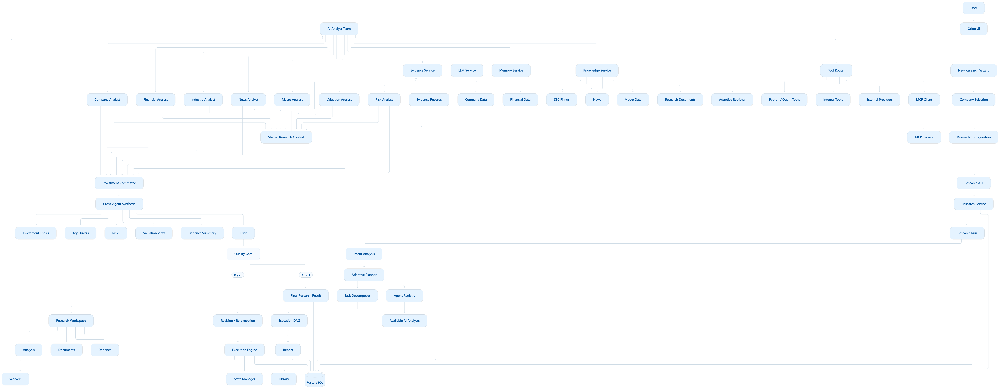

---

## 1. Overview

The New Research workflow connects the user-facing research wizard with Orion's multi-agent research infrastructure.

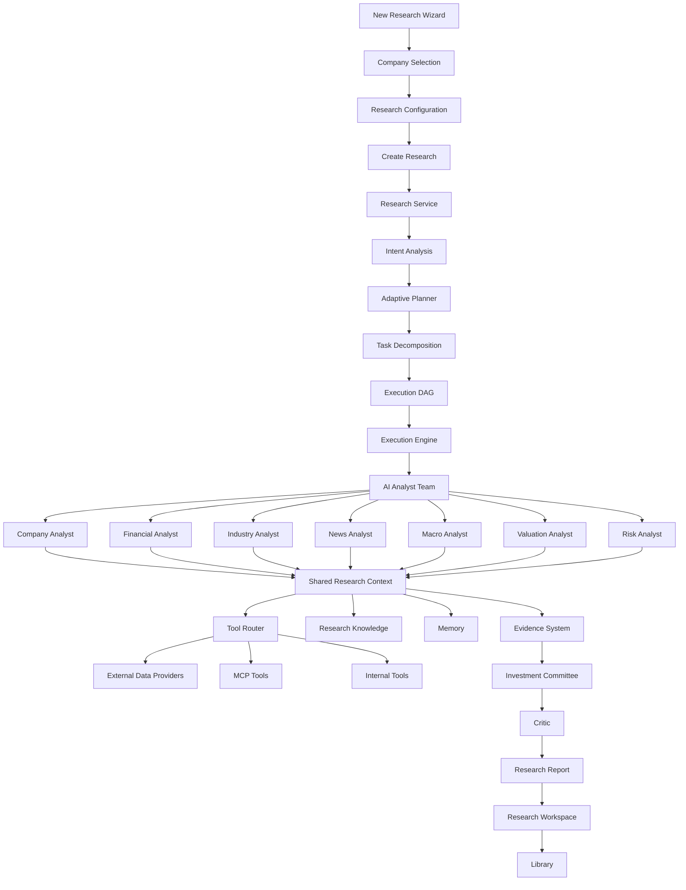

The important design principle is that the **LLM is not the workflow controller**.

The workflow is controlled by Orion's:

* Research Service
* Planner
* Task Decomposer
* Execution Engine
* Agent Registry
* Shared Research Context
* Evidence System
* Tool Router

The LLM provides reasoning and structured generation capabilities to the AI analysts.

---

## 2. User Journey

The user begins from the Orion research interface.

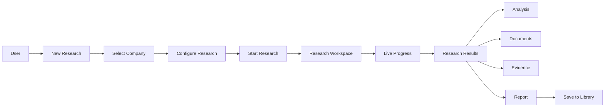

The user does not need to manually decide which AI analysts should run.

That decision is handled by the planning layer.

---

## 3. New Research Wizard

The New Research interface collects the information required to create a research run.

Typical inputs include:

* Company
* Research objective
* Research type
* Analysis scope
* Optional research parameters
* Time period
* Additional instructions

The frontend then submits the research request to the backend.

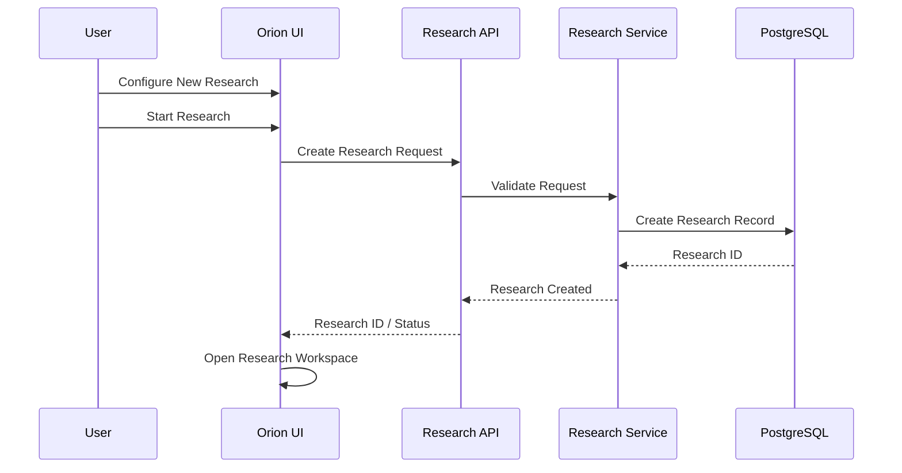

The **Research ID** becomes the identifier used to associate subsequent execution state, outputs, evidence, and reports with the research run.

---

## 4. Company Selection

Company selection is intentionally separated from research execution.

The company search layer provides company metadata and allows the user to select the entity that will become the subject of the research.

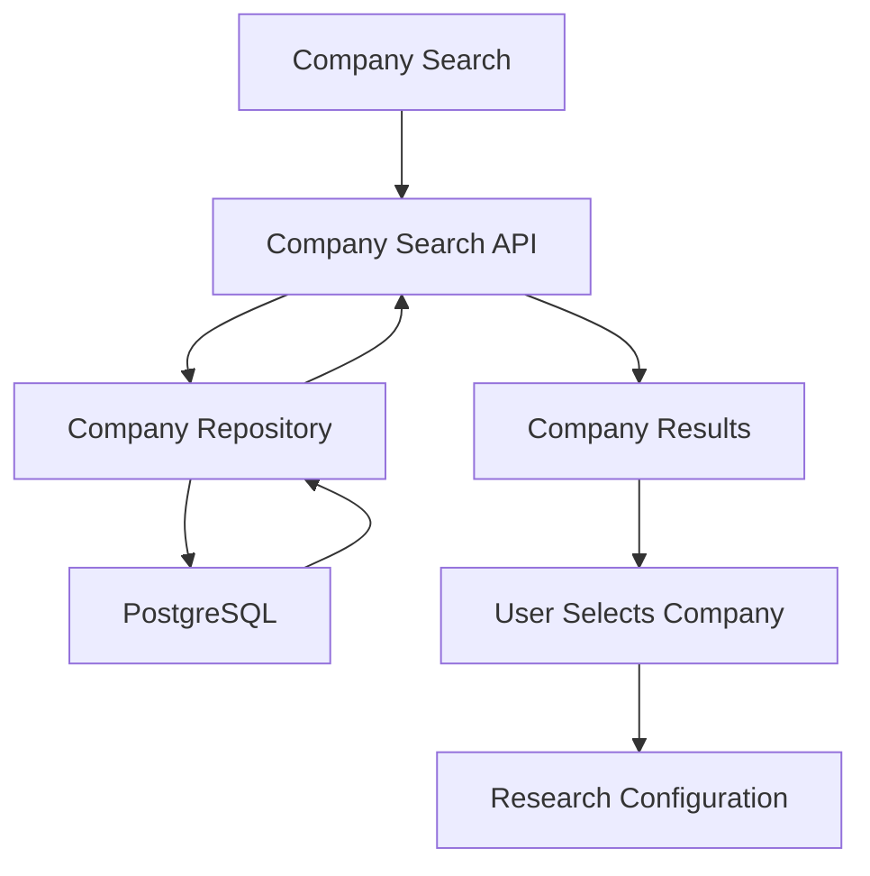

The company database primarily provides structured company metadata.

Detailed research information is retrieved during research execution through the appropriate knowledge and tool layers.

---

## 5. Creating the Research Run

After the user submits the New Research form, Orion creates a research run.

Conceptually:

```text
Research Request
       |
       v
Research Service
       |
       +---- Research ID
       |
       +---- Company
       |
       +---- Research Type
       |
       +---- User Instructions
       |
       +---- Initial Status
       |
       v
Research Execution
```

The research record provides persistent identity for the complete workflow.

This allows the system to track:

* Execution status
* Selected analysts
* Tasks
* Intermediate outputs
* Evidence
* Final results
* Errors
* Timestamps
* Generated reports

---

## 6. Research Intent

The first intelligence stage is understanding what the user actually wants to investigate.

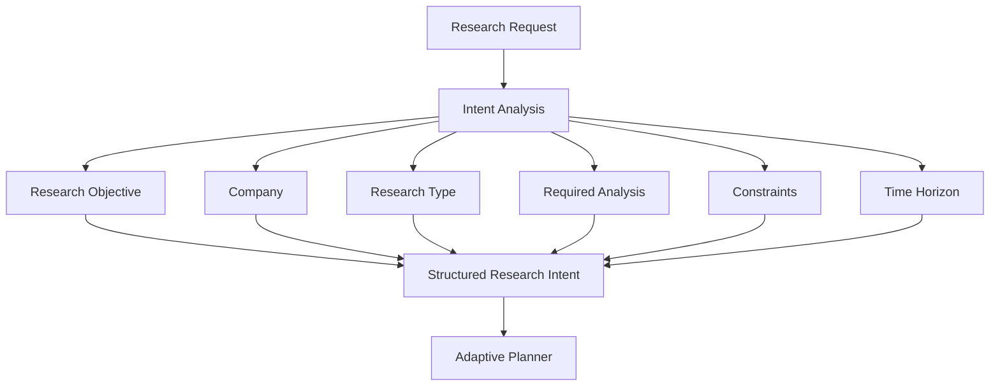

The planner should work from structured intent rather than relying on a raw natural-language prompt throughout the entire execution.

This makes the downstream workflow more deterministic and observable.

---

## 7. Adaptive Planning

The planner determines which AI analysts are relevant to the research question.

For example, a valuation-focused research request may require:

* Company Analyst
* Financial Analyst
* Valuation Analyst
* Risk Analyst
* Investment Committee
* Critic

A macro-focused research request may additionally require:

* Macro Analyst
* Industry Analyst
* News Analyst

The goal is **dynamic agent selection** rather than executing every analyst for every request.

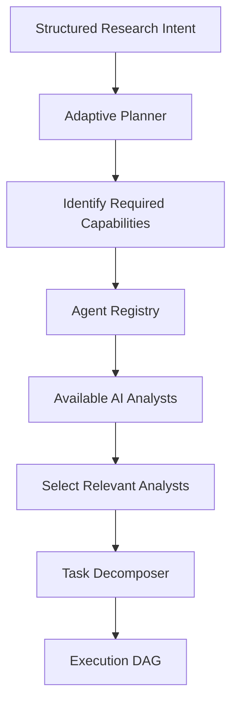

---

## 8. Agent Registry

The Agent Registry provides metadata about available AI analysts.

Conceptually, each analyst can expose:

```text
Agent
├── name
├── group
├── capabilities
├── dependencies
├── tools
├── input schema
├── output schema
└── execution metadata
```

The registry allows the planner to reason about capabilities without directly coupling planning logic to individual agent implementations.

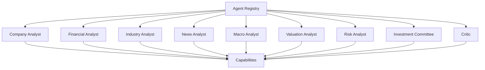

This provides a foundation for future expansion of the analyst ecosystem without rewriting the planner.

---

## 9. Task Decomposition

After selecting the required analysts, Orion decomposes the research request into executable tasks.

The output is represented as a dependency graph or DAG.

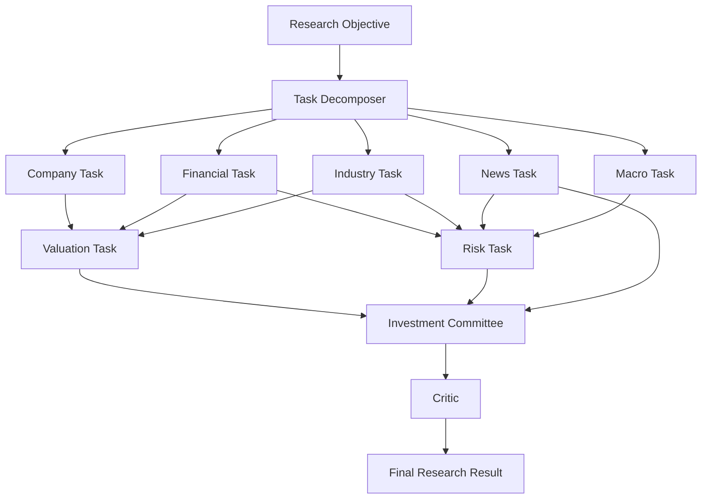

Dependencies matter because not every task can execute independently.

For example:

```text
Financial Analysis
        |
        v
Valuation Analysis
        |
        v
Investment Committee
        |
        v
Critic
```

The execution engine uses these dependencies to determine execution order.

---

## 10. Execution Engine

The Execution Engine is responsible for running the research plan.

Its responsibilities include:

* Loading the execution plan
* Scheduling tasks
* Resolving dependencies
* Invoking analysts
* Maintaining execution state
* Handling failures
* Retrying eligible tasks
* Collecting outputs
* Updating research progress

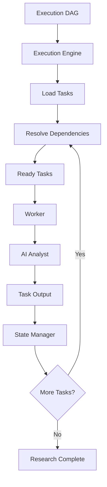

The Execution Engine therefore acts as the runtime coordinator of the research process.

---

## 11. AI Analyst Execution

Each AI analyst specializes in a specific research capability.

The analysts do not need to know how the entire research system works.

Instead, they receive shared services and research context.

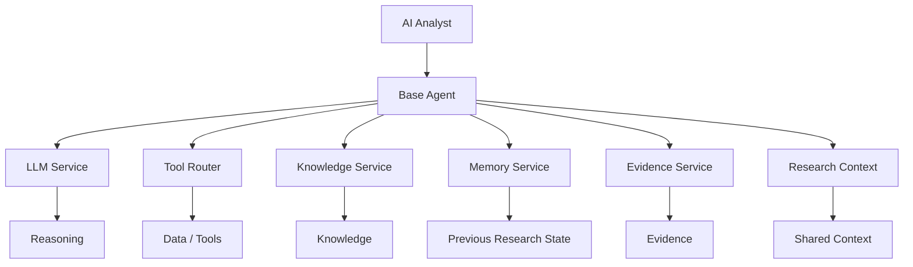

This gives analysts a consistent execution environment.

---

## 12. Shared Research Context

One of the key architectural concepts in Orion is **shared research context**.

Instead of creating direct dependencies between every pair of analysts, analysts communicate through shared research state.

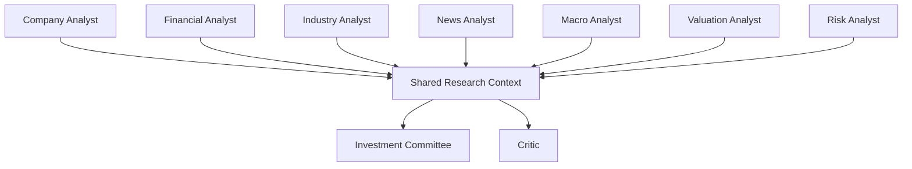

This reduces direct agent-to-agent coupling.

It also allows downstream analysts to consume relevant outputs generated by earlier tasks.

---

## 13. Knowledge and Retrieval

AI analysts may require information from several knowledge sources.

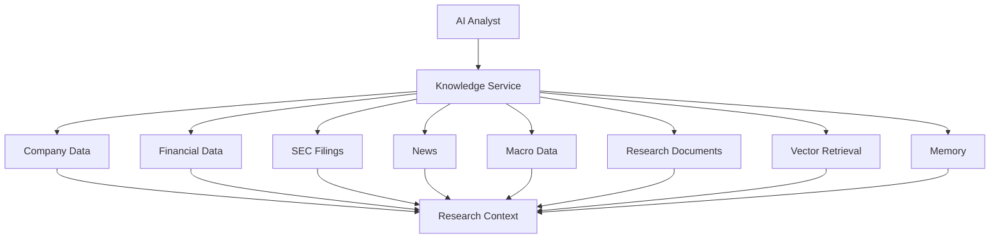

The knowledge layer separates information access from reasoning.

This is important because an analyst should not directly implement database queries, API authentication, vector retrieval, or provider-specific logic.

---

## 14. Tool Router

The Tool Router provides a controlled interface between analysts and external/internal tools.

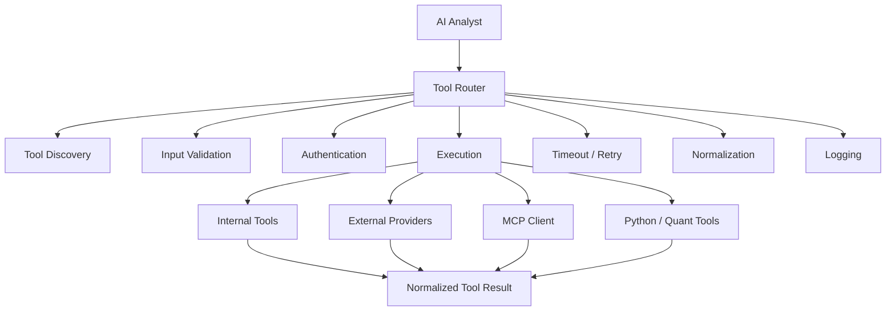

This creates a controlled boundary between AI reasoning and external systems.

For example, an analyst can request financial information through the Tool Router rather than directly embedding provider-specific API calls inside the agent.

---

## 15. MCP Integration

MCP can be used as an integration layer behind the Tool Router.

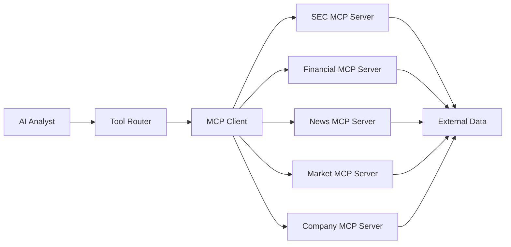

MCP is therefore **not the primary orchestration mechanism**.

The Tool Router remains the controlled entry point for tool execution.

---

## 16. Evidence Collection

Research outputs should be grounded in evidence.

The Evidence System records the relationship between claims and their supporting sources.

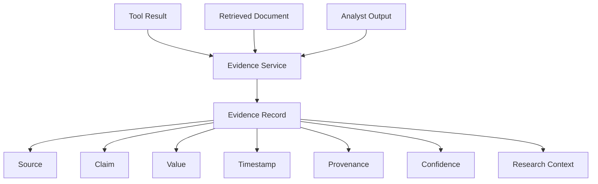

Evidence can then be reused by downstream analysts and the final report.

This makes the research result more traceable than an answer generated directly from an unconstrained language model.

---

## 17. Analyst Collaboration

The analyst team works as a coordinated research system.

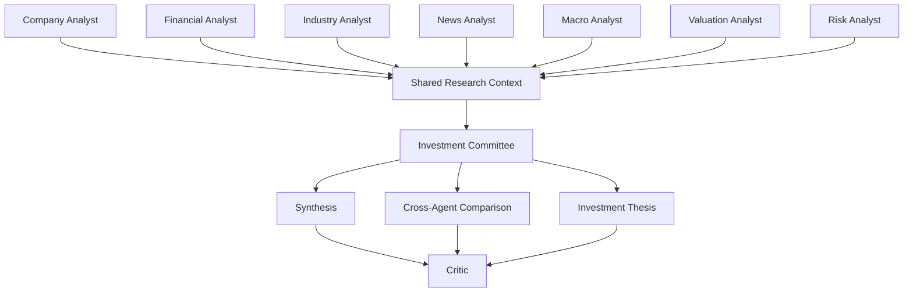

The important distinction is:

* Analysts generate specialized research.
* The Investment Committee synthesizes the research.
* The Critic challenges the synthesized result.

---

## 18. Investment Committee

The Investment Committee is the synthesis stage.

It consumes the outputs of the relevant analysts and attempts to construct a coherent research conclusion.

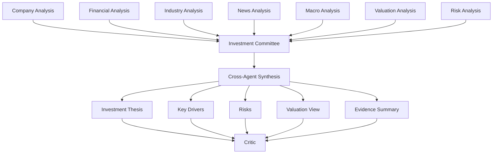

The committee does not replace the specialist analysts.

It combines their outputs.

---

## 19. Critic

The Critic provides a separate quality-control stage.

Its purpose is to identify problems in the generated research before the final result is presented.

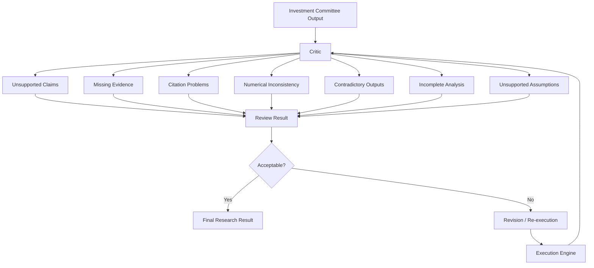

The Critic therefore acts as a **quality gate** rather than simply another analyst.

---

## 20. Research State

A research run progresses through explicit states.

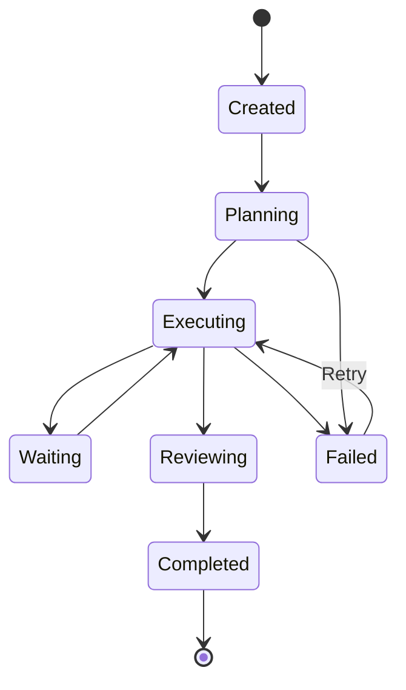

This state model allows the frontend to represent research progress and allows backend services to distinguish active, completed, failed, and retryable executions.

---

## 21. Live Research Progress

The workspace can expose research execution progress while the backend processes the research plan.

Conceptually:

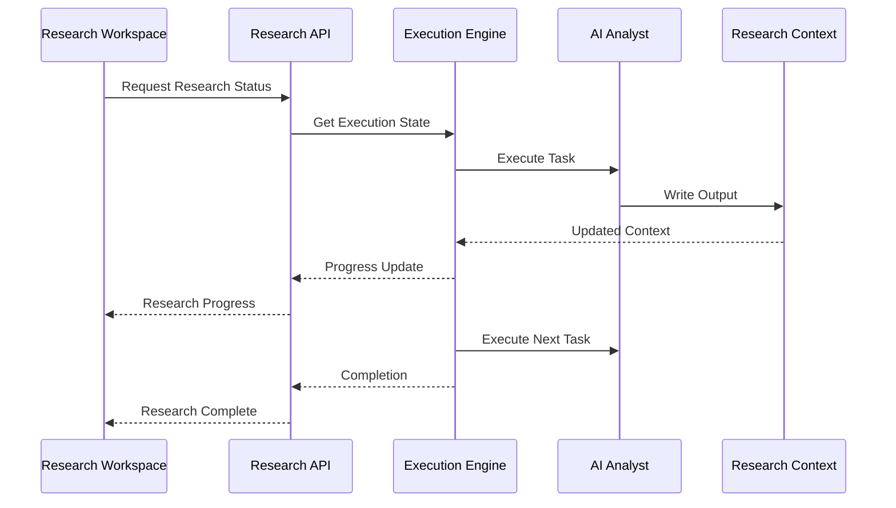

Depending on the frontend implementation, progress can be represented through status polling or streaming mechanisms.

---

## 22. Research Workspace

Once research execution produces results, the user is taken to the Research Workspace.

The workspace organizes the generated research into multiple views.

```mermaid
flowchart TD
    A["Research Workspace"] --> B["Analysis"]
    A --> C["Documents"]
    A --> D["Evidence"]
    A --> E["Report"]

    B --> F["Agent Analysis"]
    B --> G["Financial Analysis"]
    B --> H["Valuation"]
    B --> I["Risk"]

    C --> J["Research Documents"]

    D --> K["Sources"]
    D --> L["Claims"]
    D --> M["Citations"]

    E --> N["Final Research Report"]
```

The workspace is therefore the presentation layer over the research execution result.

---

## 23. Research Data Flow

The complete New Research data flow can be summarized as follows:

```mermaid
flowchart LR
    A["User"] --> B["New Research Wizard"]
    B --> C["Research API"]
    C --> D["Research Service"]
    D --> E["Research Record"]
    E --> F["Intent"]
    F --> G["Planner"]
    G --> H["Task Decomposer"]
    H --> I["Execution DAG"]
    I --> J["Execution Engine"]
    J --> K["AI Analysts"]

    K --> L["Shared Research Context"]
    L --> M["Evidence"]
    L --> N["Research Knowledge"]
    L --> O["Tool Router"]

    O --> P["Providers / MCP / Tools"]
    K --> Q["LLM Service"]

    M --> R["Investment Committee"]
    R --> S["Critic"]
    S --> T["Research Result"]

    T --> U["Workspace"]
    U --> V["Report"]
    V --> W["Library"]
```

---

## 24. End-to-End Sequence

The complete workflow can also be represented as a sequence.

```mermaid
sequenceDiagram
    participant User
    participant UI as Orion UI
    participant API as Research API
    participant RS as Research Service
    participant Planner
    participant Engine as Execution Engine
    participant Analyst as AI Analysts
    participant Tools as Tool Router
    participant Knowledge as Knowledge System
    participant Evidence
    participant Committee as Investment Committee
    participant Critic
    participant DB as PostgreSQL

    User->>UI: Configure New Research
    UI->>API: Create Research

    API->>RS: Validate Request
    RS->>DB: Create Research Run
    DB-->>RS: Research ID

    RS->>Planner: Build Research Plan
    Planner->>Planner: Analyze Intent
    Planner->>Planner: Select Analysts
    Planner->>Planner: Decompose Tasks

    Planner-->>Engine: Execution DAG

    Engine->>Analyst: Execute Analyst Task

    Analyst->>Knowledge: Retrieve Research Data
    Knowledge-->>Analyst: Relevant Knowledge

    Analyst->>Tools: Request Tool
    Tools-->>Analyst: Tool Result

    Analyst->>Evidence: Record Evidence
    Evidence-->>Analyst: Evidence Reference

    Analyst-->>Engine: Analyst Output

    Engine->>Analyst: Execute Dependent Tasks
    Analyst-->>Committee: Research Outputs

    Committee->>Committee: Synthesize Research
    Committee->>Critic: Submit Draft

    Critic->>Critic: Validate Research
    Critic-->>Engine: Review Result

    Engine->>DB: Persist Final Research
    DB-->>Engine: Saved Result

    Engine-->>API: Research Complete
    API-->>UI: Research Result

    UI->>User: Display Research Workspace
```

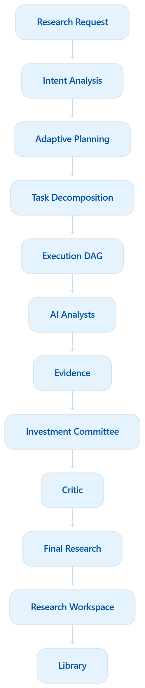

---

## 25. Example — Valuation Research

Consider a request such as:

> Analyze the valuation and investment risks of a selected company.

The planner does not need to execute every available analyst.

A possible plan is:

```mermaid
flowchart TD
    A["Valuation Research Request"] --> B["Intent Analysis"]

    B --> C["Company Analyst"]
    B --> D["Financial Analyst"]
    B --> E["Valuation Analyst"]
    B --> F["Risk Analyst"]

    C --> G["Shared Context"]
    D --> G
    E --> G
    F --> G

    D --> E
    C --> E

    E --> H["Investment Committee"]
    F --> H

    H --> I["Critic"]
    I --> J["Final Research"]
```

The exact set of analysts should be determined by the planner and the available agent capabilities rather than hard-coded into the user interface.

---

## 26. Failure and Recovery

Production research workflows must account for partial failures.

Examples include:

* Provider timeout
* Unavailable market-data source
* Failed analyst task
* Invalid tool response
* LLM timeout
* Retrieval failure
* Malformed structured output
* Missing evidence

The execution layer should isolate failures where possible.

```mermaid
flowchart TD
    A["Analyst Task"] --> B{"Execution Successful?"}

    B -->|Yes| C["Store Output"]
    B -->|No| D["Record Failure"]

    D --> E{"Retryable?"}

    E -->|Yes| F["Retry Task"]
    F --> A

    E -->|No| G["Mark Task Failed"]
    G --> H["Update Research State"]

    C --> I["Continue DAG"]
    H --> J["Research Error / Partial Result"]
```

A failure in one task should not automatically invalidate the entire research run when independent tasks can continue.

---

## 27. Persistence

The research workflow produces multiple categories of persistent information.

```mermaid
flowchart TD
    A["Research Run"] --> B["Research Metadata"]
    A --> C["Execution State"]
    A --> D["Analyst Outputs"]
    A --> E["Evidence"]
    A --> F["Research Result"]
    A --> G["Report"]

    B --> H["PostgreSQL"]
    C --> H
    D --> H
    E --> H
    F --> H
    G --> H

    G --> I["Library"]
```

PostgreSQL provides the persistent system of record for research-related application state.

The Library provides a user-facing location for retaining completed research artifacts.

---

## 28. Research → Workspace → Library

The final application flow is:

```mermaid
flowchart LR
    A["New Research"] --> B["Research Run"]
    B --> C["Research Execution"]
    C --> D["Research Result"]
    D --> E["Research Workspace"]

    E --> F["Analysis"]
    E --> G["Documents"]
    E --> H["Evidence"]
    E --> I["Report"]

    I --> J["Save"]
    J --> K["Library"]
```

This separates three concepts:

### Research Run

The execution lifecycle.

### Research Workspace

The interactive environment for exploring the results.

### Library

The persistent user-facing collection of completed research artifacts.

---

## 29. Architectural Responsibilities

| Component                | Responsibility                                   |
| ------------------------ | ------------------------------------------------ |
| **New Research UI**      | Collect research configuration                   |
| **Company Search**       | Identify the company/entity                      |
| **Research API**         | Accept and validate research requests            |
| **Research Service**     | Create and coordinate research runs              |
| **Intent Analysis**      | Convert user intent into structured requirements |
| **Planner**              | Determine required capabilities/analysts         |
| **Agent Registry**       | Describe available AI analysts                   |
| **Task Decomposer**      | Build executable research tasks                  |
| **Execution Engine**     | Execute the research DAG                         |
| **Worker**               | Run individual execution units                   |
| **State Manager**        | Track execution state                            |
| **AI Analysts**          | Perform specialized research                     |
| **Knowledge Service**    | Provide structured research knowledge            |
| **Adaptive Retrieval**   | Retrieve relevant information                    |
| **Tool Router**          | Controlled access to tools/providers             |
| **MCP Client**           | Connect to MCP-based tools                       |
| **LLM Service**          | Provide reasoning and structured generation      |
| **Memory**               | Preserve relevant research state                 |
| **Evidence Service**     | Track claims and provenance                      |
| **Investment Committee** | Synthesize analyst outputs                       |
| **Critic**               | Perform quality control                          |
| **Research Result**      | Store consolidated research output               |
| **Workspace**            | Present research to the user                     |
| **Report**               | Present final synthesized research               |
| **Library**              | Persist completed research artifacts             |

---

## 30. Key Design Principles

### 30.1 Research-first orchestration

The user asks a research question.

Orion decides how that question should be investigated.

```text
User Question
     ↓
Research Intent
     ↓
Plan
     ↓
Tasks
     ↓
Analysts
     ↓
Evidence
     ↓
Synthesis
     ↓
Review
     ↓
Research Result
```

---

### 30.2 Capability-based agent selection

The planner should select analysts based on required capabilities rather than always executing the entire analyst team.

This reduces unnecessary work and makes research plans more targeted.

---

### 30.3 Shared services

AI analysts receive shared services rather than implementing infrastructure independently.

```text
AI Analyst
   |
   +-- LLM Service
   +-- Tool Router
   +-- Knowledge Service
   +-- Memory Service
   +-- Evidence Service
   +-- Research Context
```

---

### 30.4 Evidence-grounded research

Research claims should be connected to evidence wherever possible.

The system therefore treats evidence as a first-class research object rather than simply text embedded inside a final prompt.

---

### 30.5 Separation of reasoning and infrastructure

The AI analyst performs research reasoning.

Infrastructure services handle:

* Databases
* Retrieval
* Tools
* Credentials
* External APIs
* MCP
* Persistence
* Observability

This keeps individual analysts focused on their research role.

---

### 30.6 Execution is separate from planning

Planning determines what should happen.

Execution determines how and when those tasks run.

```text
Planner
   ↓
Execution DAG
   ↓
Execution Engine
   ↓
Workers
   ↓
AI Analysts
```

This separation allows the execution infrastructure to evolve independently from planning logic.

---

## 31. Complete Orion Mental Model

The New Research workflow can be understood as a hierarchy:

```mermaid
flowchart TD
    A["New Research"] --> B["Research Manager"]

    B --> C["Adaptive Planner"]
    C --> D["Project Manager"]
    D --> E["Execution Engine"]
    E --> F["AI Analyst Team"]

    F --> G["Company"]
    F --> H["Financial"]
    F --> I["Industry"]
    F --> J["News"]
    F --> K["Macro"]
    F --> L["Valuation"]
    F --> M["Risk"]

    F --> N["Shared Research Context"]

    N --> O["Knowledge"]
    N --> P["Memory"]
    N --> Q["Evidence"]
    N --> R["Tools"]

    R --> S["Providers"]
    R --> T["MCP"]

    F --> U["LLM Service"]

    G --> V["Investment Committee"]
    H --> V
    I --> V
    J --> V
    K --> V
    L --> V
    M --> V

    V --> W["Critic"]
    W --> X["Research Result"]
    X --> Y["Research Workspace"]
    Y --> Z["Library"]
```

The resulting architecture can be summarized as:

> **Orion AI turns a user research request into an adaptive execution plan, delegates specialized work to AI analysts, grounds their work in data and evidence, synthesizes the results through an investment committee, validates the result through a critic, and presents the completed research through the workspace and Library.**

---

## 32. Related Documentation

The New Research workflow connects to the following Orion documentation areas:

* [`docs/architecture.md`](architecture.md) — Overall Orion architecture
* [`docs/new-research.md`](new-research.md) — This document
* [`docs/planning.md`](planning.md) — Planning and task decomposition
* [`docs/agents.md`](agents.md) — AI analyst architecture
* [`docs/execution.md`](execution.md) — Execution engine and worker model
* [`docs/knowledge.md`](knowledge.md) — Knowledge and retrieval system
* [`docs/evidence.md`](evidence.md) — Evidence and provenance
* [`docs/tools.md`](tools.md) — Tool Router and external integrations
* [`docs/observability.md`](observability.md) — Traces, metrics, logging, and execution visibility
* [`docs/evaluation.md`](evaluation.md) — Research quality and AI evaluation
* [`docs/security.md`](security.md) — Authentication, authorization, secrets, and audit controls

---

## 33. Summary

The Orion AI New Research workflow is not a simple:

```text
Prompt → LLM → Answer
```

pipeline.

It is a multi-stage research system:

```text
New Research
     ↓
Company Selection
     ↓
Research Configuration
     ↓
Research Run
     ↓
Intent Analysis
     ↓
Adaptive Planning
     ↓
Task Decomposition
     ↓
Execution DAG
     ↓
Execution Engine
     ↓
AI Analysts
     ↓
Knowledge + Retrieval + Tools + LLM
     ↓
Evidence
     ↓
Investment Committee
     ↓
Critic
     ↓
Research Result
     ↓
Research Workspace
     ↓
Report
     ↓
Library
```

This architecture allows Orion AI to evolve from a collection of independent AI agents into a coordinated multi-agent equity research platform where **planning, execution, evidence, synthesis, validation, and persistence are explicit parts of the system**.

---

.png)
