# Orion AI — Planning and Task Decomposition
.png)
> **The planning layer transforms a research request into a structured, dependency-aware execution plan for Orion's AI analyst team.**

The planning system is responsible for deciding **what research needs to be performed before execution begins**.

It does not execute the research itself.

Instead, it transforms:

```text
User Research Request
        ↓
Research Intent
        ↓
Required Capabilities
        ↓
AI Analyst Selection
        ↓
Task Decomposition
        ↓
Task Dependencies
        ↓
Execution DAG
```

The resulting execution plan is passed to the **Execution Engine**, which is responsible for actually running the tasks.

---

# 1. Planning Architecture

The planning layer sits between the Research Service and the Execution Engine.

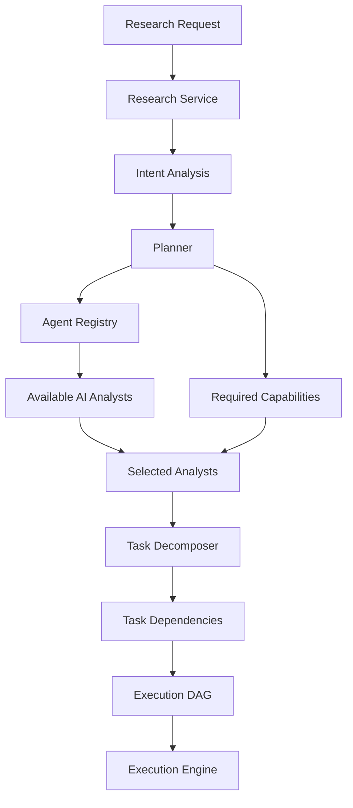

The planning layer therefore has two major responsibilities:

1. **Determine which capabilities are required.**
2. **Determine how those capabilities should be executed.**

---

# 2. Planning vs Execution

Planning and execution are intentionally separate.

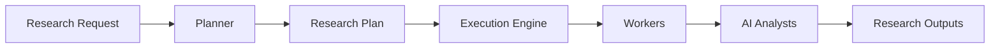

### Planner

The Planner determines:

* what needs to be researched
* which analysts are required
* which tasks are required
* task dependencies
* execution order
* required capabilities
* required tools or data sources

### Execution Engine

The Execution Engine determines:

* when a task can run
* which worker executes it
* how task state is tracked
* how failures are handled
* how retries occur
* how outputs are persisted

This separation prevents the planner from becoming an execution controller.

---

# 3. Planning Pipeline

The complete planning pipeline is:

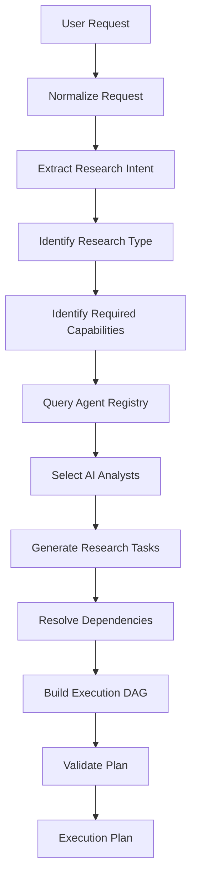

The final plan is the contract between the planning layer and the execution layer.

---

# 4. Research Intent

The planner should not operate directly on an unstructured user prompt.

The research request is first converted into structured intent.

Conceptually:

```text
ResearchIntent
├── company
├── research_type
├── objective
├── scope
├── time_horizon
├── requested_analysis
├── constraints
└── user_instructions
```

Example:

```text
User Request:

"Analyze the valuation and major risks of NVIDIA."
```

can be represented conceptually as:

```text
Company:
    NVIDIA

Research Type:
    Valuation / Investment Research

Required Analysis:
    Company
    Financial
    Valuation
    Risk

Objective:
    Evaluate valuation and major investment risks
```

The structured representation gives the planner information it can use for deterministic task selection.

---

# 5. Intent Analysis

The intent analysis stage extracts the important components of the request.

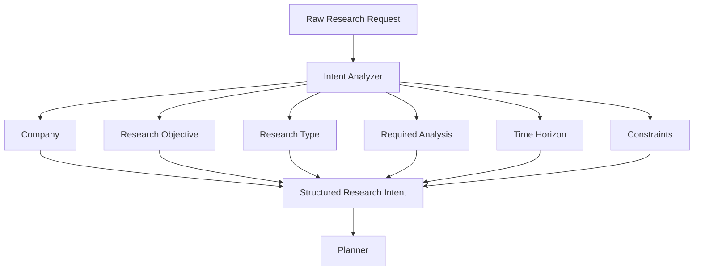

The intent layer can use an LLM where semantic interpretation is required, but the resulting intent should be converted into a structured representation before planning continues.

---

# 6. Planner Responsibilities

The Planner acts as the research planning layer.

Its responsibilities include:

```text
Planner
│
├── Understand research intent
│
├── Determine required capabilities
│
├── Query Agent Registry
│
├── Select appropriate AI analysts
│
├── Determine required research tasks
│
├── Establish task dependencies
│
├── Construct execution DAG
│
└── Validate the resulting plan
```

The Planner should **not**:

* directly execute external APIs
* directly perform database operations for analysts
* directly execute AI analyst tasks
* manage worker processes
* manage task retries
* replace the Execution Engine

---

# 7. Agent Registry

The Planner uses the Agent Registry to discover available AI analysts.

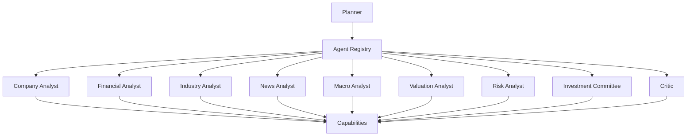

Each registered analyst can expose metadata such as:

```text
Agent Metadata
├── name
├── group
├── capabilities
├── dependencies
├── supported inputs
├── output schema
└── available tools
```

This allows planning logic to work with capabilities instead of hard-coding every analyst into the planner.

---

# 8. Capability-Based Planning

Orion should select analysts based on the capabilities required by the research request.

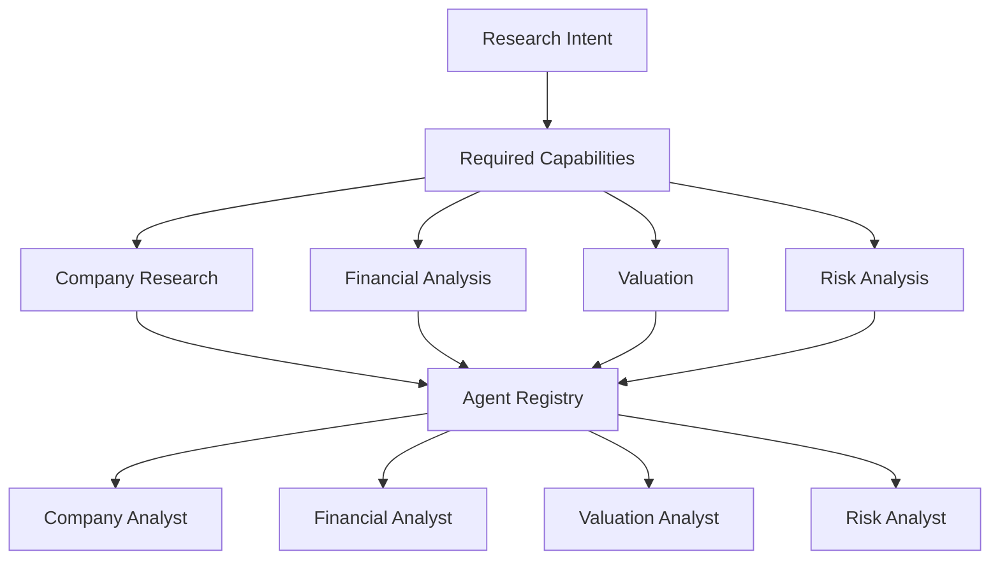

This allows the system to avoid executing unrelated analysts.

For example, a focused valuation request may not require every available research capability.

---

# 9. Analyst Selection

The selection process can be represented as:

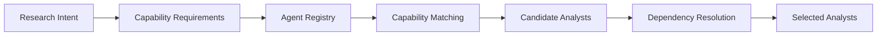

The selected analysts then become inputs to task decomposition.

---

# 10. Task Decomposition

Once analysts are selected, the planner converts the research objective into executable tasks.

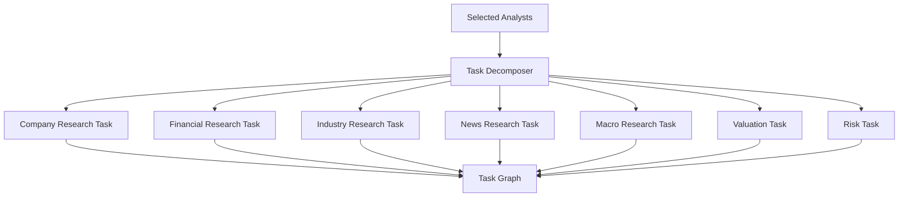

A task represents a concrete unit of research work.

Conceptually:

```text
ResearchTask
├── task_id
├── analyst
├── objective
├── input
├── dependencies
├── required_capabilities
├── output_schema
└── execution_metadata
```

---

# 11. Task Dependencies

Not all tasks can execute at the same time.

For example, valuation may require financial information.

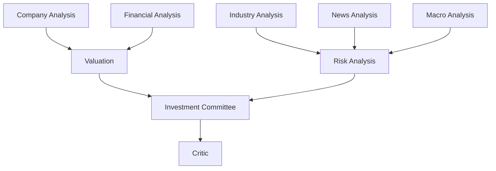

The planner captures these relationships as dependencies.

This allows independent tasks to execute concurrently while dependent tasks wait for their prerequisites.

---

# 12. Execution DAG

The final research plan is represented as a Directed Acyclic Graph.

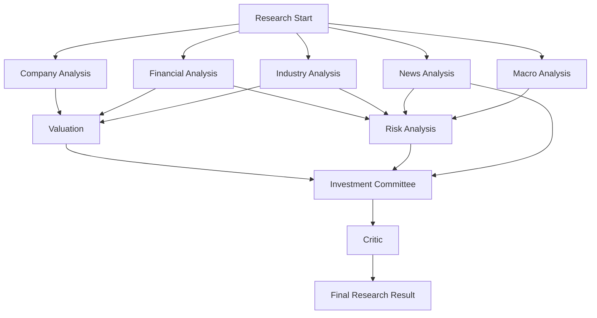

The graph represents both:

* task dependencies
* possible execution parallelism

---

# 13. Parallel Execution

Independent tasks can execute in parallel.

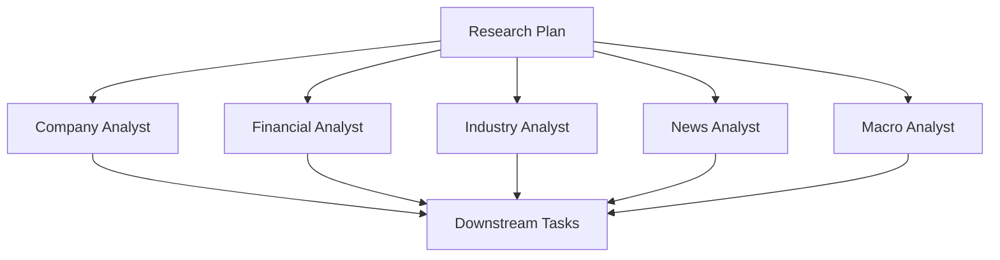

For example:

```text
Company ───────┐
Financial ─────┤
Industry ──────┤
News ──────────┤──> Downstream Analysis
Macro ─────────┘
```

The Execution Engine can schedule these independent tasks without unnecessarily waiting for unrelated tasks.

---

# 14. Dependency-Aware Planning

The planner must distinguish between:

### Independent tasks

Tasks that do not require another task's output.

### Dependent tasks

Tasks that require the result of another task.

Example:

```text
Company Analysis
       │
       └─────────────┐
                     ↓
Financial Analysis → Valuation
                     ↓
                     ↓
              Investment Committee
                     ↓
                   Critic
```

This dependency information becomes part of the execution DAG.

---

# 15. Example Planning Scenario

Consider:

> "Perform a complete equity research analysis of a company."

The planner may determine that the following capabilities are required:

```text
Company
Financial
Industry
News
Macro
Valuation
Risk
Synthesis
Critique
```

The resulting graph could be:

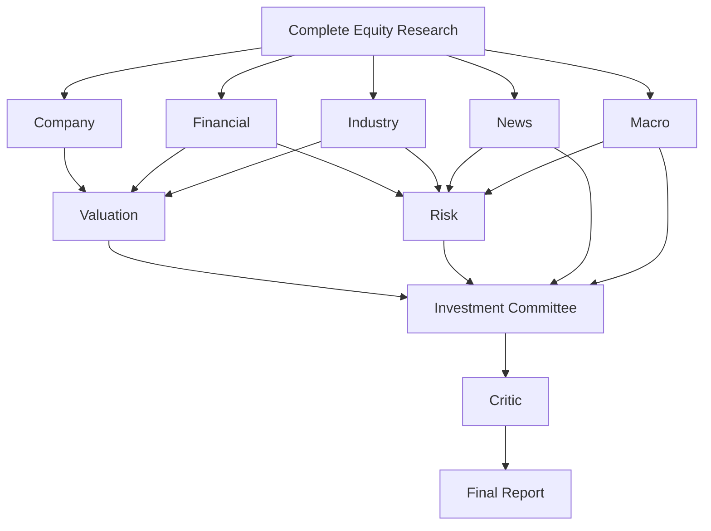

This is an example of the type of plan the planner can construct.

The actual plan should depend on the research intent and registered capabilities.

---

# 16. Planning Data Flow

The planning subsystem can be viewed as:

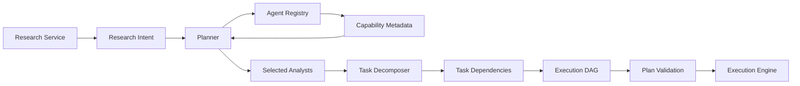

The planner therefore acts as a compiler-like layer:

```text
Research Request
        ↓
Structured Intent
        ↓
Research Plan
        ↓
Execution Graph
```

---

# 17. Plan Validation

Before execution, the generated plan should be validated.

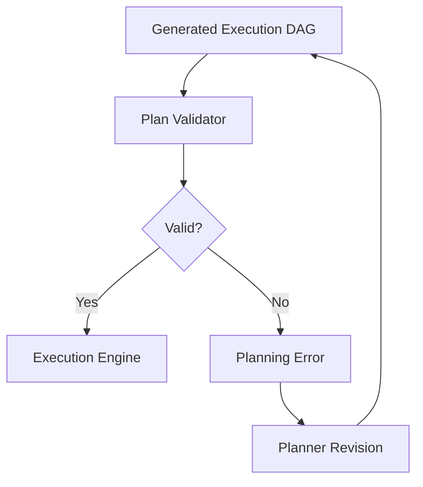

Validation should check for conditions such as:

* missing required analyst
* unresolved dependency
* invalid task reference
* duplicate task
* circular dependency
* missing output requirement
* unsupported capability
* invalid task configuration

A DAG must not contain cycles.

---

# 18. Planning and Shared Research Context

The planner creates the structure that allows later analysts to share results.

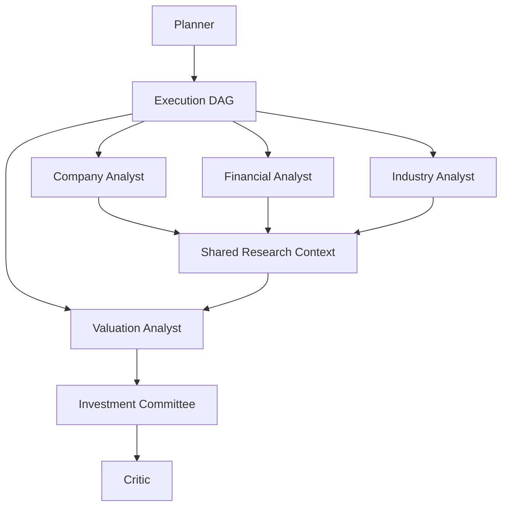

The planner therefore determines not only **which analysts run**, but also **which outputs become prerequisites for downstream work**.

---

# 19. Planner and LLM

The LLM can assist with semantic reasoning during planning.

However, the LLM should not become the unrestricted execution controller.

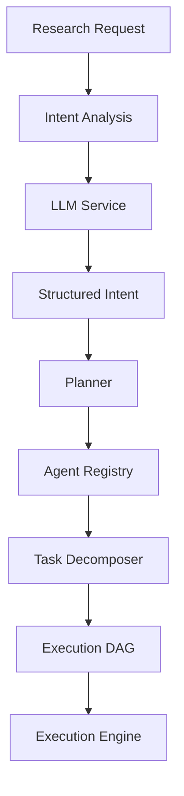

The architectural boundary is:

```text
LLM
    ↓
Reason about intent / structured planning information

Planner
    ↓
Create deterministic execution structure

Execution Engine
    ↓
Run the actual research
```

This makes the system easier to observe, test, and control.

---

# 20. Planner Output

A conceptual planning result can look like:

```text
ResearchPlan
│
├── research_id
│
├── objective
│
├── selected_agents
│
├── tasks
│
├── dependencies
│
└── execution_graph
```

Example:

```text
ResearchPlan

Research ID:
    research-123

Objective:
    Evaluate company valuation and risk

Selected Analysts:
    Company Analyst
    Financial Analyst
    Valuation Analyst
    Risk Analyst
    Investment Committee
    Critic

Tasks:
    company-analysis
    financial-analysis
    valuation-analysis
    risk-analysis
    committee-synthesis
    research-critique

Dependencies:
    valuation-analysis
        ← financial-analysis
        ← company-analysis

    risk-analysis
        ← financial-analysis

    committee-synthesis
        ← valuation-analysis
        ← risk-analysis

    research-critique
        ← committee-synthesis
```

---

# 21. Planning Lifecycle

The planning lifecycle is:

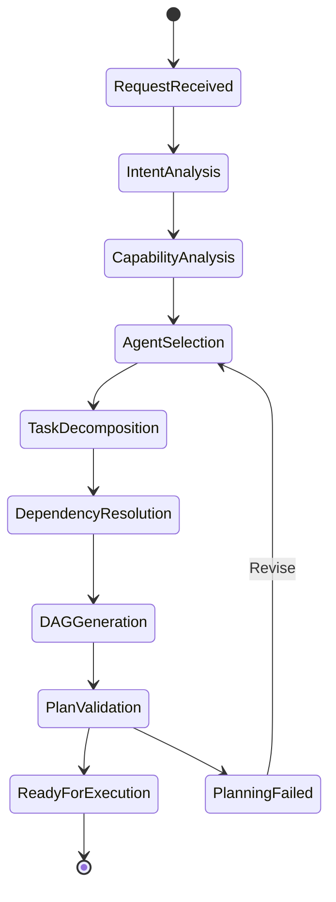

The execution engine begins only after the plan reaches the `ReadyForExecution` stage.

---

# 22. Planning Failure

Planning itself can fail before any analyst executes.

Examples include:

```text
Unknown capability
Missing analyst
Invalid dependency
Circular dependency
Invalid research request
Unsupported research type
Invalid task configuration
```

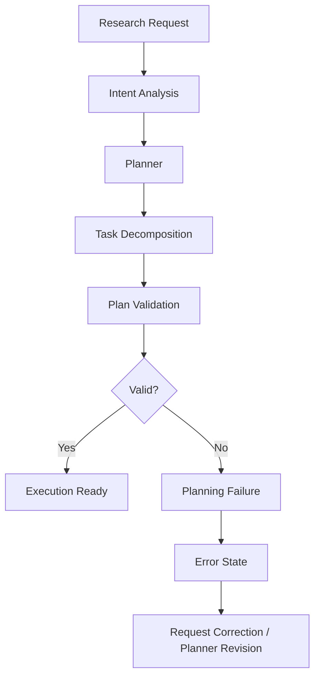

This separates **planning failures** from **execution failures**.

---

# 23. Planning vs Agent Collaboration

The Planner does not need to directly coordinate every interaction between analysts.

Its job is to define the research structure.

```text
Planner
    ↓
"What needs to happen?"
```

The Execution Engine handles:

```text
"When can it happen?"
"Which worker runs it?"
"What happens if it fails?"
```

The Shared Research Context handles:

```text
"What previous research is available?"
```

The AI analysts handle:

```text
"How should this research task be analyzed?"
```

---

# 24. Planning Architecture in Orion

The conceptual module structure is:

```text
backend/
└── app/
    ├── planning/
    │   ├── planner.py
    │   ├── task_decomposer.py
    │   └── templates/
    │       ├── comparison
    │       ├── industry
    │       ├── investment_theme
    │       ├── market_macro
    │       └── portfolio
    │
    ├── agents/
    │   └── base/
    │       └── registry.py
    │
    └── execution/
        ├── execution_engine.py
        ├── worker.py
        └── state_manager.py
```

The exact implementation can evolve while maintaining the same architectural responsibility boundaries.

---

# 25. Planning Templates

Orion can support predefined research planning templates for common research patterns.

Examples include:

```text
Comparison
Industry
Investment Theme
Market / Macro
Portfolio
```

Conceptually:

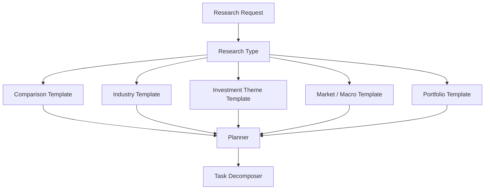

Templates provide reusable planning structures while still allowing the planner to adapt the final execution graph to the specific request.

---

# 26. Adaptive Planning

A template should not necessarily result in a fixed execution graph.

The planner can adapt the plan according to:

* research objective
* selected company
* requested scope
* available data
* required capabilities
* analyst dependencies
* research constraints

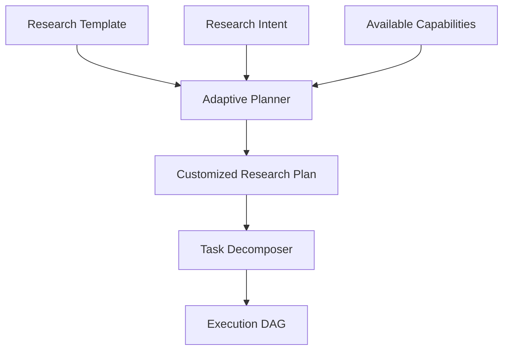

This is the basis for Orion's adaptive planning architecture.

---

# 27. Planning and Observability

Planning should produce enough metadata for the system to understand how a research run was constructed.

```mermaid
flowchart LR

    A["Research Request"] --> B["Planner"]

    B --> C["Plan"]

    C --> D["Selected Analysts"]
    C --> E["Tasks"]
    C --> F["Dependencies"]

    D --> G["Observability"]
    E --> G
    F --> G

    G --> H["Research Trace"]
```

Useful planning telemetry includes:

* planning latency
* number of selected analysts
* number of tasks
* DAG depth
* dependency count
* planning failures
* plan revisions
* task parallelism

---

# 28. Planning and Evaluation

Planning quality can also be evaluated independently from final report quality.

Potential planning metrics include:

| Metric                   | Purpose                                        |
| ------------------------ | ---------------------------------------------- |
| Agent Selection Accuracy | Whether required analysts were selected        |
| Task Completeness        | Whether important research tasks were included |
| Dependency Correctness   | Whether task relationships are valid           |
| Plan Validity            | Whether the DAG can execute                    |
| Unnecessary Task Rate    | Whether irrelevant work was added              |
| Planning Latency         | Time required to construct the plan            |
| Revision Rate            | Frequency of planner corrections               |

The final research quality should not be the only evaluation target.

A poor plan can produce a poor result even when individual analysts perform correctly.

---

# 29. Planning Security Considerations

Planning is also a security boundary.

Research requests can contain untrusted input.

The planning layer should therefore avoid allowing user input to arbitrarily:

* invoke privileged tools
* bypass authorization
* select restricted capabilities
* modify execution infrastructure
* access another research run
* inject arbitrary tool parameters

```mermaid
flowchart TD

    A["User Research Request"] --> B["Input Validation"]

    B --> C["Authorization"]

    C --> D["Intent Analysis"]

    D --> E["Planner"]

    E --> F["Allowed Capabilities"]

    F --> G["Execution DAG"]

    G --> H["Execution Engine"]
```

Tool-level authorization remains the final enforcement boundary when external systems are accessed.

---

# 30. Planning Mental Model

The easiest way to understand Orion's planning layer is:

```text
Research Request
       ↓
"What does the user want?"
       ↓
Research Intent
       ↓
"What capabilities are required?"
       ↓
Planner
       ↓
"Which AI analysts provide those capabilities?"
       ↓
Agent Registry
       ↓
"What tasks do they need to perform?"
       ↓
Task Decomposer
       ↓
"What depends on what?"
       ↓
Dependency Resolution
       ↓
"How should the work be executed?"
       ↓
Execution DAG
       ↓
Execution Engine
```

---

# 31. Final Planning Architecture

```mermaid
flowchart TD

    A["User"] --> B["New Research"]

    B --> C["Research Service"]

    C --> D["Research Intent"]

    D --> E["Planner"]

    E --> F["Agent Registry"]

    F --> G["Capabilities"]

    G --> E

    E --> H["Selected AI Analysts"]

    H --> I["Task Decomposer"]

    I --> J["Task Dependencies"]

    J --> K["Execution DAG"]

    K --> L["Plan Validator"]

    L --> M["Execution Engine"]

    M --> N["AI Analyst Execution"]

    N --> O["Shared Research Context"]

    O --> P["Evidence / Research Outputs"]

    P --> Q["Investment Committee"]

    Q --> R["Critic"]

    R --> S["Final Research Result"]
```

---

# 32. Summary

The Orion planning layer converts an open-ended research request into a structured execution plan.

Its core pipeline is:

```text
Research Request
        ↓
Intent Analysis
        ↓
Capability Identification
        ↓
Agent Registry
        ↓
Analyst Selection
        ↓
Task Decomposition
        ↓
Dependency Resolution
        ↓
Execution DAG
        ↓
Plan Validation
        ↓
Execution Engine
```

The architectural separation is deliberate:

```text
Planner
  = decides what should happen

Task Decomposer
  = converts the research objective into tasks

Agent Registry
  = describes what analysts can do

Execution DAG
  = describes dependencies and execution structure

Execution Engine
  = runs the plan

AI Analysts
  = perform specialized research

Shared Research Context
  = allows research outputs to flow between tasks
```

This design allows Orion AI to move beyond a collection of independent LLM agents toward a **coordinated, adaptive multi-agent research system**.
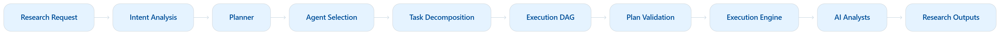