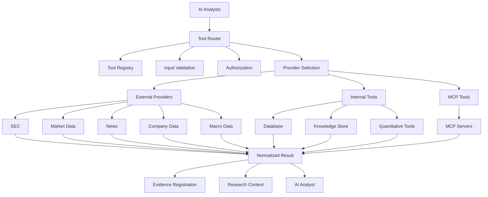
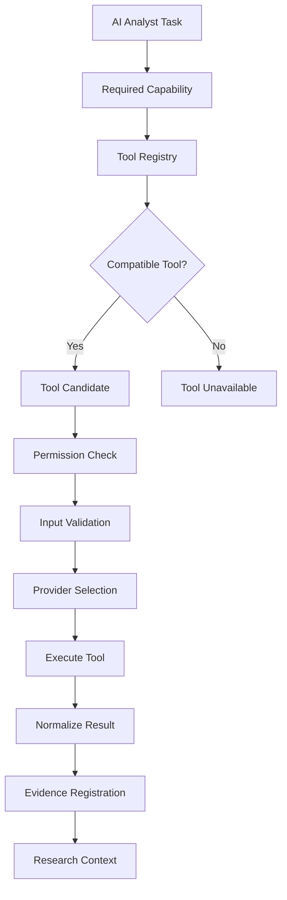
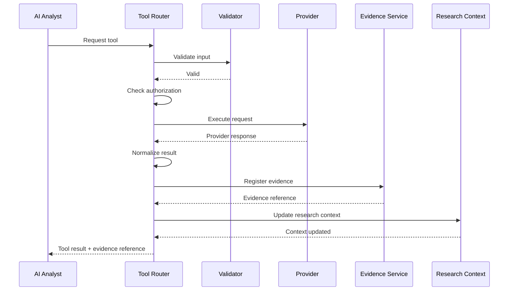
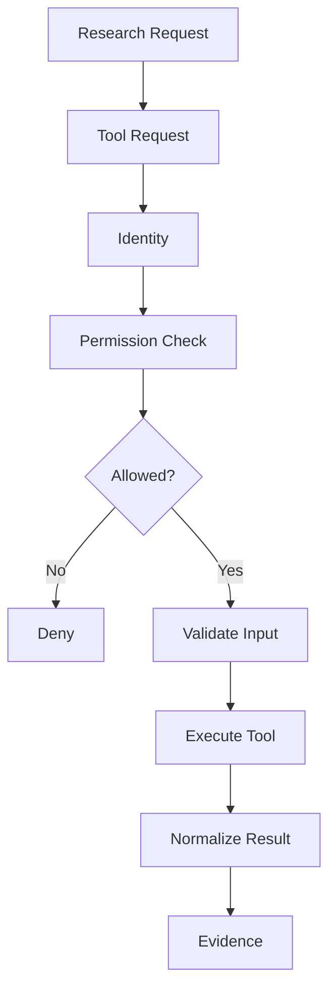
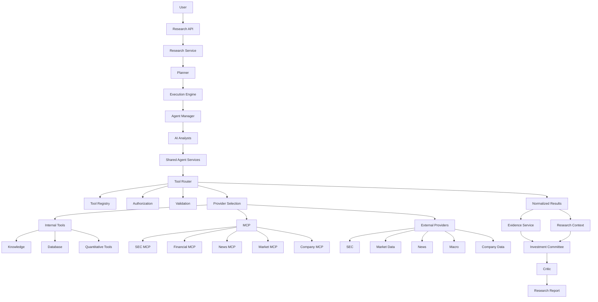
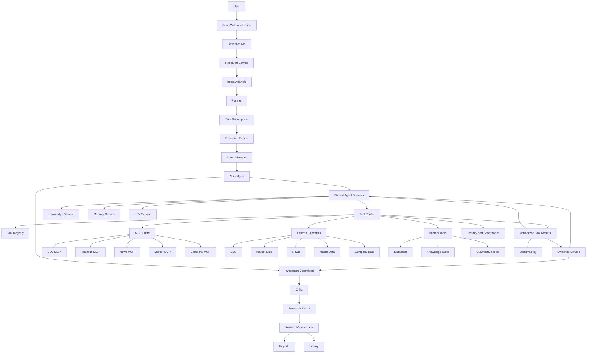

# Orion AI — Tool Router and External Integrations

## Tool Integration Architecture


> **Production-oriented tool execution architecture for controlled access to financial data, SEC filings, company information, market data, news, macroeconomic data, MCP servers, and analytical utilities.**

---

## 1. Overview

Orion AI uses a **Tool Router** as the controlled integration layer between AI analysts and external or internal capabilities.

AI analysts should not directly access arbitrary APIs, databases, credentials, or external services.

Instead, the execution path is:

```text
AI Analyst
    |
    v
Tool Router
    |
    +-------------------+
    |                   |
    v                   v
Internal Tools      External Tools
    |                   |
    |                   +---- Data Providers
    |                   +---- SEC
    |                   +---- Market APIs
    |                   +---- News APIs
    |                   +---- Company Data
    |                   +---- Macro Data
    |
    +---- Database
    +---- Knowledge Store
    +---- Calculations
    +---- Retrieval
    |
    v
Normalized Tool Result
    |
    v
AI Analyst
```

This architecture provides a single control point for:

* tool discovery
* capability matching
* input validation
* authentication
* authorization
* provider selection
* API execution
* MCP communication
* retries
* timeouts
* error handling
* response normalization
* evidence registration
* logging
* metrics
* cost tracking
* security controls.

The Tool Router therefore acts as the **integration boundary of Orion AI**.

---

# 2. Why Orion AI Needs a Tool Router

An equity research system needs access to many types of information.

For example:

```text
Company information
Financial statements
SEC filings
Market prices
News
Industry information
Macroeconomic indicators
Historical financial data
Research documents
Quantitative calculations
```

Allowing every AI analyst to directly call these services creates several problems.

### Without a Tool Router

```text
Company Analyst ---> SEC API
Company Analyst ---> Yahoo
Company Analyst ---> Database
Company Analyst ---> News API

Financial Analyst ---> Yahoo
Financial Analyst ---> SEC
Financial Analyst ---> Database

Valuation Analyst ---> Market API
Valuation Analyst ---> Financial API
Valuation Analyst ---> Python

Risk Analyst ---> News API
Risk Analyst ---> Macro API
```

This creates duplicated integration logic and makes security, observability, and testing difficult.

### With a Tool Router

```text
Company Analyst -----+
Financial Analyst ---+
Industry Analyst ----+
News Analyst --------+
Macro Analyst -------+
Valuation Analyst ---+
Risk Analyst --------+
                     |
                     v
                Tool Router
                     |
       +-------------+-------------+
       |             |             |
       v             v             v
   Providers        MCP       Internal Tools
```

The Tool Router centralizes integration behavior.

---

# 3. Core Architecture

The Tool Router sits between AI analysts and tool implementations.



The router therefore separates:

```text
Research reasoning
        |
        v
Tool selection
        |
        v
Tool execution
        |
        v
Result normalization
        |
        v
Evidence + research context
```

---

# 4. Tool Router Responsibilities

The Tool Router is responsible for coordinating tool execution.

Its responsibilities include:

1. Tool discovery
2. Capability matching
3. Input validation
4. Authentication
5. Authorization
6. Provider selection
7. Tool invocation
8. Timeout handling
9. Retry handling
10. Error normalization
11. Response normalization
12. Evidence registration
13. Observability
14. Cost tracking
15. Security enforcement.

The router should not perform the actual research reasoning.

Instead:

```text
AI Analyst
    |
    | "I need historical revenue"
    v
Tool Router
    |
    | selects appropriate capability
    v
Financial Data Tool
    |
    v
Provider
    |
    v
Normalized Result
```

---

# 5. Tool Categories

Orion AI can organize tools into several categories.

## 5.1 Company Tools

Company tools provide information about companies.

Examples:

```text
company profile
company description
products
services
segments
management
headquarters
corporate metadata
```

Conceptual flow:

```text
Company Analyst
      |
      v
Tool Router
      |
      v
Company Tool
      |
      v
Company Provider
      |
      v
Normalized Company Data
```

---

# 6. SEC Tools

SEC tools provide access to regulatory filings and related information.

Examples include:

```text
10-K
10-Q
8-K
company filings
filing metadata
filing sections
financial disclosures
```

Architecture:

```text
Financial / Company Analyst
          |
          v
      Tool Router
          |
          v
       SEC Tool
          |
          v
     SEC Connector
          |
          v
    Filing Information
          |
          v
       Evidence
```

SEC data is particularly important for evidence-grounded research because regulatory filings can provide primary-source information.

---

# 7. Financial Data Tools

Financial tools provide structured financial information.

Examples:

```text
revenue
net income
EPS
gross margin
operating margin
free cash flow
balance sheet
cash
debt
assets
liabilities
financial ratios
historical financial metrics
```

Example:

```text
Financial Analyst
      |
      v
Tool Router
      |
      v
Financial Tool
      |
      v
Financial Provider
      |
      v
Normalized Financial Data
```

Financial results can subsequently become:

```text
Research Context
        +
Evidence
        +
Derived Calculations
```

---

# 8. Market Data Tools

Market tools provide market-related information.

Examples:

```text
stock price
historical prices
volume
market capitalization
price returns
volatility
market indicators
```

A valuation workflow might use:

```text
Valuation Analyst
       |
       v
Tool Router
       |
       v
Market Data Tool
       |
       v
Market Provider
       |
       v
Price + Market Data
```

Market data should be timestamped because financial information is time-sensitive.

---

# 9. News Tools

News tools provide information about recent company and market events.

Examples:

```text
company news
earnings news
M&A announcements
product announcements
regulatory events
market events
management changes
```

Typical flow:

```text
News Analyst
    |
    v
Tool Router
    |
    v
News Tool
    |
    v
News Provider
    |
    v
Articles
    |
    v
Evidence
```

News should be treated differently from primary regulatory data because source quality, publication time, duplication, and reporting differences matter.

---

# 10. Macro Tools

Macro tools provide economic and market-level information.

Examples:

```text
interest rates
inflation
GDP
employment
economic indicators
monetary policy
economic growth
```

Typical consumers include:

* Macro Analyst
* Risk Analyst
* Valuation Analyst
* Investment Committee.

Example:

```text
Macro Analyst
      |
      v
Tool Router
      |
      v
Macro Tool
      |
      v
Economic Data Provider
      |
      v
Macro Evidence
```

---

# 11. Knowledge Tools

Not every tool needs to access an external API.

Some tools operate on Orion's internal knowledge system.

Examples:

```text
knowledge search
document retrieval
vector search
keyword search
research memory
company facts
financial facts
previous research
```

Architecture:

```text
AI Analyst
    |
    v
Tool Router
    |
    v
Knowledge Tool
    |
    +---- Vector Store
    +---- Keyword Search
    +---- Knowledge Store
    +---- Research Memory
```

This allows analysts to use previously ingested information without directly interacting with storage systems.

---

# 12. Quantitative Tools

Valuation and financial research often require deterministic calculations.

Examples:

```text
growth calculations
margin calculations
financial ratios
DCF calculations
discounting
terminal value
comparable-company calculations
return calculations
volatility calculations
scenario analysis
```

The Tool Router can expose these capabilities as controlled tools.

Example:

```text
Valuation Analyst
       |
       v
Tool Router
       |
       v
Quantitative Tool
       |
       v
Deterministic Calculation
       |
       v
Calculated Result
```

This creates a useful separation:

```text
LLM
    -> reasoning

Python / Quant Tool
    -> deterministic calculation
```

The LLM should not be relied upon for arithmetic when a deterministic calculation tool is available.

---

# 13. MCP Integration

Orion AI includes an MCP layer for exposing structured capabilities.

Conceptually:

```text
AI Analyst
    |
    v
Tool Router
    |
    v
MCP Client
    |
    v
MCP Server
    |
    +---- SEC Server
    +---- Financial Server
    +---- News Server
    +---- Market Server
    +---- Company Server
```

The MCP layer allows capabilities to be exposed through a standardized tool interface.

Orion's MCP architecture can therefore be viewed as:

```text
              Tool Router
                   |
                   v
              MCP Client
                   |
       +-----------+-----------+
       |           |           |
       v           v           v
    SEC MCP    Financial MCP  News MCP
       |
       v
  External Sources
```

MCP remains behind the Tool Router rather than becoming a direct uncontrolled connection from an AI analyst.

---

# 14. MCP Servers

The project contains a conceptual MCP server structure:

```text
backend/
└── app/
    └── mcp/
        ├── client.py
        ├── registry.py
        ├── server_manager.py
        │
        └── servers/
            ├── sec_server.py
            ├── financial_server.py
            ├── news_server.py
            ├── market_server.py
            └── company_server.py
```

The responsibilities are separated.

### MCP Client

Communicates with MCP servers.

### MCP Registry

Tracks available MCP capabilities.

### Server Manager

Manages MCP server lifecycle and connectivity.

### MCP Servers

Expose domain-specific capabilities.

---

# 15. Tool Registry

The Tool Registry provides metadata about available tools.

A conceptual tool registration contains:

```text
tool_name
tool_type
description
capabilities
input_schema
output_schema
required_permissions
provider
timeout
retry_policy
version
```

Example:

```text
Tool:
    get_company_financials

Capabilities:
    financial_history
    revenue
    earnings
    margins

Input:
    company_id
    period

Output:
    normalized financial data
```

The registry allows the planner and router to reason about available capabilities without hard-coding every tool into every analyst.

---

# 16. Capability-Based Tool Selection

Tools should be selected based on capabilities rather than arbitrary tool names.

For example:

```text
Research Requirement:
"Analyze historical revenue growth"

Required Capability:
financial_history

Tool Registry:
    SEC Financial Tool
    Financial Data Tool
    Company Financial Tool

Tool Router:
    select compatible capability
```

This provides flexibility when providers change.

---

# 17. Tool Selection Architecture



---

# 18. Tool Input Validation

Every tool invocation should validate its inputs before execution.

Example:

```text
Tool:
get_historical_prices

Input:
{
    company_id,
    start_date,
    end_date,
    interval
}
```

Validation should check:

```text
required fields
data types
allowed ranges
date formats
enum values
company identifier format
permission scope
```

Invalid requests should fail before reaching the external provider.

---

# 19. Authentication

External providers may require credentials.

The Tool Router should abstract credential handling from AI analysts.

The desired architecture is:

```text
AI Analyst
    |
    v
Tool Router
    |
    v
Credential Manager
    |
    v
Provider Credential
    |
    v
External API
```

AI analysts should never receive raw API secrets.

---

# 20. Authorization

Authentication answers:

```text
Who is making the request?
```

Authorization answers:

```text
Is this request allowed?
```

Tool execution can therefore be checked against:

```text
user permissions
research permissions
tool permissions
provider permissions
tenant boundaries
data access policies
```

Example:

```text
Research Request
      |
      v
Authorization
      |
      +---- allowed
      |
      +---- denied
```

---

# 21. Provider Abstraction

The Tool Router should avoid tightly coupling AI analysts to individual providers.

Instead:

```text
AI Analyst
    |
    v
Tool Interface
    |
    v
Provider Adapter
    |
    +---- Provider A
    +---- Provider B
    +---- Provider C
```

This makes provider replacement easier.

For example:

```text
MarketDataTool
      |
      +---- Provider A
      +---- Provider B
```

The analyst only needs the normalized tool interface.

---

# 22. Response Normalization

External providers frequently return different schemas.

For example:

```text
Provider A:
{
    "revenue": 100000
}
```

Another provider might return:

```text
{
    "totalRevenue": 100000
}
```

Or:

```text
{
    "financials": {
        "revenue": 100000
    }
}
```

The Tool Router should normalize these into a common internal representation.

```text
Provider Response
       |
       v
Provider Adapter
       |
       v
Normalized Tool Result
       |
       v
AI Analyst
```

This keeps provider-specific schemas outside analyst logic.

---

# 23. Normalized Tool Result

A conceptual normalized result may contain:

```text
tool_name
request_id
timestamp
source
data
metadata
source_url
source_document
publication_date
retrieval_time
confidence
status
errors
```

For financial information:

```text
{
    company_id,
    metric,
    value,
    unit,
    period,
    source,
    timestamp
}
```

This structure also makes evidence registration easier.

---

# 24. Tool Result and Evidence

Tool output should not automatically become a final research claim.

The relationship is:

```text
Tool Result
    |
    v
Evidence Registration
    |
    v
Evidence
    |
    v
Analyst Finding
    |
    v
Claim
```

This preserves the distinction between:

```text
Data
Evidence
Interpretation
Claim
```

---

# 25. Tool Execution Lifecycle

A typical tool execution follows:

```text
Requested
   |
   v
Discovered
   |
   v
Validated
   |
   v
Authorized
   |
   v
Prepared
   |
   v
Executing
   |
   v
Completed
   |
   v
Normalized
   |
   v
Evidence Registered
```

Failures can transition to:

```text
Failed
Timed Out
Retried
Unavailable
Unauthorized
Invalid
```

---

# 26. Tool Execution Sequence



---

# 27. Retries

External services can fail temporarily.

Examples:

```text
network failure
temporary provider outage
rate limit
connection timeout
transient server error
```

The router can use controlled retry policies.

Conceptually:

```text
Tool Request
     |
     v
Execute
     |
     v
Failure?
   /     \
 No       Yes
 |         |
 v         v
Result   Retry Policy
            |
       +----+----+
       |         |
    Retry      Stop
       |
       v
   Execute Again
```

Retries should be bounded.

A tool should not retry indefinitely.

---

# 28. Timeouts

External calls should have explicit timeout boundaries.

```text
Tool Request
     |
     v
Provider
     |
     +---- response
     |
     +---- timeout
```

On timeout:

```text
Timeout
   |
   +---- Retry
   |
   +---- Fallback Provider
   |
   +---- Mark Failed
```

Timeout behavior should depend on tool criticality.

---

# 29. Rate Limits

External providers may impose rate limits.

The Tool Router can centralize:

```text
request throttling
backoff
rate-limit handling
provider quotas
concurrency limits
```

Instead of every analyst implementing its own rate-limit logic.

---

# 30. Error Normalization

Providers expose different error formats.

The Tool Router should normalize them.

For example:

```text
Provider Error
      |
      v
Tool Router
      |
      v
Normalized Error
```

Conceptual error categories:

```text
INVALID_INPUT
UNAUTHORIZED
FORBIDDEN
NOT_FOUND
RATE_LIMITED
TIMEOUT
PROVIDER_ERROR
NETWORK_ERROR
UNAVAILABLE
NORMALIZATION_ERROR
UNKNOWN_ERROR
```

This allows the Execution Engine to make consistent decisions.

---

# 31. Failure Isolation

A failed tool should not necessarily terminate the entire research run.

Example:

```text
Company Analyst
Financial Analyst
Industry Analyst
News Analyst
Macro Analyst
       |
       v
    Research
```

If a news provider fails:

```text
News Tool -> Failed

Company      -> Completed
Financial    -> Completed
Industry     -> Completed
Macro        -> Completed
News         -> Failed
```

The Execution Engine can decide whether the research should continue.

This is important for resilient multi-agent research.

---

# 32. Fallback Providers

Some tool categories can support fallback providers.

Example:

```text
Market Data Tool
       |
       +---- Primary Provider
       |
       +---- Secondary Provider
       |
       +---- Cached Data
```

Fallback behavior should preserve source and timestamp information.

A fallback should never silently make data appear equivalent if the underlying sources differ.

---

# 33. Caching

Some data does not need to be retrieved repeatedly.

Examples:

```text
company profile
historical financial data
older SEC filings
industry metadata
previously retrieved documents
```

The Tool Router can use caching where appropriate.

```text
Tool Request
     |
     v
Cache
   /   \
Hit    Miss
 |      |
 v      v
Result Provider
         |
         v
       Cache
         |
         v
       Result
```

Time-sensitive market data requires stricter freshness handling.

---

# 34. Tool and Research Context

Tool results should flow into the shared Research Context.

```text
Tool Router
     |
     v
Normalized Result
     |
     +---- Evidence
     |
     +---- Research Context
     |
     +---- Analyst Output
```

This allows downstream analysts to consume previous findings.

For example:

```text
Financial Analyst
       |
       v
Revenue + Margin Evidence
       |
       v
Shared Research Context
       |
       v
Valuation Analyst
```

---

# 35. Tool Router and AI Analysts

AI analysts request capabilities through shared services.

Conceptually:

```python
class FinancialResearchAgent(BaseAgent):

    async def run(self, task):
        result = await self.services.tools.execute(
            tool="financial_data",
            input=task.input
        )

        return result
```

The exact implementation may differ, but the architectural principle is:

```text
Agent
  |
  v
Agent Services
  |
  v
Tool Router
```

rather than:

```text
Agent
  |
  +---- Direct API call
```

---

# 36. Tool Router and Agent Manager

The Agent Manager provides shared services to AI analysts.

```text
Agent Manager
      |
      v
Shared Agent Services
      |
      +---- Memory
      +---- Knowledge
      +---- Evidence
      +---- Tool Router
      +---- LLM
      +---- Research Context
```

Therefore, every analyst can use the same controlled integration layer.

---

# 37. Tool Router and Planner

The planner determines **what capabilities are required**.

The Tool Router determines **how those capabilities are executed**.

Example:

```text
Planner:
"Historical financial analysis is required."

        |
        v

Capability:
financial_history

        |
        v

Tool Registry

        |
        v

Financial Data Tool

        |
        v

Tool Router

        |
        v

Provider
```

This creates a clean separation between planning and execution.

---

# 38. Tool Router and Execution Engine

The Execution Engine controls task execution.

The Tool Router controls tool execution within a task.

```text
Execution Engine
      |
      v
Task
      |
      v
AI Analyst
      |
      v
Tool Router
      |
      v
External / Internal Tool
```

Therefore:

```text
Execution Engine
    = when and where a task runs

Tool Router
    = how a capability is accessed
```

---

# 39. Tool Dependencies

Some tools depend on other services.

Example:

```text
Valuation Tool
      |
      +---- Financial Data
      +---- Market Data
      +---- Company Data
```

The router should keep these dependencies explicit.

This makes execution easier to trace.

---

# 40. Tool Observability

Every tool invocation should be observable.

Important metadata includes:

```text
request_id
research_id
task_id
agent_id
tool_name
provider
start_time
end_time
duration
status
retry_count
error_type
result_size
source
```

This enables analysis such as:

```text
Which tool is slow?
Which provider fails most frequently?
How many calls occur per research?
How often are retries required?
Which analyst uses which tools?
```

---

# 41. Tool Metrics

Useful metrics include:

### Execution Metrics

```text
tool_calls_total
tool_success_total
tool_failure_total
tool_timeout_total
tool_retry_total
```

### Performance

```text
tool_latency_ms
provider_latency_ms
normalization_latency_ms
```

### Reliability

```text
tool_success_rate
provider_error_rate
timeout_rate
retry_rate
```

### Research Metrics

```text
tool_calls_per_research
evidence_records_per_tool
source_distribution
```

---

# 42. Tool Tracing

A research trace can connect:

```text
Research
   |
   v
Task
   |
   v
Agent
   |
   v
Tool Call
   |
   v
Provider
   |
   v
Evidence
```

Example:

```text
Research ID: R123

Task:
financial_analysis

Agent:
financial_analyst

Tool:
financial_data

Provider:
market_data_provider

Evidence:
E456
```

This creates end-to-end provenance.

---

# 43. Tool Cost Tracking

Some external providers may charge per request.

The Tool Router can expose usage information to the cost tracker.

```text
Tool Call
   |
   v
Provider
   |
   v
Usage Metadata
   |
   v
Cost Tracker
```

Useful fields:

```text
provider
tool
request_count
estimated_cost
research_id
agent_id
```

This is particularly useful for production deployments.

---

# 44. Security Boundary

The Tool Router is also a major security boundary.

External content should be treated as **untrusted data**.

For example:

```text
SEC Filing
News Article
Web Content
Research Document
External API Response
```

must not automatically be treated as instructions for the AI analyst.

The security boundary is:

```text
External Source
      |
      v
Tool
      |
      v
Tool Router
      |
      v
Normalized Data
      |
      v
Evidence
      |
      v
AI Analyst
```

---

# 45. Prompt Injection Protection

External sources can contain arbitrary text.

A retrieved document might contain text resembling instructions.

The system should preserve the distinction:

```text
External Content
    =
    DATA
```

not:

```text
External Content
    =
    SYSTEM INSTRUCTIONS
```

The Tool Router and downstream research services should therefore maintain clear trust boundaries.

---

# 46. Secret Management

API keys and provider credentials should be handled outside analyst prompts and outputs.

Conceptually:

```text
AI Analyst
     |
     v
Tool Router
     |
     v
Secret Manager
     |
     v
Provider Credential
     |
     v
External API
```

The analyst should never receive:

```text
API keys
access tokens
database passwords
provider secrets
```

as research context.

---

# 47. Tool Authorization Boundary

A tool request can be evaluated using:

```text
User
Research
Agent
Tool
Provider
Data Scope
```

Conceptually:



---

# 48. Data Freshness

Financial research depends heavily on temporal validity.

Tool results should therefore retain timestamps.

For example:

```text
retrieval_timestamp
publication_date
effective_period
market_timestamp
```

This allows downstream systems to distinguish:

```text
Current information
Historical information
Stale information
```

---

# 49. Tool Versioning

Tools may change over time.

A tool result should therefore be traceable to the tool/provider version when practical.

Conceptually:

```text
Tool
  |
  +---- name
  +---- version
  +---- provider
```

This supports reproducibility.

---

# 50. Tool Reproducibility

A research result should ideally allow reconstruction of how external information was obtained.

A trace can look like:

```text
Research ID
    |
    v
Task ID
    |
    v
Agent ID
    |
    v
Tool ID
    |
    v
Provider
    |
    v
Request
    |
    v
Timestamp
    |
    v
Result
    |
    v
Evidence ID
```

This is particularly important for financial research.

---

# 51. Tool Result Persistence

Important tool outputs may be persisted through the research state and evidence systems.

Conceptually:

```text
Tool Result
    |
    +---- Research Context
    |
    +---- Evidence Store
    |
    +---- Execution State
    |
    +---- Observability
```

Not every raw response necessarily needs permanent storage.

The system can distinguish between:

```text
raw provider response
normalized result
evidence record
derived finding
```

---

# 52. Tool Result and Evidence Provenance

The relationship between tools and evidence is:

```text
Provider
   |
   v
Tool
   |
   v
Normalized Result
   |
   v
Evidence Record
   |
   v
Claim
```

For example:

```text
SEC Filing
    |
    v
SEC Tool
    |
    v
Revenue Disclosure
    |
    v
Evidence E123
    |
    v
Claim C45
```

This allows the Evidence System to answer:

> Where did this claim come from?

---

# 53. Tool Conflict Handling

Different providers may return conflicting values.

Example:

```text
Provider A:
Revenue = X

Provider B:
Revenue = Y
```

The Tool Router should not silently choose one and hide the discrepancy.

Instead:

```text
Provider A ----+
               |
Provider B ----+----> Normalized Evidence
               |
               v
          Conflict Detection
               |
               v
          Analyst / Critic
```

The conflict can then be evaluated using source quality, reporting period, timestamp, and other metadata.

---

# 54. Tool Availability

The system should be able to represent tool availability.

Conceptually:

```text
AVAILABLE
DEGRADED
RATE_LIMITED
UNAVAILABLE
DISABLED
UNAUTHORIZED
```

The planner or execution engine can then adapt when a required capability is unavailable.

---

# 55. Graceful Degradation

Suppose the news provider is unavailable.

Instead of:

```text
Research = Failed
```

the system can produce:

```text
Research
 |
 +---- Company Analysis
 +---- Financial Analysis
 +---- Industry Analysis
 +---- Macro Analysis
 +---- News Analysis = unavailable
 |
 v
Critic
 |
 v
Report with limitation
```

The final report should make the limitation explicit rather than implying complete coverage.

---

# 56. Tool Testing

Tools should be tested independently from AI analysts.

Important tests include:

```text
input validation
provider adapter behavior
authentication
authorization
normalization
timeouts
retry behavior
rate-limit behavior
failure handling
evidence registration
```

A tool should be testable without requiring an entire research run.

---

# 57. Mock Providers

For local development and automated tests, provider adapters can be mocked.

```text
Tool Interface
      |
      +---- Real Provider
      |
      +---- Mock Provider
```

This makes it possible to test:

```text
Financial Analyst
+
Tool Router
+
Execution Engine
```

without relying on live external services.

---

# 58. Tool Evaluation

Tool quality can be evaluated separately from LLM quality.

Useful metrics include:

```text
tool success rate
provider availability
latency
data freshness
normalization correctness
source correctness
evidence registration rate
```

This helps distinguish:

```text
Model failure
```

from:

```text
Tool failure
```

---

# 59. Tool Architecture with the Complete System



---

# 60. Example: Financial Research

Suppose the user requests:

```text
Analyze Apple's historical financial performance.
```

The planner determines:

```text
Required capabilities:
financial_history
profitability_analysis
market_data
```

The execution engine starts the Financial Analyst.

The Financial Analyst requests:

```text
historical revenue
net income
operating margin
free cash flow
```

The Tool Router:

```text
1. validates request
2. checks permissions
3. selects financial tool
4. selects provider
5. executes request
6. normalizes response
7. registers evidence
8. updates research context
9. returns result
```

The analyst then reasons over the structured data.

---

# 61. Example: Valuation Research

A valuation workflow may look like:

```text
Valuation Analyst
       |
       +---- Financial Tool
       |
       +---- Market Data Tool
       |
       +---- Company Tool
       |
       +---- Quantitative Tool
       |
       v
Valuation Inputs
       |
       v
DCF / Comparable Calculations
       |
       v
Evidence + Derived Calculations
       |
       v
Valuation Finding
```

The distinction between source data and derived calculations is important.

For example:

```text
Revenue
   =
source data

Growth Rate
   =
derived calculation

DCF Value
   =
derived calculation
```

Each derived output should retain enough provenance to identify its inputs.

---

# 62. Example: News Research

```text
News Analyst
      |
      v
Tool Router
      |
      v
News Tool
      |
      v
News Provider
      |
      v
Articles
      |
      +---- publication date
      +---- source
      +---- title
      +---- URL
      +---- content
      |
      v
Evidence
      |
      v
News Finding
```

The Evidence System can then associate specific findings with specific articles.

---

# 63. Example: SEC Research

```text
Company Analyst
      |
      v
SEC Tool
      |
      v
SEC Connector
      |
      v
10-K
      |
      v
Relevant Section
      |
      v
Evidence Record
      |
      v
Company Finding
```

The evidence record can preserve:

```text
document
section
passage
publication date
retrieval timestamp
source
```

---

# 64. Example: Tool Failure

Suppose:

```text
Market Data Provider
        |
        v
Timeout
```

The Tool Router can:

```text
1. detect timeout
2. record failure
3. apply retry policy
4. attempt fallback if available
5. return normalized result or failure
```

If all attempts fail:

```text
Tool = unavailable
```

The Execution Engine decides whether the dependent task can continue.

---

# 65. Example: Rate Limit

```text
Tool Request
      |
      v
Provider
      |
      v
429 / Rate Limit
      |
      v
Tool Router
      |
      +---- Backoff
      +---- Retry
      +---- Fallback
      +---- Fail
```

Rate-limit events should be observable and attributable to the correct provider and research run.

---

# 66. Example: Unauthorized Tool

```text
AI Analyst
    |
    v
Tool Router
    |
    v
Authorization
    |
    v
DENIED
```

The router should stop the request before external execution.

The event should be recorded for security auditing.

---

# 67. Tool Router and Governance

The Tool Router contributes to AI governance by controlling:

```text
which tools are available
which agents can access them
which providers can be used
what inputs can be submitted
what data can be returned
how calls are logged
how evidence is recorded
```

This creates a controlled tool-use boundary.

---

# 68. Tool Router and AI Security

The Tool Router reduces several classes of risk:

```text
arbitrary API access
credential exposure
uncontrolled external requests
unvalidated tool inputs
unbounded tool execution
provider abuse
missing audit trails
untrusted content becoming instructions
```

It therefore acts as an important part of the AI security architecture.

---

# 69. Tool Router and Observability

The Tool Router provides a natural observability boundary.

A trace can contain:

```text
Research
    |
    +-- Task
         |
         +-- Agent
              |
              +-- Tool Call
                   |
                   +-- Provider
                   |
                   +-- Result
                   |
                   +-- Evidence
```

This allows operators to inspect the complete execution path.

---

# 70. Tool Router and Evaluation

Evaluation can determine whether the system selected and used appropriate tools.

Example dimensions:

```text
Tool Selection Accuracy
Tool Result Correctness
Source Correctness
Evidence Registration
Data Freshness
Tool Reliability
```

A research evaluation can therefore distinguish:

```text
Did the analyst reason correctly?
```

from:

```text
Did the analyst receive the correct data?
```

---

# 71. Conceptual Module Structure

The Orion AI integration architecture can be organized conceptually as:

```text
backend/
└── app/
    ├── tools/
    │   ├── router.py
    │   ├── registry.py
    │   ├── interfaces.py
    │   ├── validation.py
    │   ├── normalization.py
    │   └── providers/
    │
    ├── mcp/
    │   ├── client.py
    │   ├── registry.py
    │   ├── server_manager.py
    │   └── servers/
    │       ├── sec_server.py
    │       ├── financial_server.py
    │       ├── news_server.py
    │       ├── market_server.py
    │       └── company_server.py
    │
    ├── knowledge/
    ├── evidence/
    ├── agents/
    ├── planning/
    ├── execution/
    └── observability/
```

Some of these components represent the target architectural organization and should not be interpreted as claiming that every file currently exists exactly under these paths.

---

# 72. Existing MCP Architecture

The project already has a dedicated MCP area:

```text
backend/app/mcp/
```

with:

```text
client.py
registry.py
server_manager.py
```

and domain-specific servers:

```text
sec_server.py
financial_server.py
news_server.py
market_server.py
company_server.py
```

This allows Orion AI to keep MCP-specific concerns separate from the higher-level Tool Router.

---

# 73. Tool Router Design Principles

### 1. Centralized access

AI analysts should access capabilities through controlled services.

### 2. Provider independence

Analysts should not depend directly on provider-specific schemas.

### 3. Explicit permissions

Tool access should be authorized.

### 4. Strong validation

Tool inputs should be validated before execution.

### 5. Normalized outputs

Different providers should produce consistent internal results.

### 6. Observable execution

Every important tool call should be traceable.

### 7. Evidence-aware execution

Research-relevant outputs should retain provenance.

### 8. Resilience

Retries, timeouts, fallbacks, and graceful degradation should be supported.

### 9. Security boundaries

Credentials and external content must remain controlled.

### 10. Deterministic computation

Calculations should use deterministic tools where possible.

---

# 74. Complete Tool Execution Mental Model

The complete mental model is:

```text
AI Analyst
    |
    v
Required Capability
    |
    v
Tool Router
    |
    +---- Registry
    +---- Validation
    +---- Authorization
    +---- Provider Selection
    |
    v
Tool
    |
    +---- Internal Service
    +---- MCP
    +---- External Provider
    |
    v
Normalized Result
    |
    +---- Research Context
    +---- Evidence
    +---- Observability
    |
    v
AI Analyst
    |
    v
Finding
```

---

# 75. Complete Orion AI Architecture



---

# 76. Summary

The Orion AI Tool Router provides a controlled integration boundary between AI analysts and the systems they need to perform equity research.

The architecture can be summarized as:

```text
AI ANALYST
    |
    v
CAPABILITY
    |
    v
TOOL ROUTER
    |
    +---- VALIDATION
    +---- AUTHORIZATION
    +---- TOOL REGISTRY
    +---- PROVIDER SELECTION
    |
    v
TOOL
    |
    +---- INTERNAL SERVICE
    +---- MCP
    +---- EXTERNAL PROVIDER
    |
    v
NORMALIZED RESULT
    |
    +---- EVIDENCE
    +---- RESEARCH CONTEXT
    +---- OBSERVABILITY
    |
    v
AI ANALYST
```

The key architectural principle is:

> **AI analysts reason over controlled capabilities; they do not directly control external integrations.**

This separation allows Orion AI to combine multi-agent reasoning with controlled data access, provider abstraction, MCP integration, evidence provenance, observability, security, and resilient execution.

The resulting research architecture is:

```text
PLAN
  ↓
EXECUTE
  ↓
ANALYZE
  ↓
USE CONTROLLED TOOLS
  ↓
COLLECT EVIDENCE
  ↓
SHARE RESEARCH CONTEXT
  ↓
SYNTHESIZE
  ↓
CRITIQUE
  ↓
REPORT
```

The Tool Router is therefore a core architectural boundary connecting Orion AI's **AI analysts, data systems, MCP infrastructure, external providers, evidence layer, security controls, and observability system**.
